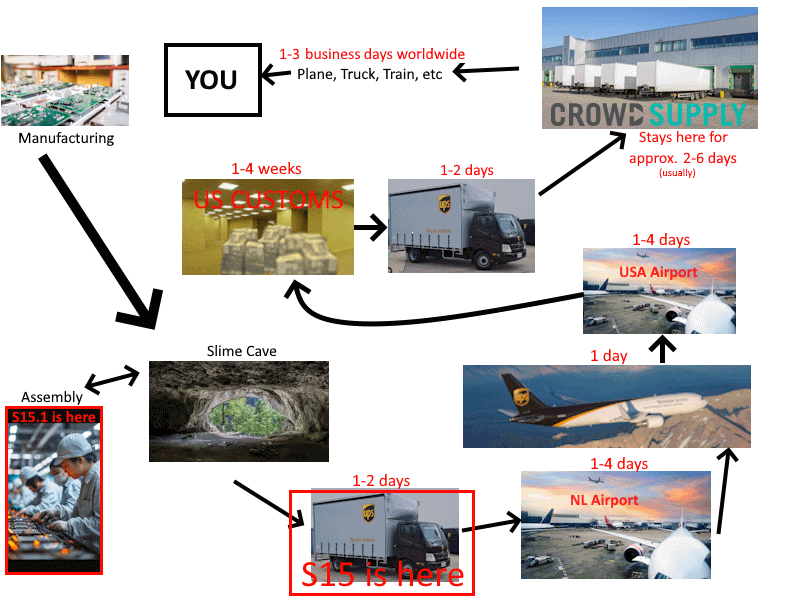
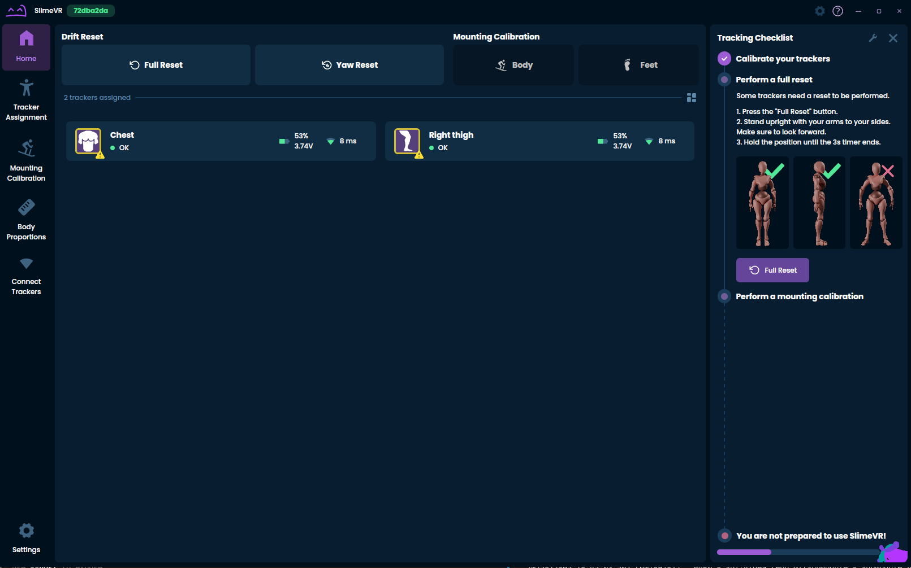
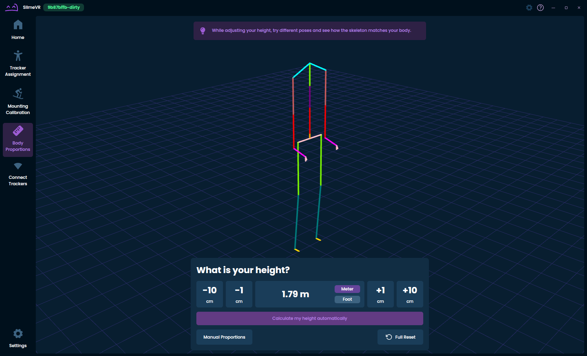
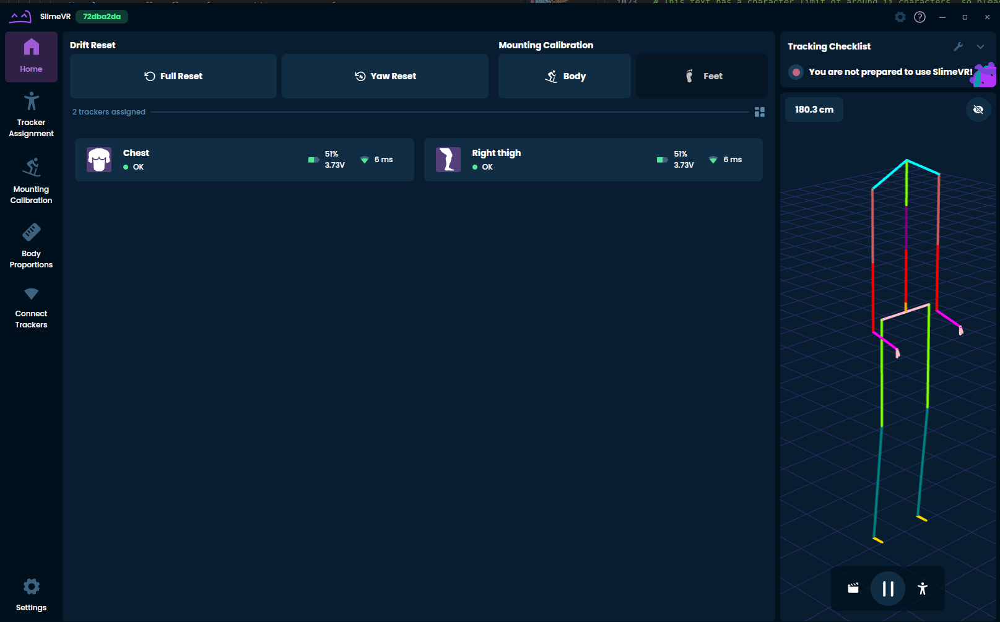
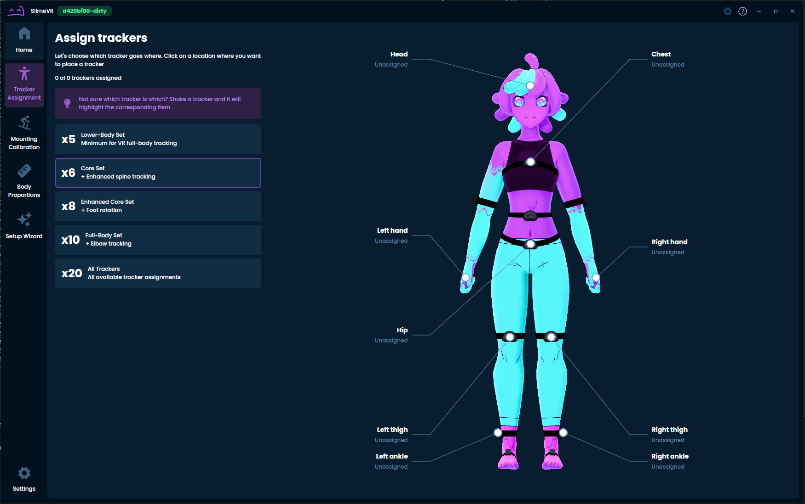

Hiyo slime gang~! Spazzwan here, with a fresh new update... 100% fat free and no added sugar! *(Ingredients: Natural flavour, Aqua, Chemical X, Corn syrup, Potassium benzoate, Ajinomoto)*
## Shipment update 
**Shipment 15:**
Earlier this week, Shipment 15 started its long journey towards its final destination, and should leave the land of tulips in the next handful of days. You can keep an eye on its journey if you want, or just forget and be pleasantly surprised some time in the near future.
> SHIPMENT tracking for S15 can be found here: https://scsapps.ups.com/forwardinghub/tracking/tracksearch?trackingNumber=3266109550&searchBy=1
-# THIS IS THE WHOLE SHIPMENT NOT INDIVIDUAL ORDERS

*Remember: Do not panic ~~if~~ when the timing changes, exceptions occur, etc. It happens literally every time.*

**For those asking "Am I in shipment 15?":**
* Did you order one of the following sets and nothing else?
* Lower body set
* Core set
* Enhanced core set
* Full-body set
*Then the answer is **YES** (At the time of writing this). Your order is part of S15. *

* If you ordered other things (DIY, upgrade):
*Then the answer is **MAYBE.** You might be fulfilled by S15 or S15.1.*

## New Server!!! 

Wake up babe! New RC Just dropped!!!!

18.0 is likely the biggest patch we have ever released, and is prepping for official launch with a Release candidate finally available. I have mentioned this for months in previous updates, but we are finally seeing the fruits of the months of labour by our team.

This new version contains:
- **New home screen layout:**
- Better 3D Preview; faster and bigger
- Better resets buttons; less confusing and bigger
- **Tracking Check list:**
- New sounds (The Mew returns!)
- **Simplified Setup wizard, less pages:**
- Many of the pages are un-necessary thanks to the new Check list system!
- **New Assignment pages:**
- Better responsiveness
- Updated Nighty art
- **New User Height calibration wizard:**
- More responsive
- Faster and simpler
- More precise
- Allows for both manual and automatic height
- **Improved OTA updates:**
- No longer require a reboot at start for firmware newer than last April.

This update is HUGE, so we really need feedback to make sure this all goes smoothly.
I know you are interested now. Go here to get it: https://discord.com/channels/817184208525983775/1446657436512419941
### **Please provide feedback if you can**
It is invaluable to ensure we stay on the right track. Even small stuff can go a long way!

## Butterfly Launch SOON™ 
The cave is abuzz with preparation for the grand opening of our Butterfly Tracker campaign. There is a bunch of stuff being worked on, such as media, writing, voiceover, review kits, and much more. Expect lots more butterfly news in the coming weeks!
Sign up for the campaign to get notified the moment we go live: https://slimevr.dev/smol

## Special Notice 
For those who have recently received or will be receiving SlimeVR trackers, I thought id do a little PSA for optimizing drift, since news is a little light due to the upcoming butterfly launch.

1. Be sure to always place your trackers down for 10-20 seconds at least before use. Do this immediately after switching them on (or turn them off and switch them back on to force the process).

2. If it is winter and your trackers drift more than in summer, you will likely benefit from pre-warming up your trackers before use.
*To pre-warm: Turn on the trackers 10 mins prior to playing and place them somewhere warm away from drafts. When you are ready to play, just switch them off then on, and place them down for 20 seconds to self-calibrate.*

3. If you do a few spins in game and your tracker does not return to the expected position, the IMU in some of your trackers may need to be calibrated.
*To recalibrate the IMU: Isolate the affected trackers and follow this process to reset and recalibrate them (approx. 20 mins): *https://discord.com/channels/817184208525983775/878727840118505533/1446200712827768912

*That's it for this week. Thank you for reading to the end, hope you all have a lovely week and weekend. See you space slimethings~! <3*
