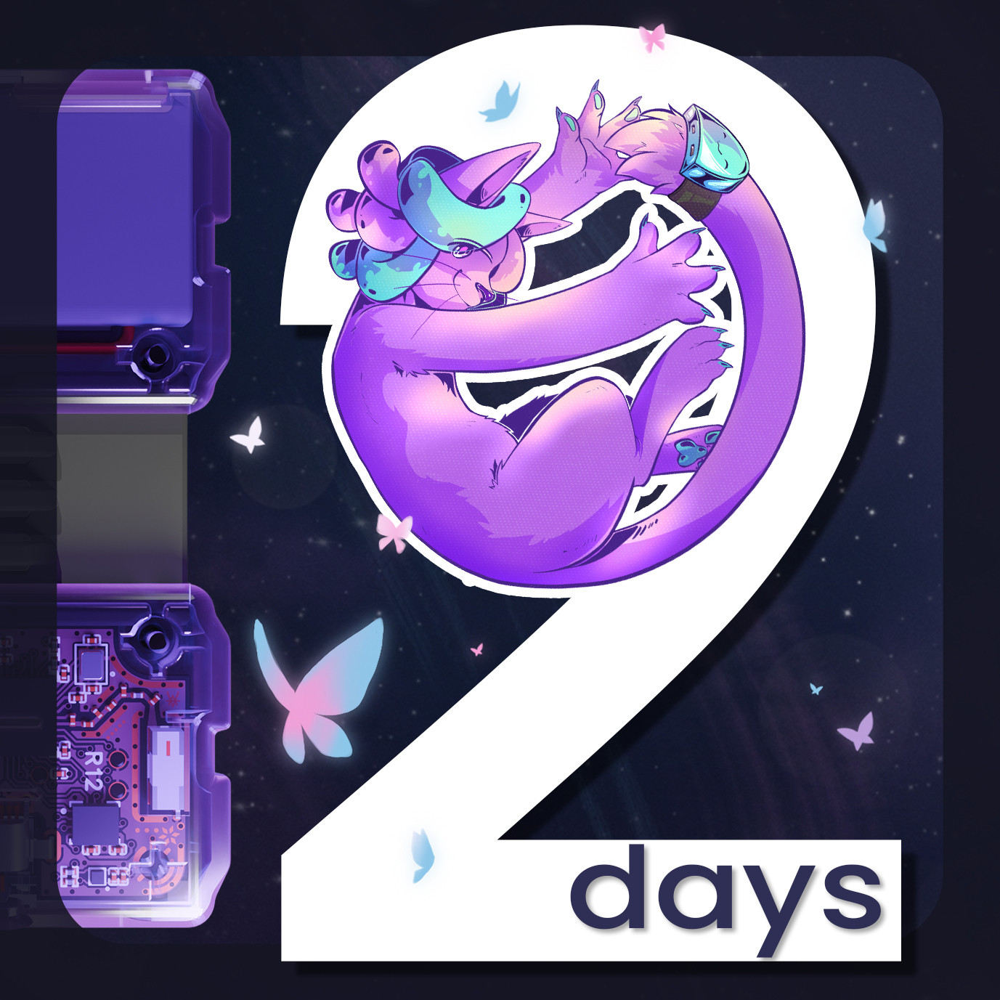
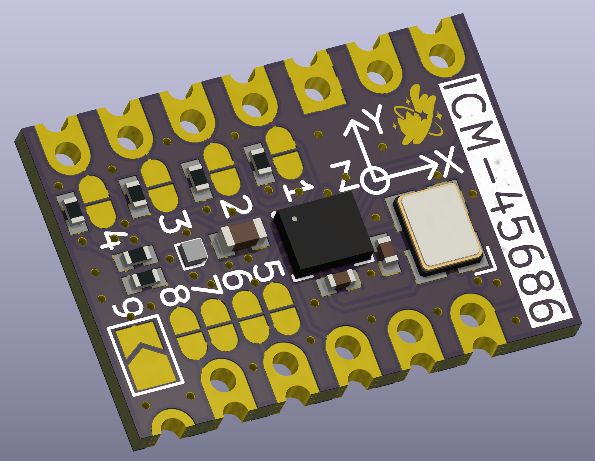

Hiyo slime gang~! Spazzwan here, with a very buttery update that I hope will fly into your hearts with a flutter.
## Shipment update 
**Shipment 15.1:**
Finally finished being packed, it is sitting patiently at SlimeVR HQ, all wrapped up and ready for Truck-kun to arrive. UPS pickup has been confirmed, with pick up **locked in for MONDAY**. Good news is we managed to squeeze on 1400 more sets, so there are still a lot of LBS, FBS and DTS sets unsold in this shipment, so waits should be short if u order those. The bad news is that the small handful of you waiting for DIY sets will have to wait a few weeks more, unfortunately. [#shipping-progress (discord  server)](https://discord.com/channels/817184208525983775/1129107343058153623) was updated yesterday with exact numbers of what's in here. I will be posting shipment updates at each major milestone of this shipment once tracking is up and running, and we expect these to arrive at CS **early march**

**Shipment 15.2:**
A new shipment? Yup, all the stuff that couldn't make 15.1 will be on here, which includes the DIY sets and other stray upgrades. Hopefully this means a lot of people waiting for s16 will get stuff a little sooner than expected. We are hoping to have this shipped out in the next two weeks, so expect these to arrive at CS **early March**.

**Shipment 16:**
A lot of the excess stock expected for S16 jumped the queue into s15.1, so this shipment will be a tad smaller than expected. Pre-orders showing as March on Crowd Supply will be part of this shipment or s15.1 if you are lucky. We are still predicting this shipment arrival at CS **around the middle of March**.

__To sum up the current sets and when they are next expected:__
S**15.1** (mid-late Feb) **-** Contains: 6+0, 6+2, 8+2, 12+4, upgrades
S**15.2** (late Feb-early March) **-** Contains: DIY, upgrades
S**16** (mid-late March) **-** Contains: 5+0, 6+0, 6+2, 12+4, DIY, upgrades
## Butterfly News 
2 DAYS LEFT UNTIL BUTTERFLY CAMPAIGN!! 2 DAYS LEFT!! *2 DAYS LEFT!! 2 DAYS LEFT!!* **2 DAYS LEFT!! 2 DAYS LEFT!!** *shakes you*

*Ahem*... Sorry about that. I am just very excited about Butterfly trackers....

Our campaign starts in 2 days, and even if u don't care about the trackers its still good news for you, as we are planning a big STREAMING EVENT sometime next week for you to come hang out, ask questions, and see cool in-development tech we have. We don't have an exact date just yet, so sign up for the ⁨⁨⁨`Streaming notifications`⁩⁩⁩ role in [#roles (discord server)](https://discord.com/channels/817184208525983775/844382850845376521), subscribe to our [Youtube Page](https://www.youtube.com/@SlimeVR), and be on the lookout for more info in the coming days.

On the Butterfly front, the team has collectively been maniacally preparing for campaign day, touching up and finalising all the art, media, pages, information, documents... you name it. Everything is getting a final polish in prep for our campaign launch on Feb 9. We are very excited, and hope you are too!

Oh and obviously goes without saying, but if you are interested in Butterfly trackers, sign up for the campaign here: https://slimevr.dev/smol

We hope you can feel all the love and passion the whole team has poured into this over the last few years.

## SlimeVR Tip Corner 
**Trackers lagging or ping going wild? **The main reason for this is packet loss, and is usually caused by interference on the radio bands your 2.4ghz WiFi is using for the trackers.
### How do I fix it?
There are three main strategies to resolve this issue, all are found in the 2.4ghz settings of the router:
* **Change the router channel to one that has less interference**
The simplest method to do this is by rebooting the router, but manually changing it is ideal. 1 and 11 are considered the better ones to try, followed by 6. You can use a phone app like ⁨⁨⁨⁨⁨⁨⁨⁨⁨⁨⁨`WiFi Analyzer`⁩⁩⁩⁩⁩⁩⁩⁩⁩⁩⁩ to check for WiFi sources of interference, but non-WiFi sources of noise like 2.4ghz controllers, video streams (security cams, baby monitors), and microwaves wont show up on these apps.
* **Reduce channel width to 20mhz**
This makes your WiFi more likely to 'miss' sources of interference at the cost of maximum bandwidth. Think of it like a motorbike riding between lanes in a traffic jam.
* **Lower 2.4ghz tech level as low as possible**
This is mostly for routers with WiFi 6 and higher, as Wi Fi 6 uses both 2.4ghz and 5ghz together to boost the speed of main devices. The downside is it can cripple things that rely on 2.4ghz, like Slime trackers. Ideally set to "b/g/n" or lowest you can set it that includes those versions.

Accessing these settings is different for every router, but it can usually be done by following this guide from Nintendo and navigating to either 2.4ghz WiFi settings, advanced WiFi options, or WiFi security options: https://en-americas-support.nintendo.com/app/answers/detail/a_id/657

## Rapid Roundup 

Ready yourself for a bunch of SlimeVR news bits to bite on:
* Aed has begun working on a setup onboarding quiz, similar to how discord does it, where users will go through a small series of questions to set up the server for them. Standalone users will have OSC enabled automatically, while a mocap artist might have mocap mode enabled if they dont have a headset.
* A new MUMO has entered the battle! Well not really completely new, but Meia has a shiny new revision of her ever-popular ICM module. Check it out below.
* Speaking of new, the cave team has two new physical members at the cave, with Meia and Em now able to physically touch the beacon at the SlimeVR HQ in Netherlands. SlimeVR is one step closer to amassing an army of catgirls now.
* Our steam release progresses quietly in the background, with Hannah working on getting it ready for release, mostly focussing on linux which will help make it much simpler to get going on the Steam Frame one day.

*That's it for this week. Thank you for reading to the end, hope you all have a lovely week and weekend. See you space slimethings~! <3*
