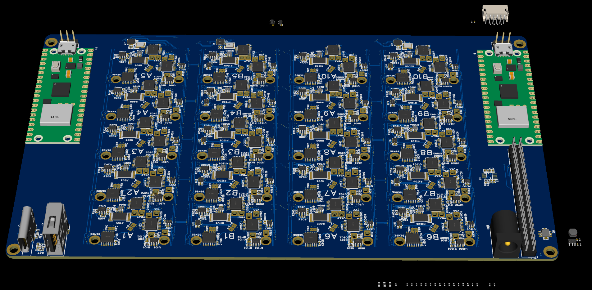
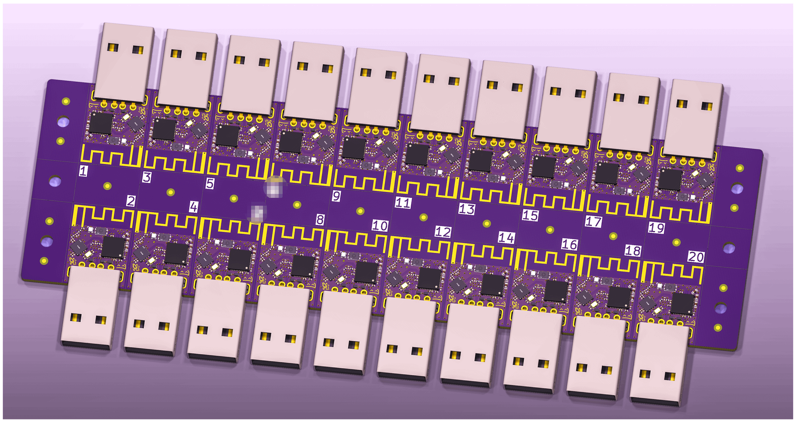
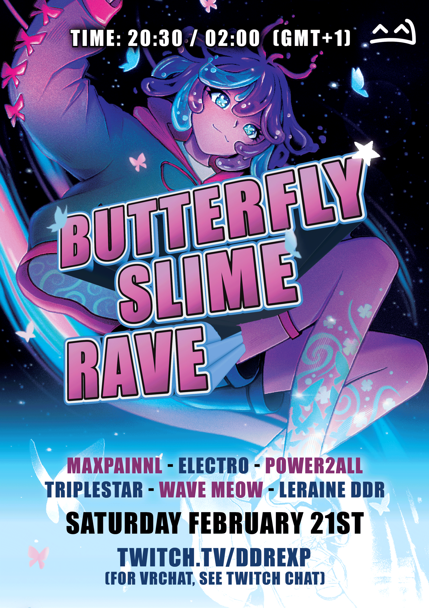
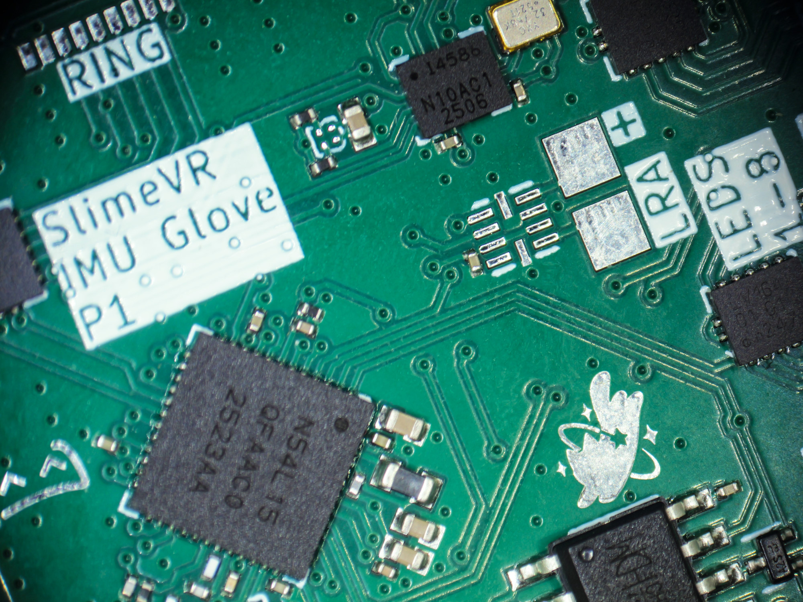

Hiyo slime gang~! Spazzwan  here, with a relaxing update to refresh your mind and stimulate your senses.
## Shipment update 
**Shipment 15.1:**
Currently working its way through the complicated maze that is international logistics, Shipment 15.1 has departed NL, and is set to arrive in Dallas Fort Worth airport on Wednesday after its brief stopover in Chicago. There have been no exceptions so far, no paperwork issues, and no delays, so it looks to be quite zoomy this time. I am expecting we will start seeing activity from Crowd Supply regarding orders from this shipment sometime next week, so keep your eyes on your inbox in the coming week for shipping notifications from Crowd Supply.
There is always a chance something holds up the shipment, but I am expecting this shipment to **arrive at CS late this week.** Over 3000 sets in this one!

**Shipment 15.2:**
Our small shipment 15.2 is still being assembled in the Cave. It will include long overdue DIY sets and loads of upgrades. Nothing much more to say here... we are hoping to have this shipped out in the next two weeks, so expect these to arrive at CS **early March**.

**Shipment 16:**
As mentioned last week, a huge chunk of S16 was shifted into s15.1, so this shipment will be a tad smaller than expected. Pre-orders showing as March on Crowd Supply will be part of this shipment or s15.1 if you are lucky. We are still predicting this shipment arrival at CS around the **second half of March**.

__To sum up the current sets and when they are next expected:__
S**15.1** (~~mid~~-late Feb) **-** Contains: 5+0, 6+2, 8+2, 12+4, upgrades (hip, feet)
S**15.2** (early March) **-** Contains: DIY, upgrades
S**16** (mid-late March) **-** Contains: **5+0**, **6+0**, 6+2, DIY, upgrades
## Butterfly News 
Wow.... what a week. It has been 6 days since we launched the Butterfly Tracker campaign, with the campaign officially hitting 100% a little over a day after starting. We are incredibly humbled by the love and support that you slimes have shown us and the community, not just by pledging but by commenting on our trailer, our posts on social media, and in this discord. After such an exhausting lead-up to the launch, it was a breath of fresh air to see all the positivity. Thank you all <3

With that all said, let's get to the meat of the news.

We have posted our first campaign update since it was launched. You all had SO many questions, and although a lot of you reading this will already know the answers (since you're cool and read updates), we collated the most common ones into a big list and answered them all in one go. If you need to find clarity on something you saw in the trailer, it's very likely answered in here:
https://www.crowdsupply.com/slimevr/slimevr-butterfly-trackers/updates/were-funded-plus-q-and-a

Next, we have shipped out even more review sets! The first wave of sets were sent out a few weeks ago, more were shipped out this week, and we have even more going out this week. There is still over 30 days left in the campaign, so expect a bunch of reviews to start streaming out in the next few weeks from the amazing creators we hand-picked. I am really looking forward to seeing them.
## Butterfly News Continued... 

On the hardware design side of things, we have had two strong advancements. Firstly, Cake has been hard at work on our Butterfly tester, which is now approaching design completion. It's one of those weird pieces of the hardware development puzzle, but VERY important for quality assurance, so it's good to see it slowly fleshing out. Similarly, Meia has been working on our Butterfly Dongle PCB, which has been fully panelised and is also coming along fantastically.

Our Livestream kicked off a few days ago; the first in over 2 years, hosted by none other than Nighty themselves!! We had Live Q&A, mocap demos of Butterfly Trackers, and guest appearances by a bunch of the Cave team! It was a little jank and a lot of fun, so thank you to everyone who tuned in and said 'Hi'! We will try to get the VOD up soon for those who missed out, I will edit the link into this post as soon as it is available.

Speaking of, Butterfly Slime Rave is three words that I wasn't expecting together, but here we are. If your dreams have an EDM soundtrack, then this is the event for you! This event is a combination of virtual event and live performance; hosted on Twitch by live DJs mixing in the Slime cave in NL, and virtually by ZRock35 simultaneously in VRChat. Come hang out with the gang and let loose, or join the stream and enjoy the beats! For event timing, see the event card below, or find more info in our events channel here:
https://discord.com/channels/817184208525983775/941879974808416306/1472683373611847942

As always, if you are interested in Butterfly Trackers, head over to the campaign page here to secure your own set or just read more:
## https://slimevr.dev/smoldc

...............................................................................................................
-# https://discord.com/events/817184208525983775/1472683026164219924

## Rapid Roundup 
Ready yourself for a bunch of SlimeVR news bits to bite on:
* For those of you who missed the announcement on our Livestream the other day, our Plushie is finally heading to the store! Expect it to show up in our official slime store in the next few weeks for $60 USD https://shop.slimevr.dev/collections/all
* Our new SlimeVR Glove PCB arrived in the cave (pic below). This bad boy can fit so many IMU's on it *slaps the top*. Capable of running up to 23(!!!) IMUs at full speed, this new model fixes one of the biggest issues that was holding us back, as older versions that relied on I2C would get slower for every IMU added. Big team effort to this point, way to go team!
* Big scary things are happening in the coding channel. In order to get SlimeVR to behave on Linux, we are moving away from our current Tauri backend to something more reliable. The goal of this migration is to make multi-platform development much more simple, so our Linux, Windows, Apple, and Android releases will be much more consistent. Great news if you are planning to get a Steam Frame!
* Hannah has been grinding away getting our behind-closed-doors Steam release and has a build successfully running on Linux. Big milestone for this hitting a public release. Way to go! pics below
* Sebby is at it again, this time using slimes to emulate a controller to play Halo and Terraria. Why? To prove she can. If you are at all interested in using IMUs as a game controller, check out her demo posted in the media channel here: https://discord.com/channels/817184208525983775/903962635161174076/1472910637259686041

*That's it for this week. Thank you for reading to the end, hope you all have a lovely week and weekend. See you space slimethings~! <3*
