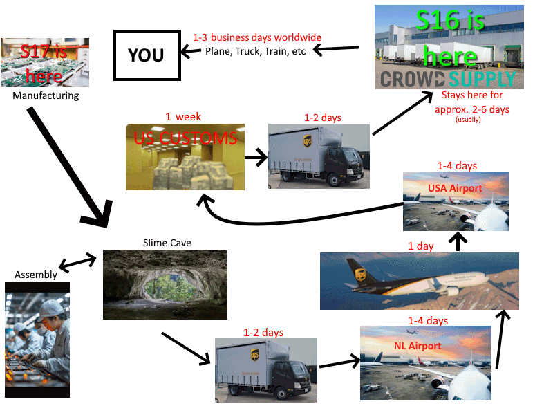

Hiyo Slimes, Spazzwan here, with a sticky slew of fresh slime news. Enjoy <3
### Shipment News
**Shipment 16**
Shipment 16 has triumphantly arrived at Crowd Supply warehouses in Texas.** Orders began shipping out to customers today**, and will continue to over the next week. Keep an eye on your inbox's for information regarding your order. **Time to arrival after receiving shipping notification** in your inbox **is 1-3 days** worldwide (for the majority of orders) *These are educated guesses based on past shipment times.*

-# **Shipment 16.1**: This shipment has been rendered unnecessary, as we managed get all the stock destined for this shipment into shipment 16.

**Shipment 17**
Our next shipment, 17, has been organised and ordered. Expect this to be another big big shipment, hopefully with even more overstock. Not many details on this as yet, but parts and assembly are already being worked on, and I will have more info on this in the coming weeks once all our plans solidify.

## Butterfly News

While the SlimeVR team at the cave have been busy designing and organising production of our Butterfly Trackers, a second review of Butterfly Trackers has gone live, this time with the frenetic **Kokou**.

It's an energetic, cute, and entertainingly unique take on what's so exciting about Butterfly Trackers. It's not too long, so I highly recommend checking it out if you are interested: 

https://www.youtube.com/watch?v=RC6hxWJvv9Q

## SlimeVR Server news 
You may have noticed news slowing down a bit recently. Well there is good reason for that, as our core team is shifting focus to re-evaluate and prioritise long standing problems with our software stack.

There's lots of cool stuff that is being roadblocked by integration issues (UI menus, code limitations, etc), and organising the server to make this easier is a current priority focus for much of the team.

One good example is finger tracking. The code has been in the server for over 6 months, but it requires editing files and manually assigning each tracker with a text editor. Just slapping on 30 assignment circles on the current page would create a mess, so things like this need lots of design and integration discussions to implement effectively. We don't want a situation where the temporary option becomes the standard.

With that said, our rendering rework in v19.0.0 the first of these steps towards a much better future of SlimeVR. Expect lots more soon!
## Networking Feedback Survey 
It's been a little over a week since the last update, and there has been over 100 respondents to our SlimeVR Network Feedback form. Thank you all who took the time to fill it out!

This will provide valuable data to help us narrow down potential causes of the networking issues we have seen increase lately.

If you haven't done so already and can spare 2-5 minutes of time, please fill out this google form. It helps a lot <3
https://forms.gle/EKiJtSREg2dLuEFH6

I will try to collate the data into fun little images for one of the next two updates for you all to check out!
## Rapid Roundup 
Ready yourself for a bunch of SlimeVR news bits to bite on:
* We added a new emote for Trans Visibility Day: 
* A change to our driver in the most recent update has caused some games to no longer 'see' the virtual vive trackers SlimeVR generates. Long story short, we changed the internal naming to what valve documentation expects to get rid of that "chest binding" popup, and some games don't like that. We are adding in a compatibility mode to solve this, but for now if you are affected please rollback to an older driver ([v0.3.1](https://github.com/SlimeVR/SlimeVR-OpenVR-Driver/releases/tag/v0.3.1)) until we sort out a beta release for our fixed version. instructions on how to do that are available [here.](https://github.com/SlimeVR/SlimeVR-OpenVR-Driver/tree/v0.3.1#how-to-get)
* Jabberocky, the esteemed mastermind behind Stay Aligned, is cooking up something extra unique this time, with their plan involving pairing a phone camera to the server to measure proportions and set mounting orientations. It has a few caveats at the moment, and its still just proof of concept, but might turn into a viable option to get accurate mounting and proportions sometime in the future. Video demo below: https://youtu.be/HCj9Nxgpnok?t=16
* "The event is always so late/early, i cant attend". Well, lucky you, because our eventmaster ZRock35 is sprinkling in some uncommonly timed events over the next few weeks for those outside the normal prime times. Be sure to regularly check the Event Tab in discord to spot these if you are looking for an event in your time zone. https://discord.com/events/817184208525983775/1491365821593817088

*That's it for this week. Thank you for reading to the end, hope you all have a lovely week and weekend. See you space slimethings~! <3*
