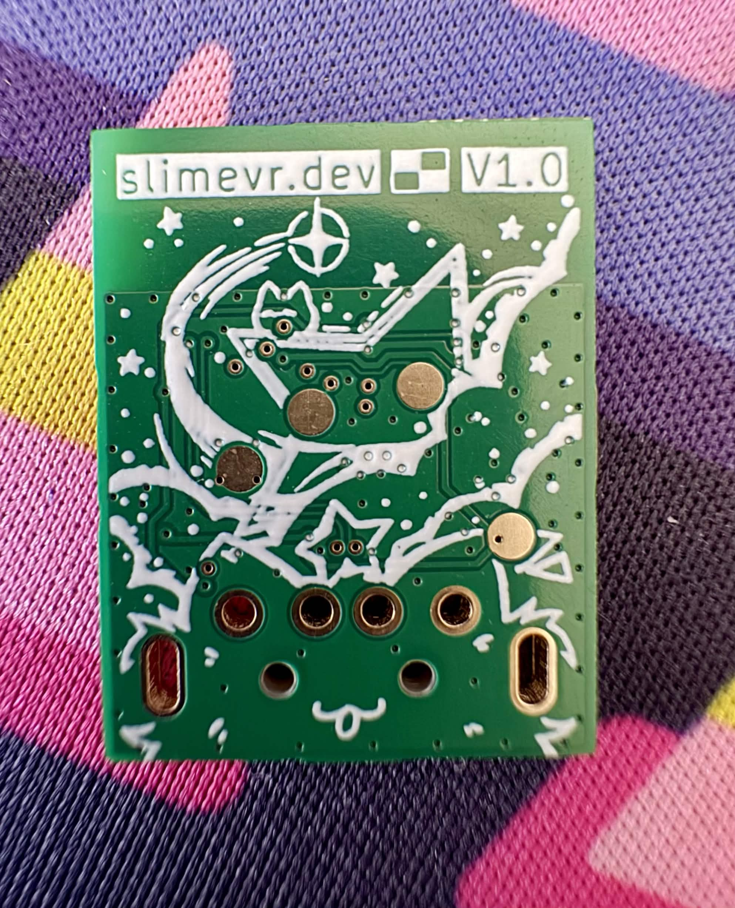
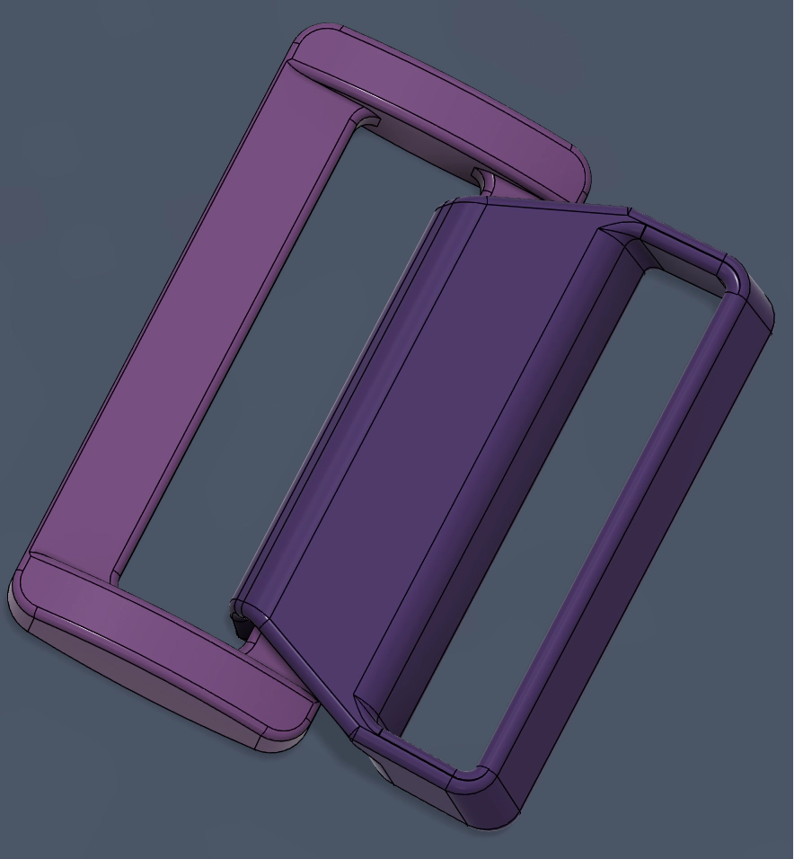
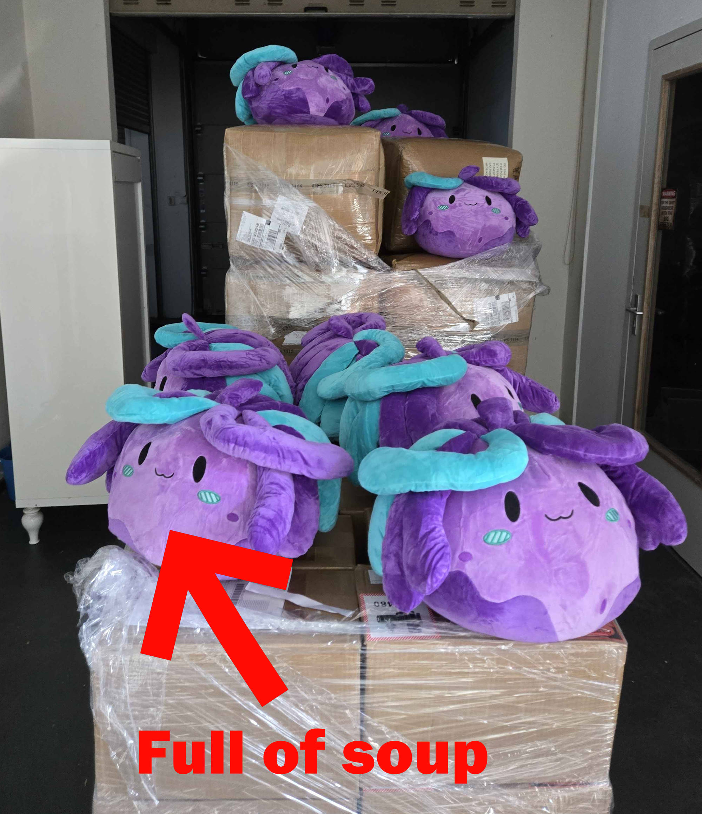
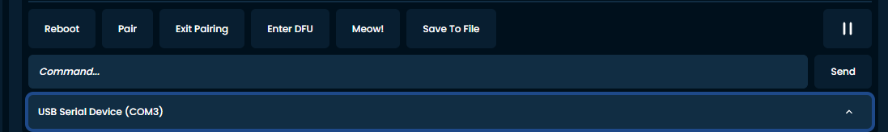

Hiyo Slimes, Spazzwanhere, hoping those of you in the upper half of the world are surviving this very normal summer. Do not become cooked, please stay cool and hydrate!
## Shipment News 
**Current Stock**
The following sets and upgrades are *still* **in-stock and available** for immediate shipping:
* ~~Core Set V1.2 (6+0)~~
* Enhanced Core Set V1.2 (6+2)
* Feet Upgrade (0+2)

**Shipment 17** 
This shipment is being finished up at our assembly partner, Chain. We are preparing for this shipment to leave from the SlimeVR cave in Netherlands for Crowd Supply next week, hopefully with an uneventfully quick journey across the pond. This has taken a little longer than we predicted due to some part sourcing issues, but it's finally all coming together.

This will also refresh our stock of the most common sets, meaning 5+0, 6+0, 6+2, 8+2, feet upgrades, *and* elbow upgrades will be once again **fully in-stock **and ready for immediate shipment 

For more information on what is being included in S17, head over to https://discord.com/channels/817184208525983775/1129107343058153623.
## SlimeVR News 
### Butterfly Progress 
The team is burning the midnight oil as we approach the final stretch towards full production for the Butterfly Trackers. Of note in the past week, we have received our v1.0 board for our Butterfly Dongle, as well as sent off designs for multiple parts to have their moulds created for injection moulding. We are also honing in on our final designs for the strap hooks, which are a particularly difficult piece to make for injection moulding due to the challenging angles required for the part to pop out of the mould cleanly.

While we are still a while out from shipping the trackers, we have strict deadlines for all the various parts that need to be made months in advance to allow sufficient time for testing, certification, and assembly. Having the dongle ready for testing is a huge milestone~!
### Translations 🐟
Our translations are community sourced, made by awesome translation contributors giving their time to help others, but it's an uphill battle as the server software changes and evolves. Unfortunately, some languages do not have many people working on them, and are slowly falling behind in support. We are in the process of reinvigorating our translations, spearheaded by our resident fox-boy, Erimel 

For this reason, **we are once again asking for your support**

If you want to help make slime more accessible and are fluent in any of the languages we support (or even want to add support for one we don't), head down to the https://discord.com/channels/817184208525983775/1277656291371778151 channel to find out more info on how you can contribute. Don't be scared to ask questions, either. The fox doesn't bite (much).

Even just a few minutes of translating or reviewing others translations can go a long way to ensuring your fellow language-havers are taken care of (yes, including OwO-glish)!

## Rapid Roundup 
Ready yourself for a bunch of SlimeVR news bits to bite on:
* The FLUFFY SQUISHY CUTE BALLS OF LOVE that are the Nighty Plushie have arrived at the SlimeVR Cave in Netherlands, ready to be re-directed towards Crowd Supply for order fulfilment. We are in the process of organising their shipment, and are expecting them to hit Crowd Supply warehouses sometime in late July. Check out how cute they are in the attached pics!
* Sapphire has managed to get our serial console to work with smol slimes, including having all the important commands such as `Meow!` as clickable buttons. This should help with simplifying and reducing the knowledge wall for debugging and messing with smol slimes (including Butterfly Trackers). Be sure to give them a pat on the head if you see them in VR (with consent of course).
* The first video in our new slew of SlimeVR related content has been launched, hosted by the lovely Jacobfov. We plan to do lots more videos in the coming months, so stay subscribe to our YouTube channel for a bunch of informative and entertaining content like this! Check it out here: 
 https://www.youtube.com/watch?v=quDmfCtTQ0Y

*That's it for this week. Thank you for reading to the end, hope you all have a lovely week and weekend. See you space slimethings~! <3*
