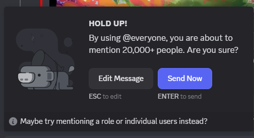
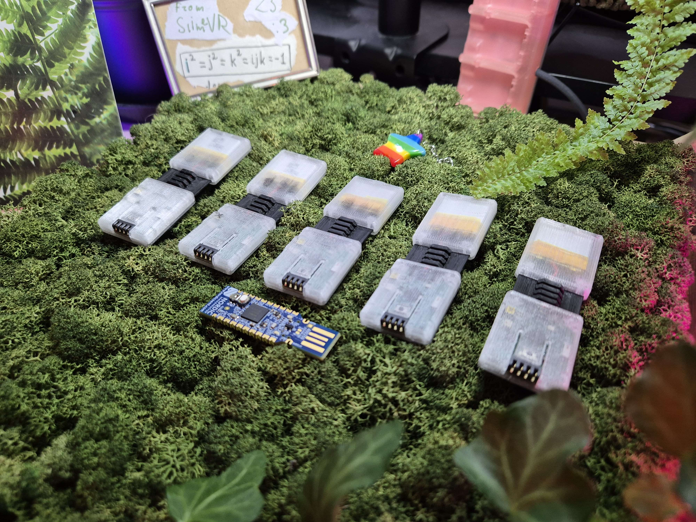
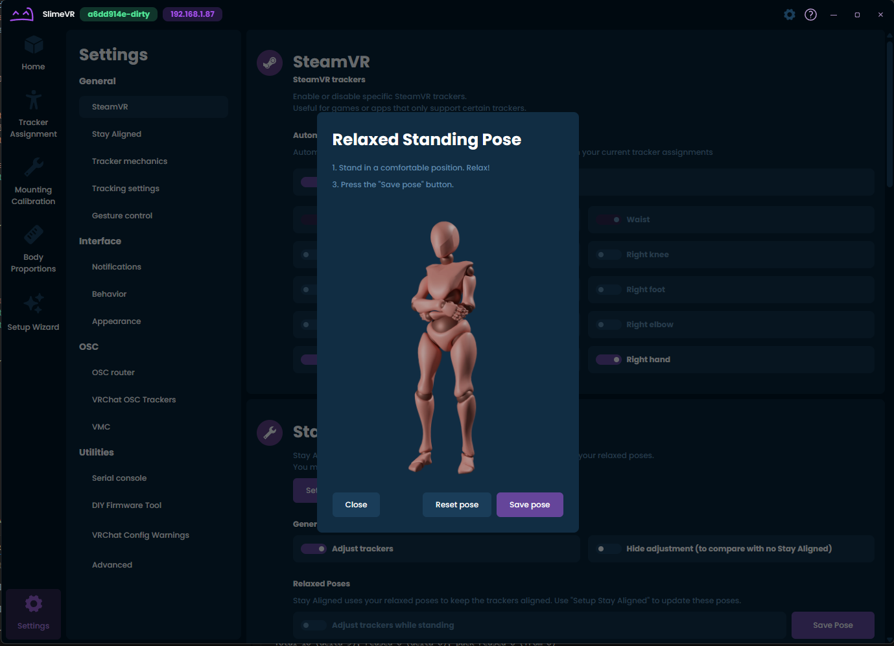

## WE ARE IN STOCK!
See above or in https://discord.com/channels/817184208525983775/1129107343058153623/1356221858072100971
**If you see on the order page "In Stock" that means Crowd Supply has it on hand and it will ship the next day or so!**
## Shipment 13
Almost all orders from S13 have been shipped, there are around 200 still open and they should be shipped today, so keep an eye on your email <a:eyeshakebig:1115217029155278888>
## Shipment 13.1
We got confirmation from UPS that S13.1 will be delivered to Mouser today! Which means we managed to outrun the tariffs by a few hours <:firL:785677220093231134> Fuck you, trump! <:fuck:1046808825992314950> I'm gonna stop holding my breath when it actually arrives to Mouser, but it seems like we're good. If your order is in S13.1, it will be shipped to you early next week! <a:eyeshake:727315755904925706> <:slimenom:663823059920224277>
## Shipment 13.2
We are almost done with testing for S13.2, but we're not sure when it wll be delivered. We added a solid month to expected dates on CS because no one fucking knows what will happen because of tariffs, so we're playing it safe.
## Tariffs
As mentioned, we're working with Mouser to ensure that 1) tariffs don't affect people outside of the USA, and 2) tariffs affect people in the USA as little as possible. More when we make the next shipment, I guess.
## Shipment 14
If you ordered Core Set or Enhanced Core Set recently, your order might be in S14. S14 is in early production stage, and we safely expect it to be delivered by the end of July. Hope we put in enough safety in it...
## Spinny!
Look at it spin! <a:spinfox:1065471046460907521> <a:catspin:861991642080608276> <a:Yurispin:474344617110798357> It's almost finished and we will be using it to tune SlimeVR v1.2.
## Server v0.14.0
Still squashing bugs after the Release Candidate. It looks like the final release will be early next week, maybe on Monday (bad idea to release on Fridays... we want some rest in case something breaks). v0.15.0 is already in the works though <:Yus2:862786221537624104>
ANYWAY GO BUY SLIMES

