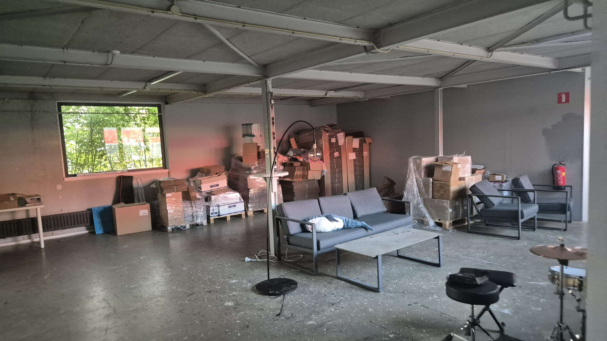

## Shipment 13.2 is ready!
Chain just delivered to us everything, and our own packing is also almost complete. We're finishing packing DTS-P and upgrades, and we plan to ship everything to Mouser next week. So yeah, took a bit more time, but what's new 😄
We're still waiting on info from Mouser on how to ship it to them because of the fucking tariffs <:nighty_gun:1314209484440338474> We should have a call on Monday to figure it out, so we expect it will be shipped by the end of the next week.
## Slimes v1.2 are finally announced!
Check the full update on Crowd Supply: https://www.crowdsupply.com/slimevr/slimevr-full-body-tracker/updates/announcing-slimevr-version-1-2
They're already in production, and so far everything has been going great <:firPog:785701297478959104>
It's a short update, because we had a bunch of holidays, and we also were busy with business side of things, but it's going great now <:nya_umu:850498715617198080>
Especially smol slimes <:firPog:785701297478959104> Can't wait~
oh yeah, go help test us 0.15.0 release candidate 3, please! 🥺

