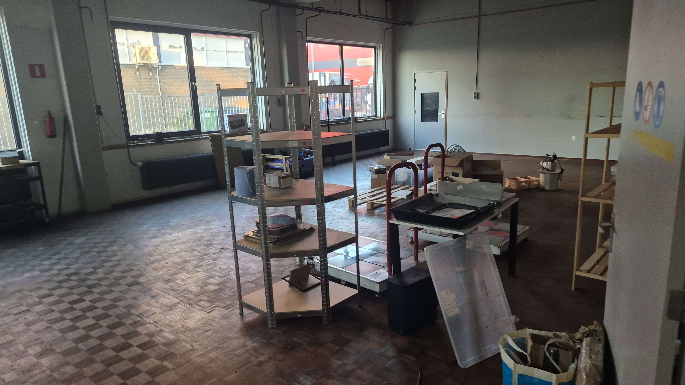

<:nighty_a:1314209496029204572>
_Huge one. You will need a cup of coffee or something. Enjoy the ride~_
## 0.15.0 server version has been released
_Is it worth to install?_ Oh, heck **YES.** <:nighty_gun:1314209484440338474>
All of the changes _with more pictures_: https://github.com/SlimeVR/SlimeVR-Server/releases/tag/v0.15.0
Coolest and the most noticeable ones:
- VR Chat configuration warning: now SlimeVR app automatically checks if you can improve your **VR Chat settings (!!) for better tracking**
- More convenient and transparent design of manual proportions page <:nighty_yay:1319261631217143910>
- If you forgot to turn on your tracker while connecting it to Wi-Fi, the server will detect it and nicely remind you to turn it on
- If your Network profile is set up to Public (which is not recommended for SlimeVR), the server will nicely ask you to change it to private and give you a small guide on how to do it
- Now you can see if your magnetometer is actually doing anything. Congrats @tort32 with her first contribution to the Slime server!
_Check the screenshot section or the link above to see more :3_
**This update was delivered by brave slimes**: , , , , , and
**Debut contributor:** with magnetometer preview
_If you find any bugs or other inconveniences in the update, please report it to us by creating a ticket in_ <#1024357452596129862>_forum **1/6**

