Hello everyone! This week as well as a few next, we’re moving to the new Cave (again! Over 1000 m²!), finishing v0.16.0 with Stay Aligned!, and preparing to properly showcase our new project. Very excite :3 <:nighty_yay:1319261631217143910>
## Shipment news <:nighty_heart:1314209486390427659> <a:slimelol:981246371006931034>
Shipment 13.2 should arrive early next week at Mouser's warehouse, and as soon as they unpack it you should get your slimes if you ordered v1.0/1.1. Also you will be able to buy the upgrade sets! Only 300 sets for now, so keep your eyes peeled.
Shipment 14 is now in full production. The last pieces - all PCBs for main and extension trackers, and boxes - are now being produced. Still targeting the end of July for shipping <3
## Progress on Stay Aligned Feature <:bingus:1157717351861596200>
This may be one of the, if not the biggest, improvements to IMU-based tracking that we and the community have implemented to date! Stay Aligned has the possibility to eliminate almost all yaw drift based on a few calibration poses, how cool is that?!
### How does it work?
Stay Aligned works by having you calibrate 3 different poses: relaxed standing, relaxed sitting in a chair, and relaxed sitting on the floor. Over time, when sitting, standing, talking with your friends, etc., it applies small imperceptible yaw corrections towards one of these poses. This way, when you eventually fully return to that pose, it will still be perfectly aligned as it was before! This should minimize visible drift and sometimes completely remove it, and can extend your reset times to several hours! You will be able to find this new feature in the next update. To enable staying aligned, head over to settings and start the "Setup Stay Aligned process".
Please help us test the release candidate for v0.16 and Stay Aligned! here :3 https://discord.com/channels/817184208525983775/1377106666730033355/1377106666730033355
## Nighty 3D model and VR Chat Avi <:nighty_art:1314209500709781524>
We are working on a 3D model of our mascot - Nighty, which will be used in different cool ways:
- Most importantly, Nighty’s use case is in the server guides to demonstrate correct poses for calibration, or to recommend tracking mounting places. Right now, we're doing that with just 2D graphics, but as SlimeVR grows, we need more and more poses to demonstrate, so it will be super convenient for us to just use a human-proportioned model.
- We're also planning to use Nighty’s model as an addition to the skeleton preview, so the user will be able to see how their tracking looks on an actual model.
- We also want to use Nighty’s model as a default avatar for FBT, which can be recommended by the server to test users’ FBT/face tracking/haptics inside VR chat if the user doesn't have any convenient avatar that supports those features from the get-go.
- Another use case for Nighty 3D model is, of course, to use it in promotional materials or just as a VRChat avatar :3
## Announcement next week 🐟
Cool announcement next week, do not miss <3 <:slimehug:822833057593294908>

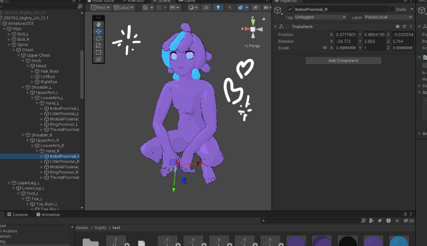
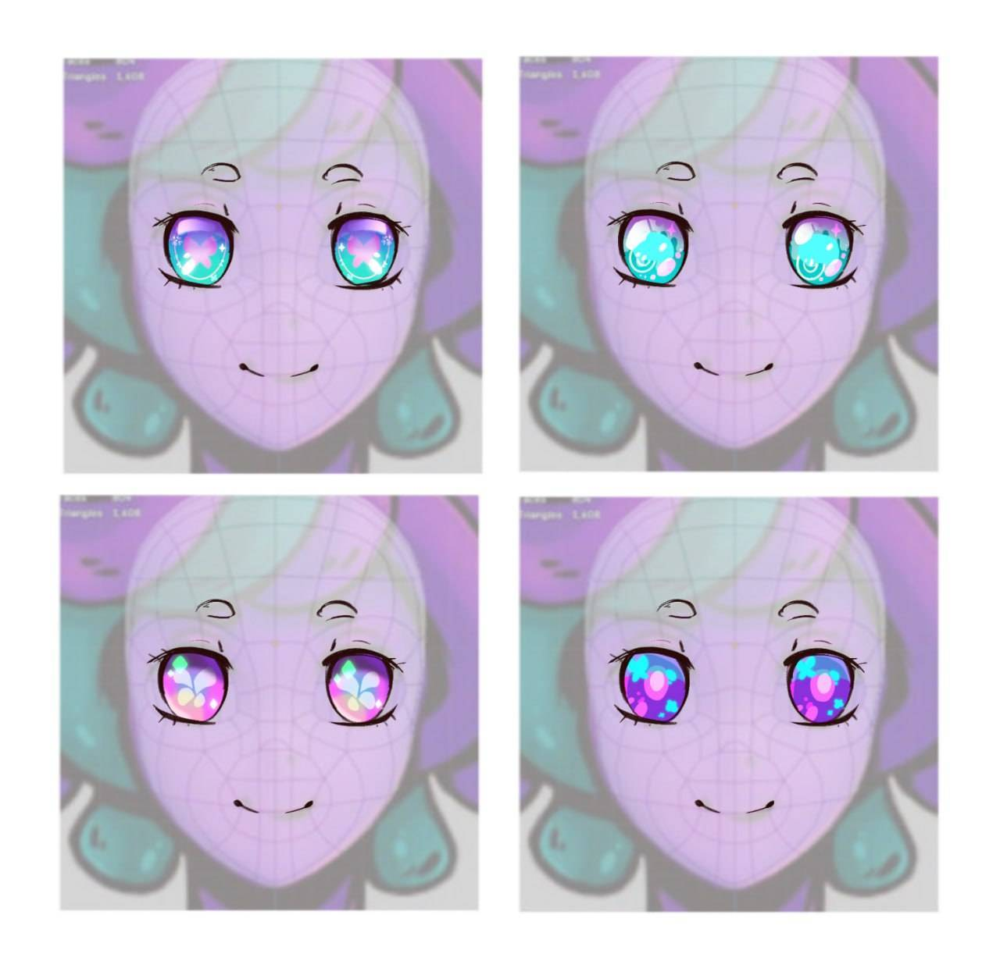
## Stickers and other cute stuff
Every SlimeVR contributor has their own Slime-sona. All the slimes that you can find in our sticker pack are slime contributor-based characters :3 Because this year we had many more new contributors, we're working on a new sticker pack for the Slimes 1.2 with more cute little guys, just look at some of them attached to the post. Also, very soon we will release the SlimeVR contributor hall of fame on our website, where you will be able to find and **catch** them all!
Don't forget to share your experience of using slimes in comments, tell us what you think about the new update format, and see you on Friday. <3
_P.S. Be kind to our support crew, please. They are not AI, but real ppl who can help you with any slime issues almost 24/7 <3_ **6/6**
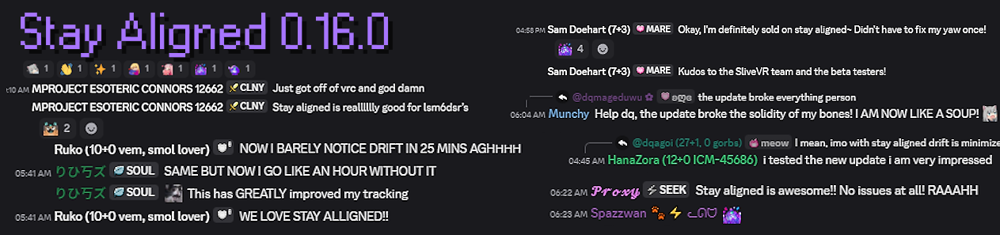

## Events
Starting from _SlimeVR x TUBE x Trans Academy Event_ in February this year, SlimeVR is attending and organizing even more events than before.
### Furality 2025
SlimeVR is coming back to Furality this year! This year's panel will be hosted by , , and . You will be able to ask our devs any questions on the Furality Discord thread, or just learn more about the inner kitchen of SlimeVR <3
When? Saturday, June 7, <t:1749319200:F> - <t:1749322800:t>
Where? VRChat
More info: https://furality.org/
### Teardown 2025 by CrowdSupply
This year, SlimeVR attends offline events too. Teardown by CrowdSupply. There you will be able to meet our MoSlime team in person, check our products yourself, and ask any questions on our stand. So if you live somewhere close, or want to check SlimeVR IRL, this will be your best option.
When? Friday 20th June to Sunday 22nd June 2025 :3
Where? Portland, Oregon, at Lloyd Center Mall
More info: https://www.crowdsupply.com/teardown/portland-2025
### Inner Events
Did you know that the SlimeVR community organizes VR Chat events hosted by , where anyone can attend, get help with calibration, dance, and relax at yoga sessions? Good news! Dancing events are coming back; you can check them on our server event calendar. **5/6**
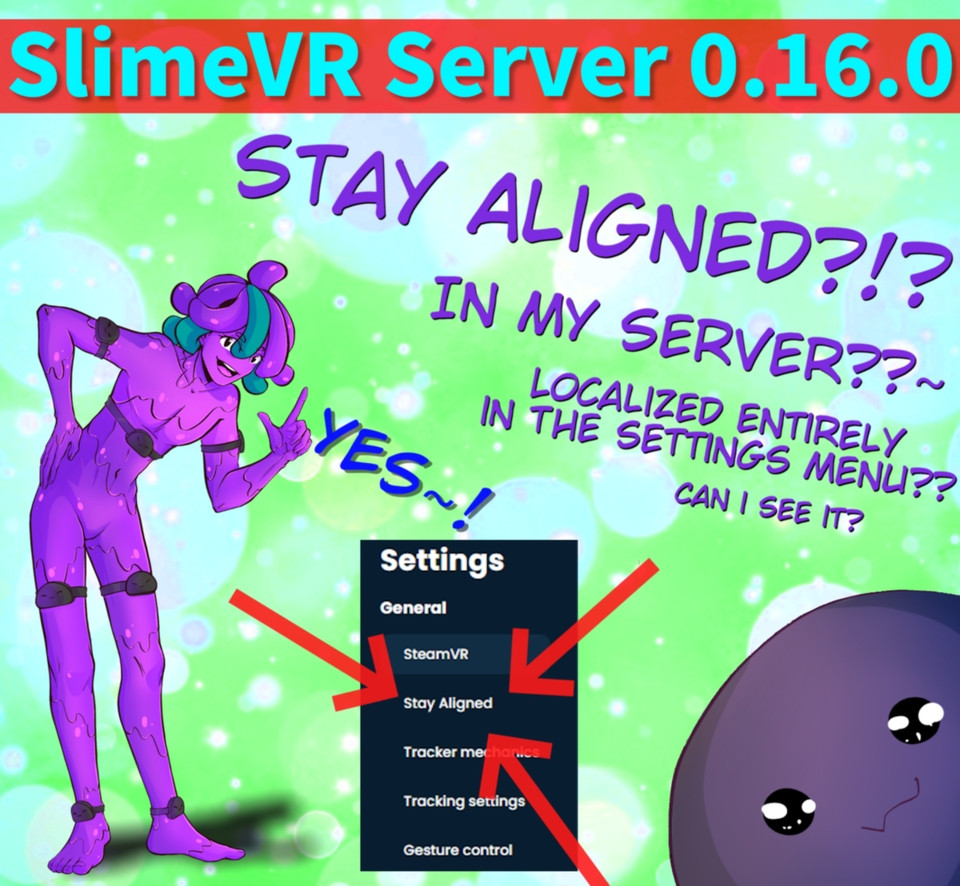
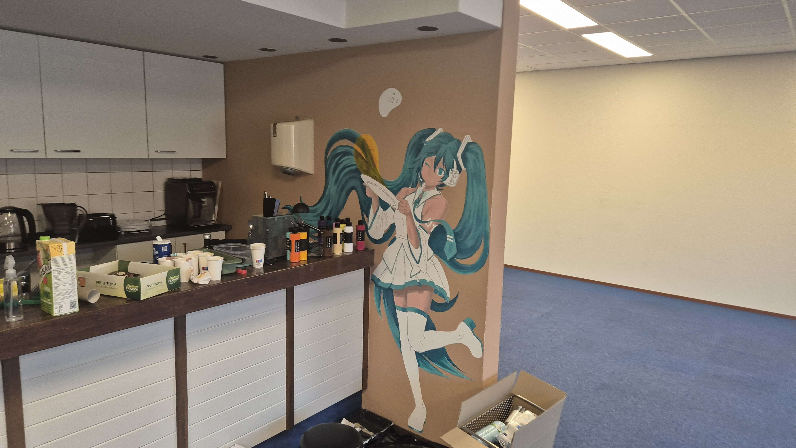
## Shipment news
**Did you ever notice that we made Lower-Body Set v1.2 (5+0) $185 instead of $195? In this economy?? With the tariff situation??**
Yep. We care, and we know that it will be more difficult to afford stuff for folks in the US. And it is also because the new IMU is not only better, but also cheaper, and we're making slimes cheaper because we can :salute:
_We cannot let the tariffs stop furries from cuddling._
**Shipment 13.2:** Requested UPS to pick it up, expect to ship to Mouser on Wednesday.
**Shipment 14:** We're getting production samples of Main v1.2 slimes tomorrow. After checking it, we're going to send it into mass production. We have problems with the magnetometer on v1.2 extensions, which looks to be a firmware not hardware problem, but until we catch and fix it, extensions aren't in production yet. We're actively working on it this week and hope it won't delay S14 from it's target shipping date in July. **4/6**
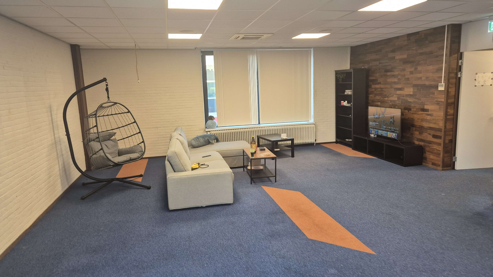
## New products~
Have you ever felt tired by the simple thought of setting up VR and your slimes? Or felt awkward wearing all these straps? Or maybe always wanted more tracking points, to have a more immersive VR experience? Or maybe wanted to use FBT for VTubing, but was afraid to set it up because it is chonky and not comfortable enough? Spaghetti of cables? Weird straps? Awkward charging? Eeeh... we are too.
This summer, we're solving all of that and even more. Like, all of that. Turn on your notifications. If you are a VR/mockup/VTubing/DIY enthusiast, you don't want to miss that moment. **Stay tuned, because we're soon going to be ready to demonstrate what we can do by putting all of our engineering, manufacturing, and logistics experience together!**
_I'll leave the rest to your imagination for now. Don't forget to put a cherry on top of whatever you imagine._ **3/6**
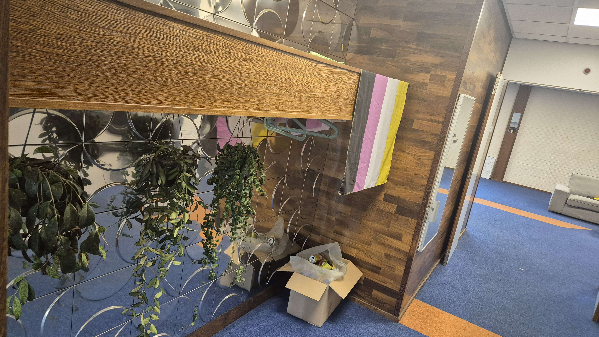
## Quick preview on what we're currently cooking for the update 0.16.0+++
### Stay Aligned feature
For those who don't know: Stay aligned is a new drift compensation system by . I cannot wait for this thing to be released, it is **huge** work on one of the biggest problems of IMU tracking: **YAW drift**. A lot of math, GUI stuff, and more. _0.16.0 hype!!!!_
### New Wi-Fi connection page
Currently, and are working on a new Wi-Fi connection page to make the process of connecting your Slimes to Wi-Fi more straightforward (or gay-forward, if you wish). There is no way you can mess up with this one, right? right!? <:blobpensivepray:766082696681488394>
### OH BOY FLIGHT LIST??? Quest list system??? Inside my SlimeVR server????
Complete the quest before every session, with a huge reward: **good tracking with the least drift.**
_Yes, we're doing that. Yes, it will be super cool. Advanced users are going to be able to turn it off, but trust me - it will be so good, that you won't want to turn it off. More news about that in the future!_
### Toggle Nighty model preview instead of just skeleton
Ever had a problem understanding where is front side of the skeleton proportion preview is? Or was I alone confused by the color of the bones? That fixes these problems and makes the GUI prettier <3
_and more... stay tuned, this summer will be HUGE for SlimeVR!_ **2/6**
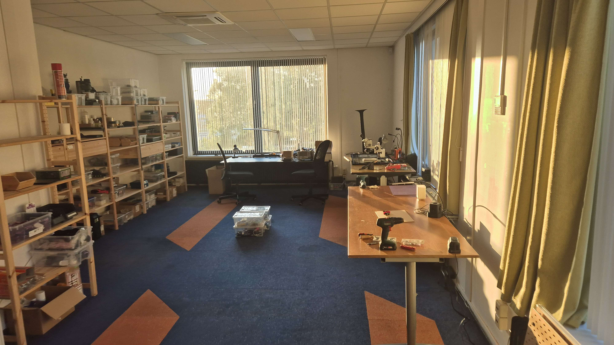
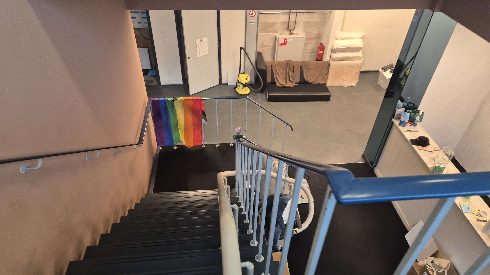
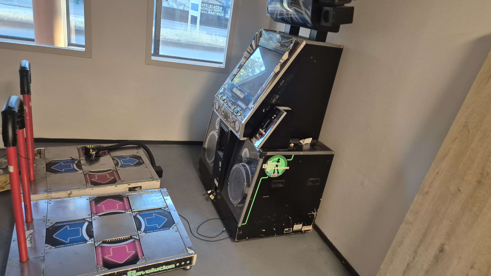
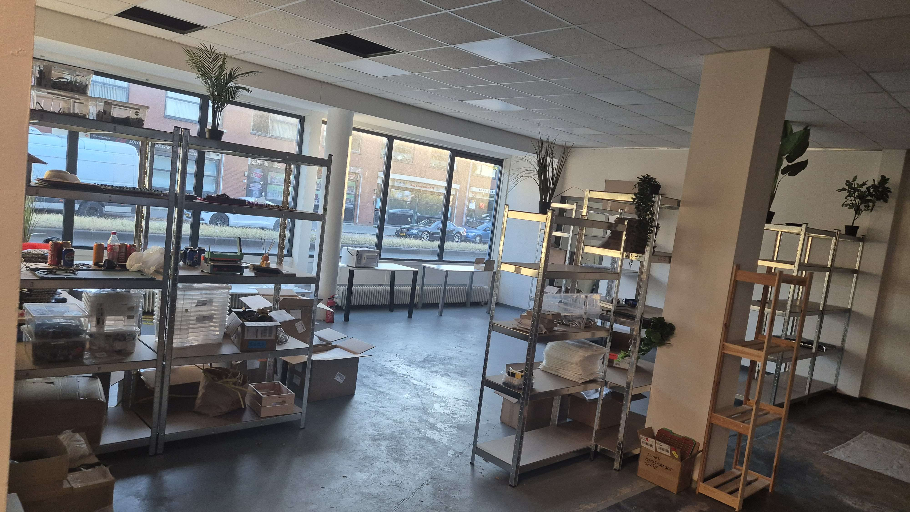
