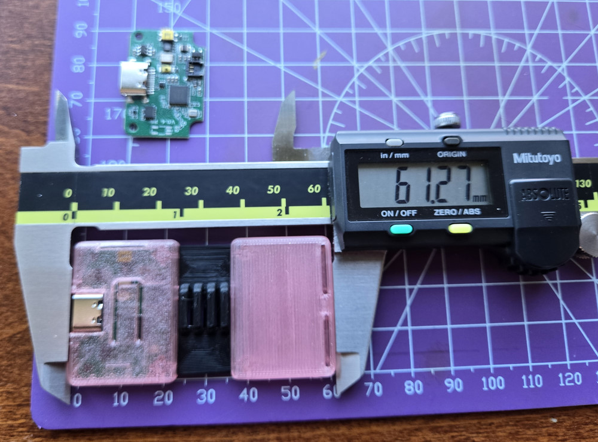
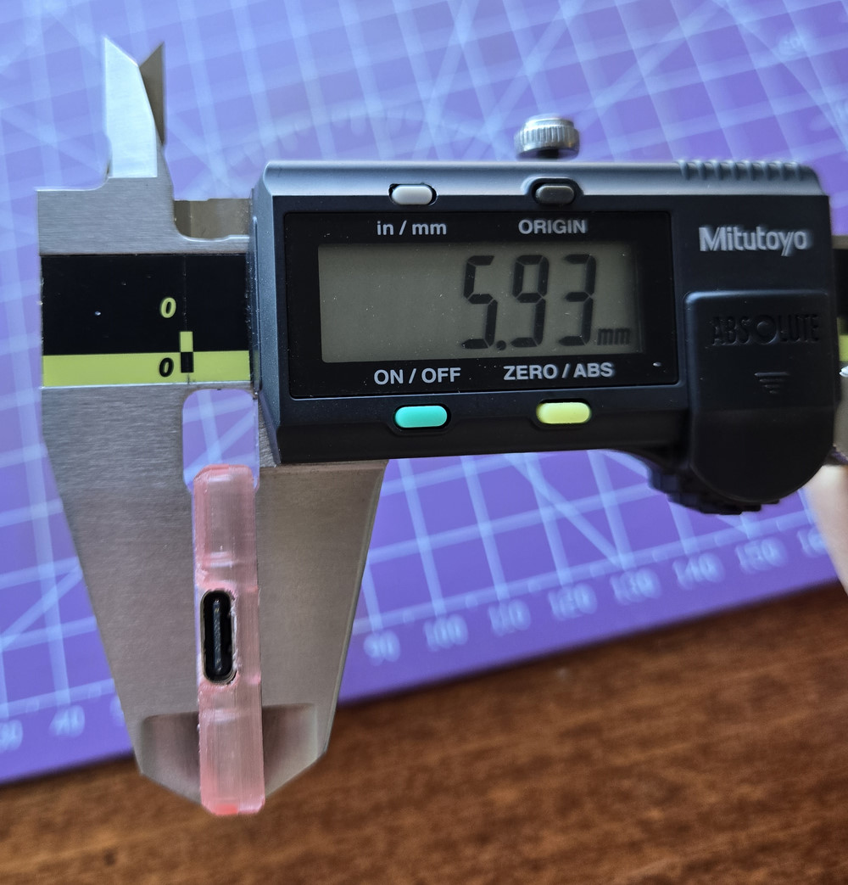

The time has finally come, ! No more secret projects, **SlimeVR Butterfly Trackers** 🦋 are finally public! https://www.youtube.com/watch?v=dJmpYQ4xoCY WE CAN FINALLY SHARE WHAT WE'RE DOING <:nighty_yay:1319261631217143910> 🦋
Amidst the chaos of the current and the previous week with **preparing v1.2 slimes, moving to a new cave (again!), preparing v0.16.0 server release with Stay Aligned and much more** we have also finished the pre-launch page of Butterfly Trackers <:firPog:785701297478959104> <:nighty_yay:1319261631217143910>
**The official version of Smol Slime is real and we're taking it a step further with a cool and extremely comfortable design!** 🤏 THEY SO SMOL <:This_smol:813468968840200213> And we're working on making them even a bit smoler!
> Like the original version, these new SlimeVR Butterfly Trackers are open hardware sensors with open-source software that can track the movement of your body. They require no base station, can’t be occluded, last for days on a single charge, and are completely wireless. Now, with the brand-new, unique, ultra-light split design inspired by butterflies, they’re less than 7 mm thick and weigh less than 12 grams, making them the most comfortable solution for full-body tracking on the market today.
**Please follow the pre-launch page on Crowd Supply to stay up to date: https://slimevr.dev/smol**
A lot more detailed information is there!
## Important Information
The one important thing we don't mention on the page is that **they are not coming for a while!**
**__We plan to launch crowdfunding campaign on August 31st and we are targeting shipping date to around March 2026.__**
The price will depend a lot on our final design and what the heck will happen with tariffs, but we're aiming at the similar cost per-tracker as the big slimes.
So, bullet points:
* The same tracking quality as v1.2 SlimeVR Trackers
* Based on Smol Slime
* Uses 2.4Ghz dongle with a range of ~10 m
* Over 24 h of battery life
* VERY SMOL AND VERY LIGHT: less than 7 mm thick and less than 12g
* Preorders planned to open August 31st
* Planned shipping date is March 2026
* Velcro-backing for wearing options
* Cool split design. Don't worry, it's very sturdy!
## Shipping Date
Now, I know what you all are thinking about. Haven't you promised march shipping date last time and also started the campaign on August 31st? Yes. Yes I did <:Laugh:863878108130050078> We think it's very symbolic. **We'll try this again.**
This time though, **we have already almost finished design, we have an amazing software, there is no chip shortages, we have a 5 times bigger team, and the most important part - we know what it takes to make it happen.**
With our experience we believe March 2026 is a safe bet if the campaign launches in August. We plan to have final PCB, enclosure and box designs before we even finish crowdfunding, with molds being made as we raise fund. <a:nod:1279885450194194506> I hope we have proven over 4 years that we can deliver things, even if a bit later than expected, and we appreciate your trust and will do our best for all backers <:nighty_heart:1314209486390427659>
### NEW CAVE??
Uh yeah, we are moving to the new cave right now... But let's talk about it the next time <:firL:785677220093231134>
### QUESTIONS?
I'm sure you have questions! First, read the campaign page for more info: <https://slimevr.dev/butterfly>. Next, go the thread below and ask away! <:down_btn:1286185807660585055>

