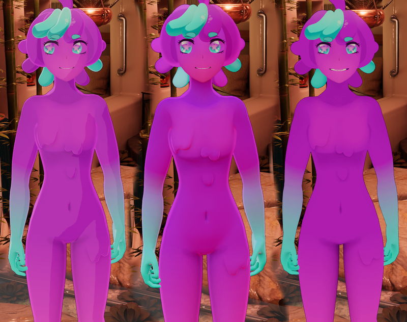
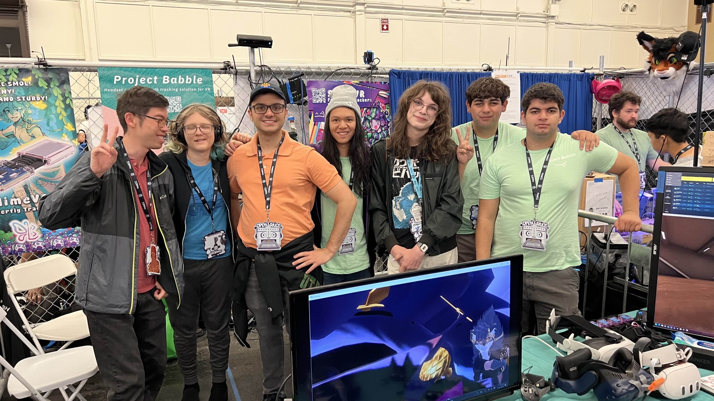
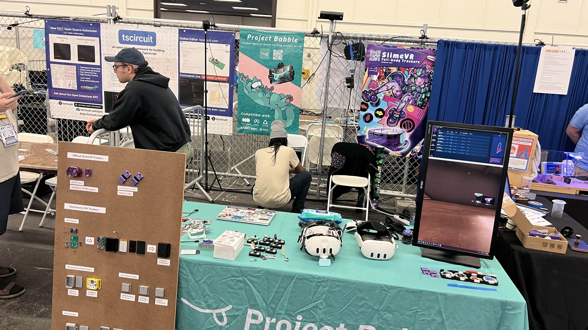
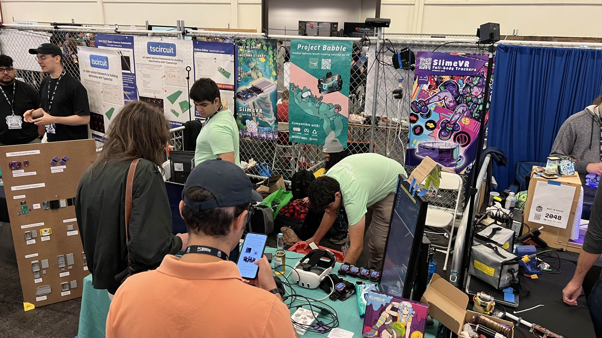
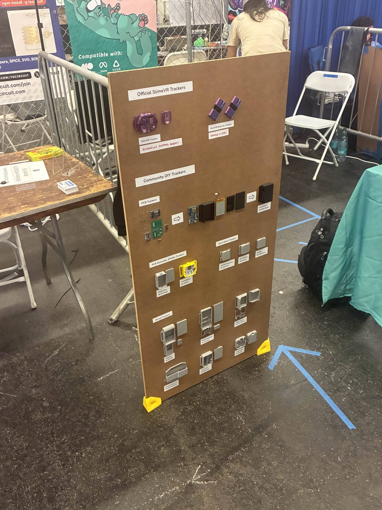
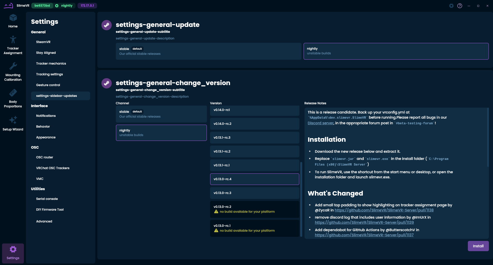
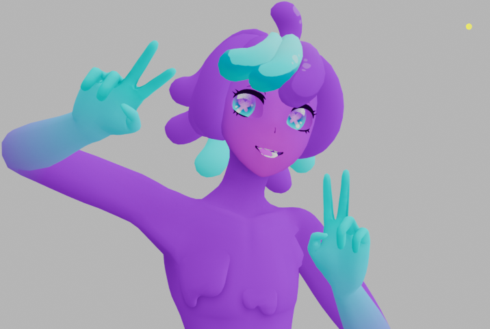
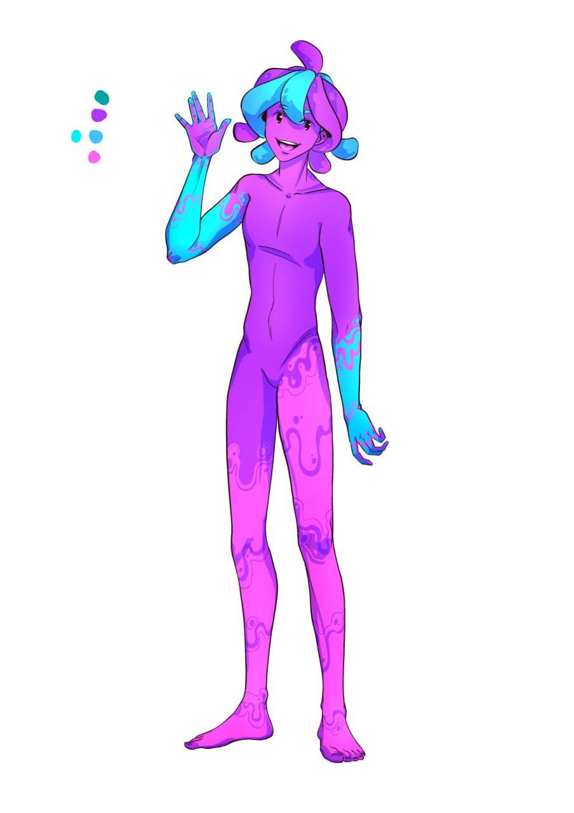

Hi everyone~! It is time for I, **Spazzwan** <:SKC_SpazzwanLogo:1369048981102919742> , to take centre stage as your update host this week... Sit down and relax for this weeks superbly spectacular slime stories, certainly set to stir your spirits... meow~ <:SKC_Nyadestinygun:1195087271494438973>
## Shipment update <:nighty_nom:1314209503276699708>
Nothing new to tell you here, which is actually good news because it means everything is still on track for S14 in late July - early August.
The small set of orders that was oversold by crowdsupply are still being sorted out, so if you have been waiting for your 1.0 or 1.1 slimes and don't have them, Crowdsupply will be in touch so keep an eye on your inbox (and junk folder). <:nighty_cry:1314209498554175578>
## 0.16.0 Release ~ Stay Nyaligned <:nighty_gun:1314209484440338474>
As I am sure you already know, the new server update was freed from the shackles of the <#1093697715763945494> earlier this week, and reception has been sensational. Not only are people reporting ***amazing*** experiences with drift times, but we are also getting barely any reports of issues from updating.
***Huge Slime W!!*** <a:AL_yAcuteDance:921744798422040587>
**0.16.1 RC** (release candidate) is **available for testing** right now, it includes a bunch of teeny tweaks and things we couldnt fit into 0.16.0 in time. (USB serial updates, linux stuff, spelling/grammar stuff, BVH button un-disappeared, etc)
I also made a little collage of people talking about Stay Aligned in discord, and a little video of **how to set it up**, which includes some of the Art by Flarchik that will be added in soon™ to replace the placeholder ones! see below:

