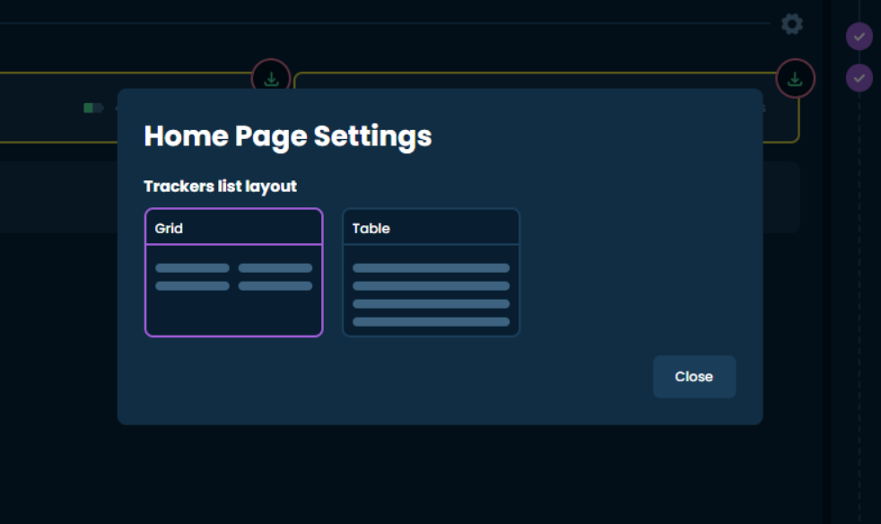
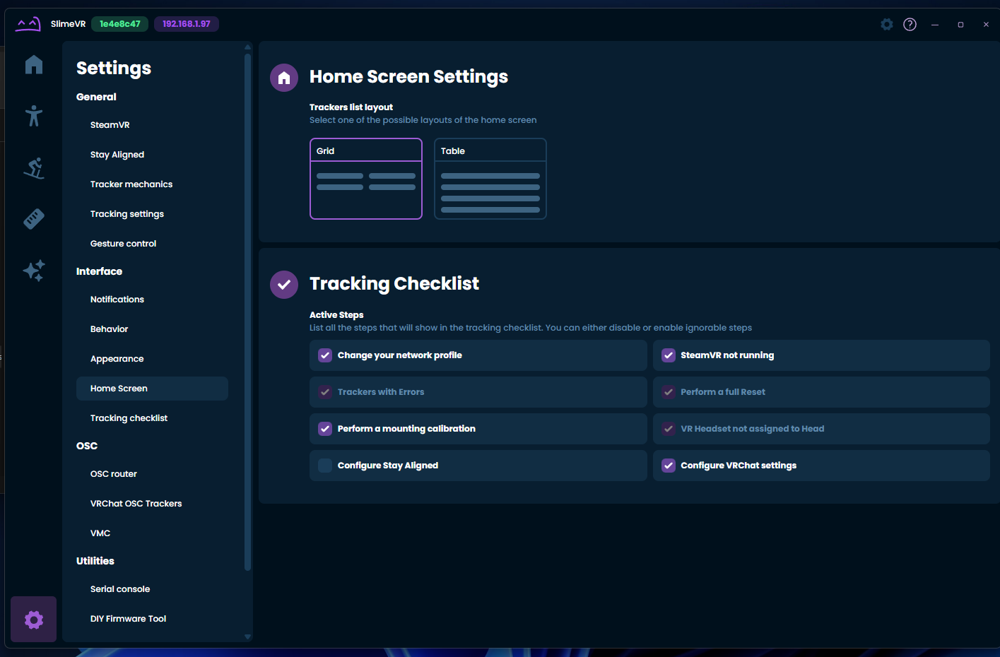
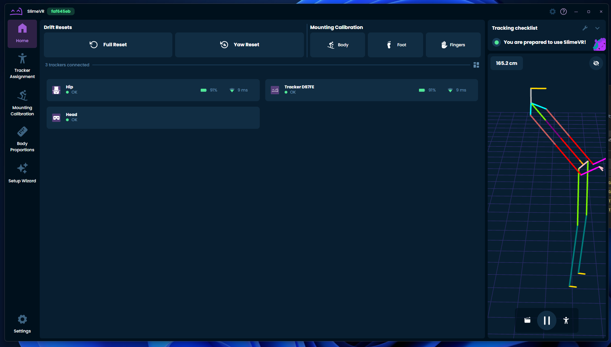
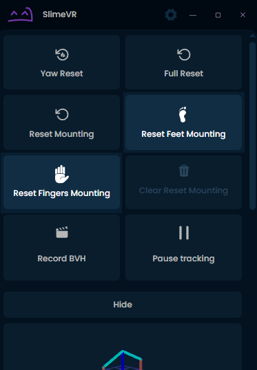
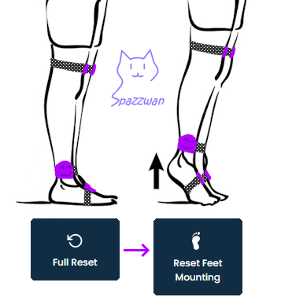
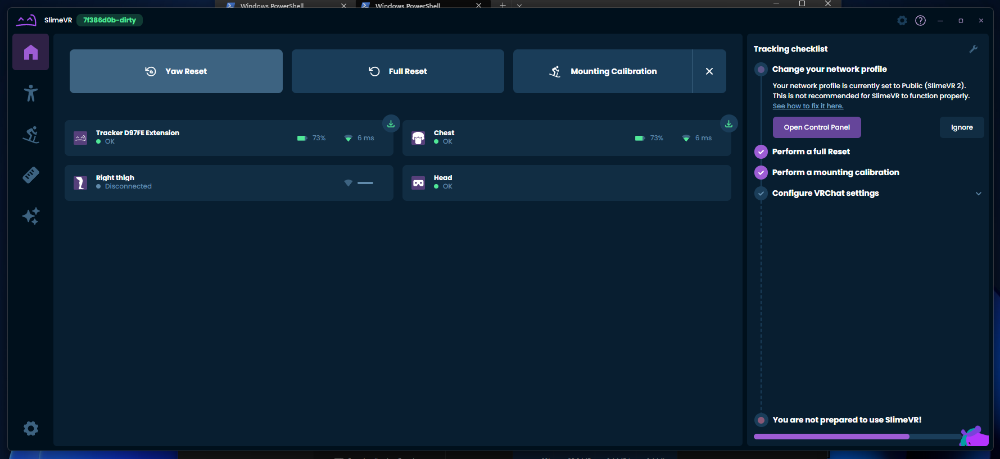
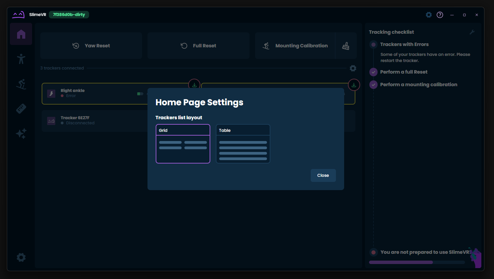

Hiyo slime gang~! It's me again, Spazzwan <:SKC_SpazzSlime:1318179225483874314>, back again by *unpopular* demand to bring you the latest slice of SlimeVR news cake, fresh out of the oven. Eat up~! Nom nom nom <a:CB_nomcake:594182325047394334>
## Shipment update <:nighty_nom:1314209503276699708>
Our team and partners are hard at work on Shipment 14 to get the next big bunch of slimes to you ASAP. The bulk of the trackers are in the process of being assembled at our partner assembly company, Chain, while some of the more specialist sets are being processed at The Cave. Whats that mean for you? Not much new, but it means everything is moving along nicely and **we are still on track** for the good stuff happening between late July and early August. Keep an eye on https://discord.com/channels/817184208525983775/1129107343058153623 for shipment stats if you are into that kind of thing. If you see "shipping August XX" you are in Shipment 14.
## Butterfly news<a:rr_bluebutterfly:808265086887657537>
*Did someone say smol?* No.. but in related tiny news the Butterfly prototyping is still full steam ahead, with the team managing to squeeze out another 0.7mm from the thickness of the trackers~! **Thats around 10% thinner**!!
Butterfly prototype 8 PCB's arrived, and enough of them this time to do some really thorough testing in real world scenarios. Big news as each new iteration improves and refines on the last one. It might not seem that exciting but its a huge hurdle to getting the product finalised so we can start working on cool accessories and ultimately getting them onto your wigglers. Pics below~!
Also we have had the night-owls complaining that Butterflies don't usually come out at night, so stay tuned for the late-night buzz the nocturnal slimes are sure to vibe with... *wink wink* <:moth:1395391150201901188>

## Cave News <:nighty_data:1314209491365007360>
Holy moly this place is huge (thank you for the tour, Polymoria). Most of the team is settling in nicely to the new environment, especially now there isnt someone crawling around in the roof... <a:CB_baguette:580789758490312704> <a:aedgy_sparkles:739764219880407110> I have added a little flythrough for you to appreciate its immensity, too <3 (getting the action cam on the butterfly was quite a monumental task <a:haj_sweat:850897889806909490>).
Warranty backlogs have also been cleared (as of last Friday), so if you have been waiting for something check your emails for a tracking number! The team has been working full speed to get them all done up to date.
## Discord Server Tag <:nighty_hug:1314209493747241011>
We have decided to make a poll for the SlimeVR Discord server tag. We discussed at length internally, and arrived at the conclusion that the little water drop coloured purple was the best fit for the icon, but we want the Slime Gang (thats you!) to decide on the text. Poll will be up today or tomorrow <3

## Butterfly SlimeVR Trackers <a:s_pinkButterfly:819624405549711401>
The hardware team is still full steam ahead with the designs of the Butterfly SlimeVR trackers. The main focus right now is on prototyping and rigorously testing a few different variations on the charging interface, as well as optimizing the layout and parts to make them impressively teemny (they are currently on the 8th iteration).
Keep your eyes peeled and be sure to [follow the campaign](https://www.crowdsupply.com/slimevr/slimevr-butterfly-trackers) if you havnt... its very exciting stuff. I'm personally very excited for the human-centric design the team is cooking up, and I'm really looking forward to seeing all the awesome ideas the team is brainstorming get into peoples hands.
## Art and Other <:nighty_art:1314209500709781524>
The team has lots of fun stuff cooking in the background that might tickle the interests of those of you whom are artistically inclined.
First up, we have a model being made of Nighty (the cute purple mascot you see everywhere) to make setting up slimes a little easier. It's gonna have all the bells and whistles and is actively being worked on. See some concept pics below.
Also, work on the Nighty plushie is slowly being done, but we are currently held up with some minor stitching details on their tendrils. Hopefully this can pick up once that is ironed out by the manufacturer. **Thank you so much for your input** on the colours the other week, was great to see everyones thoughs and how close all the votes were! <a:AL_yAheartRainbow:719889155236167700>
Finally, welcome Daniel and Natasha to the sticker club, and also Smeltie but they already had one so... welcome again I guess haha.

