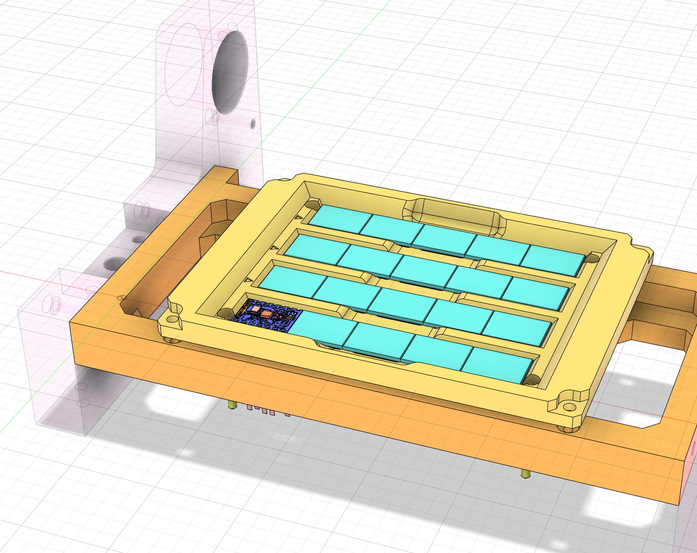
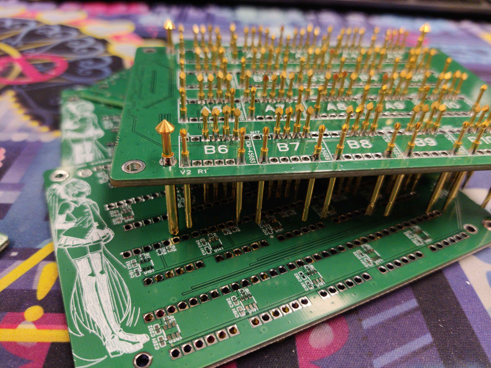
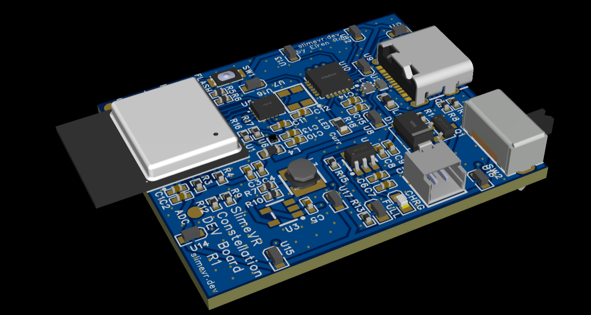
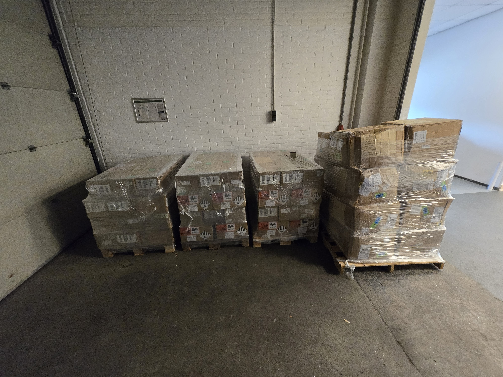
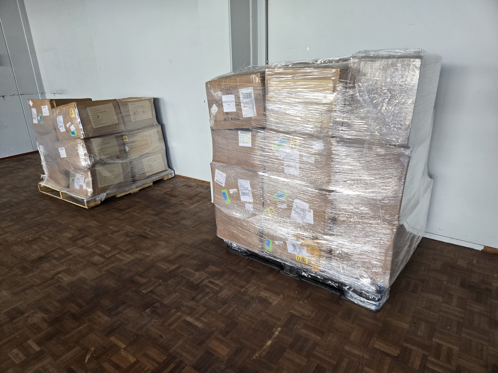
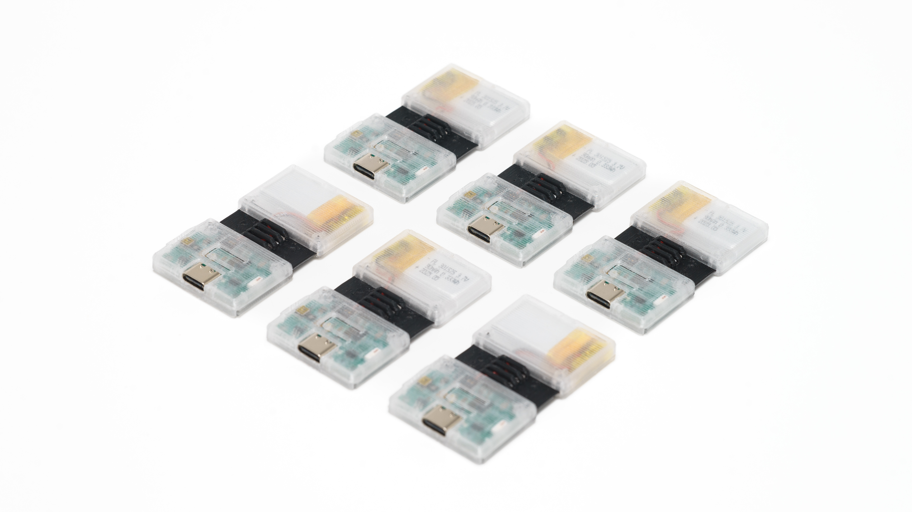

## Server GUI refresh <:nighty_hug:1314209493747241011>
Everyone loves lists, right? Well, last update I touched on a lot of the big things in the pipe being diligently crafted by our gooey team, but I was fairly vague on this cool feature that I can now show you: **A checklist**! Quest log? *Takeoff list*? We haven't agreed to what its called, but its absolutely set to make getting in to VR without missing a beat a lot smoother for both first time slimes and even seasoned pros.
The design principal is to ensure users go through all the necessary steps without getting blasted with warnings (which to be honest, most people don't read). It runs your through stuff to set up slimevr, as well as the things you need to do every session--like full reset and mounting reset. Stuff you already did will get auto-skipped, too, so it wont pester you with tedious things every time. Very simple and **very** sleek~! Check out the pictures and video below for a sneak peek.
## Rapid Roundup <:nighty_art:1314209500709781524>
So much stuff to talk about so I'm just gonna quickfire some cool stuff that's happening with SlimeVR to keep this succinct:
* Maya has been working furiously to craft a super spiffy **contributor page** to show off the team and help you connect with them. Preview below.
* Progress on the first Nighty model is going amazingly, currently work is being done **choosing the perfect shader** and adding in **full face tracking** (UE faceshapes) for you to make silly faces with to test your face tracking. Work in progress preview below
* Speaking of face tracking, talks are underway with the Babble team for slimes to produce ~~home~~***slime*grown official Babble face trackers**. More on this soon.
* Lastly, a **big hug and friendly kiss to all you amazing peeps who have sent in their BVH recordings for the spinny**. It really helps us get a wide variety of data <3
*Thank you for reading to the end, hope you all have a lovely week and weekend. Till next time~! <3*

