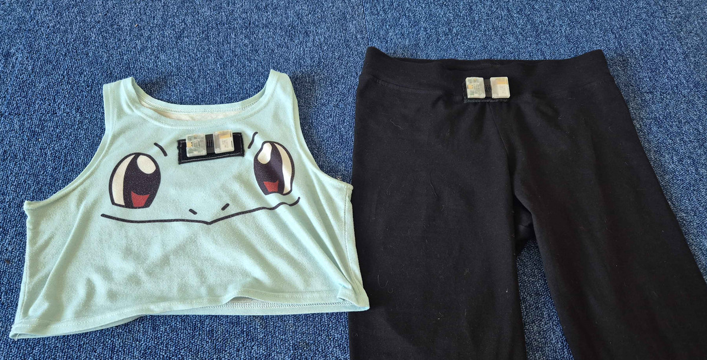
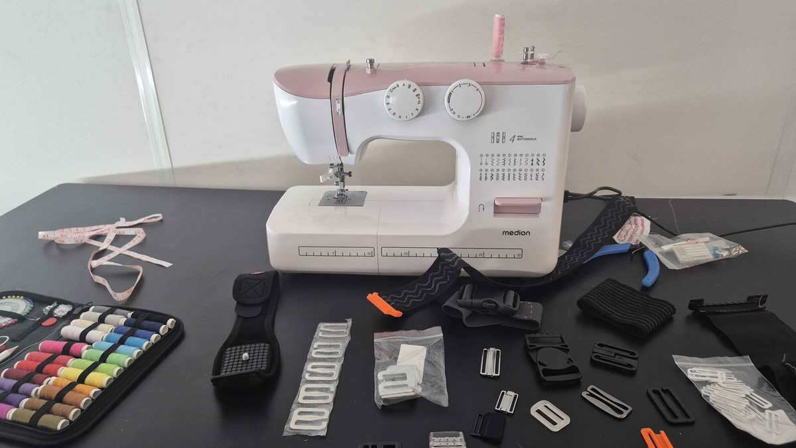
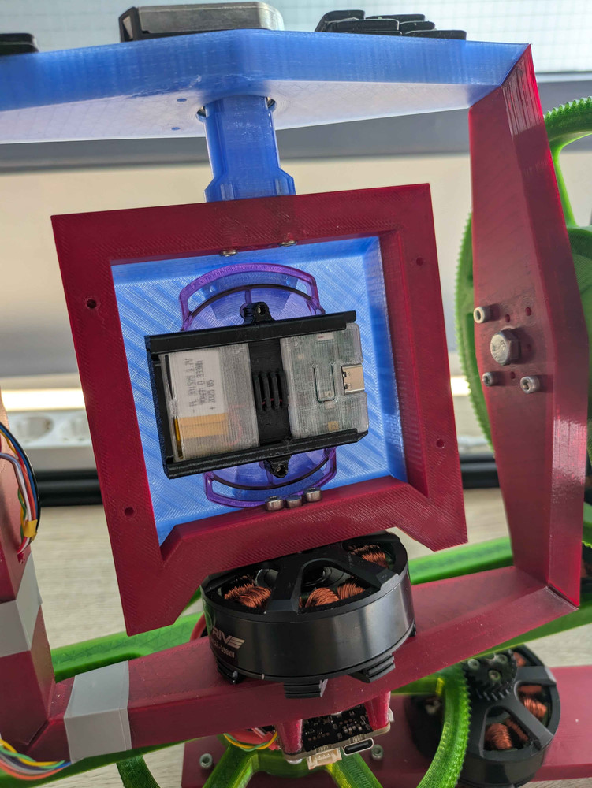
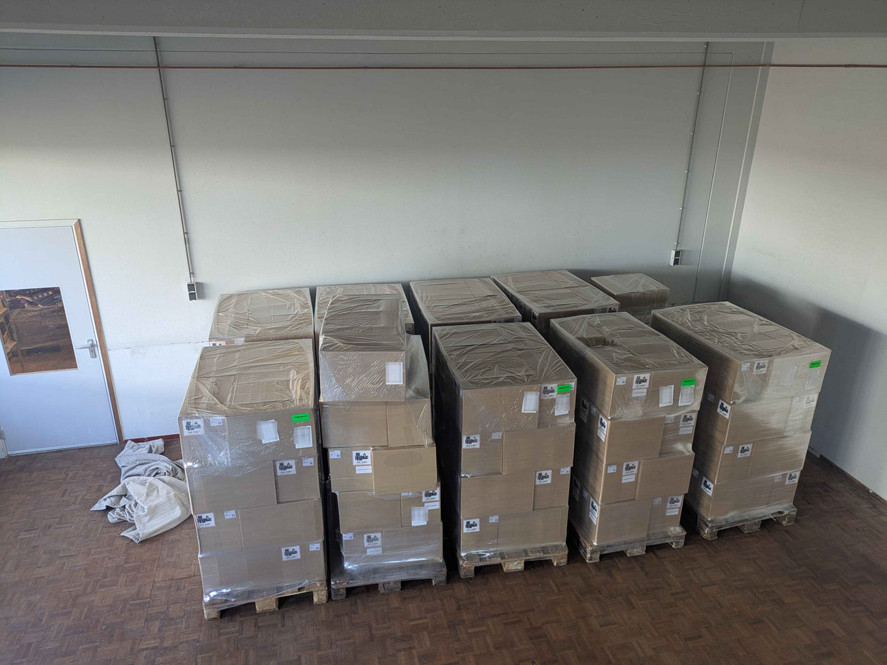
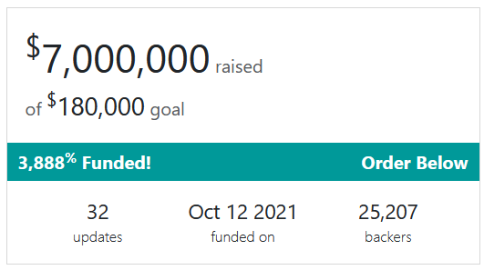

## Rapidfire Report <:nighty_gun:1314209484440338474>
* We are working on a development roadmap designed for you guys to stay informed on whats being made/worked on. The aim of this is to ensure information on stuff we are working on a lot more digestible (not literally, dont eat it!!) and accessible. But also cool, obviously.
* The cave dwellers are hard at work experimenting with optional, but very unique and creative, methods of wearing butterfly SlimeVR trackers. **Stick-on** Slimes<:hot_glue:1022176256843849768>! Clip-on! Slap-on? Slime Socks <:rainbowsocks:969829326872784918>! Ill get pic examples of these once they are more baked, but theres some really cool ideas already. Im personally very excited about this, I think the mocap peeps will love this stuff.
* "Fix your course to a star and you can navigate through any storm".... Im not sure Leonardo Da Vinci was talking about SlimeVR, but we are also cooking up a tracker solution that involves LED constellations for tracking. More info on this soon.
* The Gooey Gang is still hard at work GUI'ing. Currently they are making, testing, and iterating on various different layouts to see what works best in practice while still looking spiffy.
*Thats it for this week. Thank you for reading to the end, hope you all have a lovely week and weekend. See you space cowthings~! <3*

## Server Update 0.16.2 <:nighty_data:1314209491365007360>
Big news for fans of feet wiggling, as 0.16.2 is now out after a brief rollercoaster of code highs and lows. What was meant to be an exciting launch for 0.16.1 turned into a disaster, as we had some wild animals <:fox_uwu:1204220012189982730> get into the code at the last second just before release, resulting in what was meant to be an awesome new feature slipping in without proper testing. Mistakes happen. Luckily its all fixed now with 0.16.2.
### Whats changed?
* **New foot mounting options**
You can now **automatically set up your foot extensions/trackers by pressing the "Reset Feet mounting" while lifting your heels**. This could be standing up, sitting on a chair, or kneeling... just keep ur heels up while the reset happens (and as usual, feet 10cm apart and parallel).
For fans of the hard-mode ski pose, you will be delighted to know that the old "tip toe while ski-posing" has also returned. Now called "Force feet mounting reset" in the options, you can turn this on to have your feet reset the way you are used to during the ski pose. I don't have the balance for this but I'm glad people have the option~!
* **Staggered Firmware updates**
We have changed how firmware updates are served. Instead of opening the floodgates we will now trickle out new firmware to users. This means more stable upgrades and less messy updates.
* **Lots of bug fixes, spelling/grammar fixes, and linux support stuff**
A huge list of tiny issues have been ironed out in these releases, pretty self-explanatory. If you like grammar or linux (im guessing there is a big crossover here), you will be happy.
* **Finger mounting reset**
This is one I asked for fufufu. Finger resets are here for those working on gloves. Full reset -> open hand, Reset finger -> fist. Ezpz
Go get it!! https://slimevr.dev/#download

