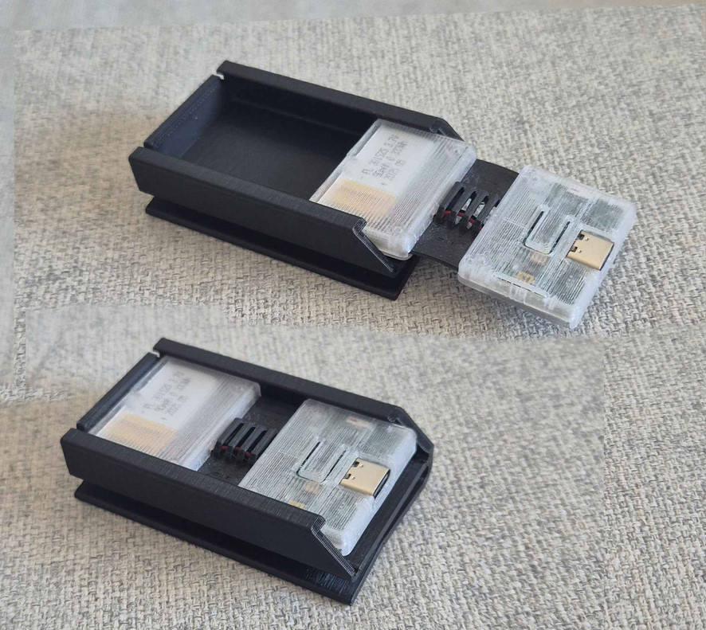

I also love Spazz's yapping, , but today it's me, Eiren (Hina) again <:firPog:785701297478959104>
## Price Increase
First of all, thank you everyone for your kind words and reception of yesterday's announcement. We're working some stuff out with UPS itself to help us lower the tariffs, but regardless there will be some price increase. So if you want your slimes at the current price... I hate to do that, but a lot of Shipment 14 sets are still available. See https://discord.com/channels/817184208525983775/1129107343058153623/1395061880074014762 for how many sets we still have, and scroll up to https://discord.com/channels/817184208525983775/818062236492759050/1403401277748019210 if you missed what's going on <:nighty_heart:1314209486390427659>

## What Else?
That's not all, of course. Besides new things, most of the people are also working on current things, such as:
* Constant improvements to our Server software with many new features: new and better UX, easy setup of trackers, better tracking, new anti-drift algorithms, new features, new supported software and hardware
* Improvements to hardware. Like two new iterations of SlimeVR Trackers hardware, including support for new IMUs.
* Fulfillment, logistics and assembly. All the things that are required for Slimes to get into hands of our customers. Sourcing parts, talking with suppliers and manufacturers, doing paperwork, sending things in correct places, packing, assembly, testing.
* Support. We pride ourselves on always being on the customer's side. We try to help with setup, with technical difficulties, and with warranties. This takes time, human effort, and money for shipping and replacing broken items.
* Community development. From organizing online and IRL events to banning spammers and scammers, writing updates and engaging with you all daily. Our community is the most important part of SlimeVR and we're trying our best to care for it.
* Marketing. VRChat advertising, web site development, new photos, Crowd Supply updates, an many more things that help us keep the lights on and Monster Energy in the fridge.
## Are There Other Ways To Help?
If you want to directly send us money, it can be done through [GitHub Sponsorship](https://github.com/sponsors/SlimeVR). Right now you don't get any perks for this, only our heartfelt thank you. In the near future, you will be listed on the team page on our site. But you will know that you help making VR more open and fair <3
Otherwise, spread the word! Or get yourself a set of Slimes!
## Thank You
Thank you for listening to my rambling. We're so... <:nighty_heart:1314209486390427659><:nighty_heart:1314209486390427659><:nighty_heart:1314209486390427659><:nighty_heart:1314209486390427659> Just... sfwefhweyhfoiweurhnf thank you. Your support means a lot to us as founders, and to the whole team, and to contributors, and to the community. Every day we're thankful to all of you 😭
Again, **if you want to secure the old price, please preorder slimes at https://slimevr.dev/buy.** If you see August on your order, that means you're in Shipment 14 and your order will be with you before summer ends.
See ya tomorrow with other news! <:nighty_heart:1314209486390427659>
## Can We Ditch Mouser?
Short answer is no. Mouser not only provides fulfillment services to us, but they also help us making very big orders from our suppliers, which lets us use economy of scale to keep the price as low as we can. They place a huge order with us, we order production, and then they sell preorders from this order. They are basically providing us with a big loan to operate. Replacing Mouser with anything else, like a bank loan, or an investment, will increase our costs, so won't save us money, but will increase our headaches. So far, it's a good deal. In addition, 68% of our customers are from the USA, so for most of them nothing would've changed anyway.
That said, we're trying to work with them to make fulfillment from Europe possible. That might happen eventually, especially with all the new global trade pressures, but it's still work in progress, and a huge company like Mouser moves very slowly.
## What's Cooking?
So what are all these people doing, what do we spend the money on? Here are some of the projects in *active development*:
* You've all heard about **[Butterfly Slimes](https://slimevr.dev/smol)**, please subscribe on the page, it's very important for us! They're coming along nicely, and we hope to start the crowdfunding campaign in late September. We're making them better every day, with new firmware, software, improved hardware, and improving accessories. We're on 8th hardware revision right now. *More tomorrow!*
* **Moth Slimes**! They flatter their wings and you can feel touch! We're working on haptics system for VR that will be more capable than anything currently available, while being affordable, modular and DIY-friendly. We're at the early prototyping stage, but most of the challenge will be in the software.
* **Constellation Tracking**. Infrared tracking with camera base stations, combined with IMUs. Close to what Quest CV1 was doing, but we have a bunch of cool ideas that will make them perform on part with SteamVR base stations, while being cheaper and easier to use. First prototypes are in production right now. Stay tuned, this is very exciting.
* **VR Glove**! A holly grail of dead VR hardware companies. There are a lot of technologies, and the server supports it, but it's a challenging product to make good, so we're not in a rush. We have a few prototype boards, but we don't have spare resources to push it forward.
* **SLAM tracking**. Inside-out camera tracking! A holy grail of standalone VR headsets that no one can make right. Very complicated and no good open-source solution exists. We've put a bunch of time into it, but we're close to abandoning it in favor of Constellation Tracking.
* **Fully Open-Source VR Headset**? The end goal, the ultimate VR achievement. Unobtanium with our current resources and technologies. But maybe when we're done with the tracking part, we will have one piece of the puzzle.
Honestly, we'd love to have a team twice as big to make all of this happen, but I guess what we have will have to do for now.

