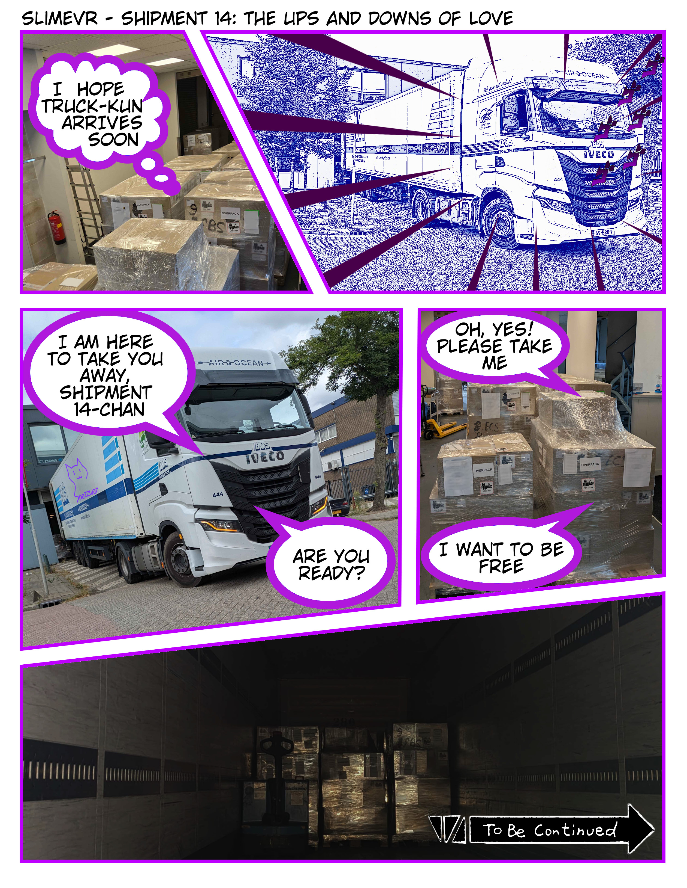
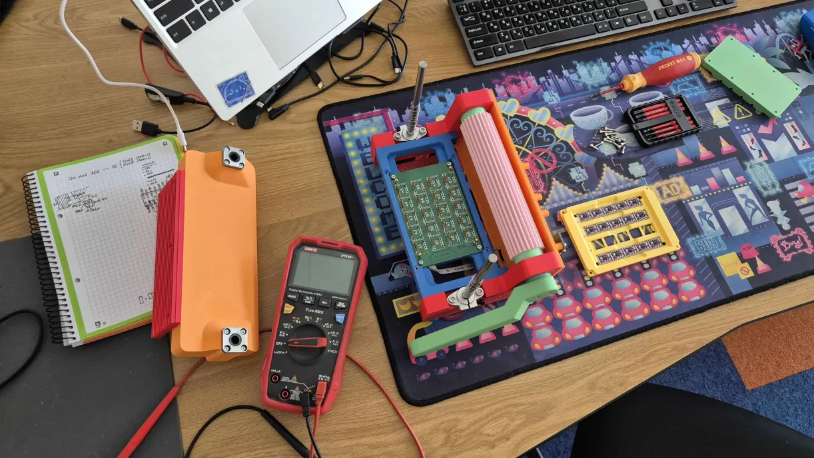
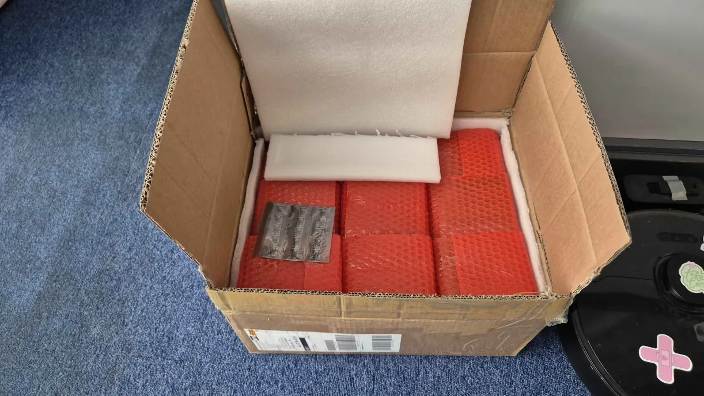
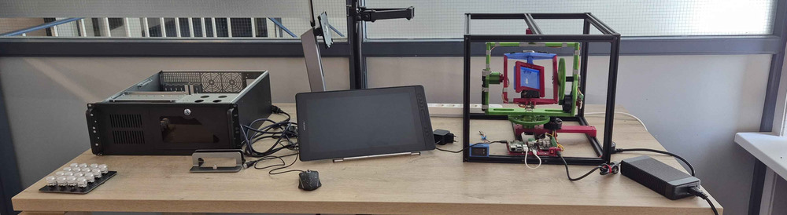
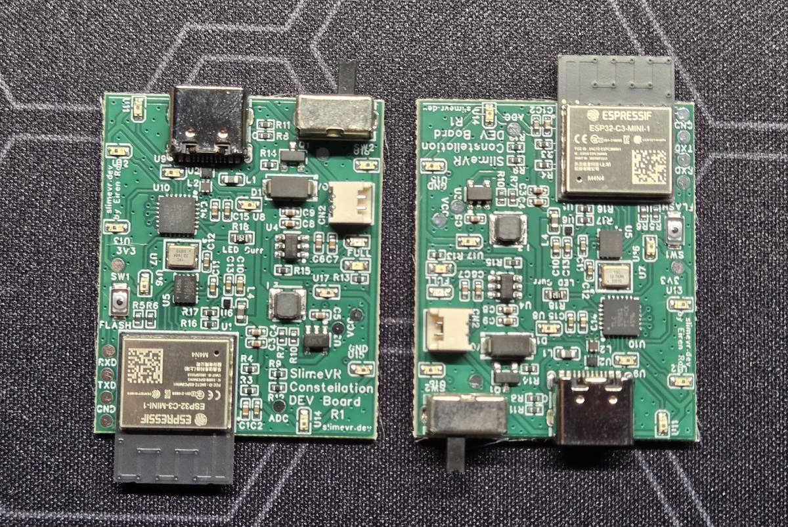
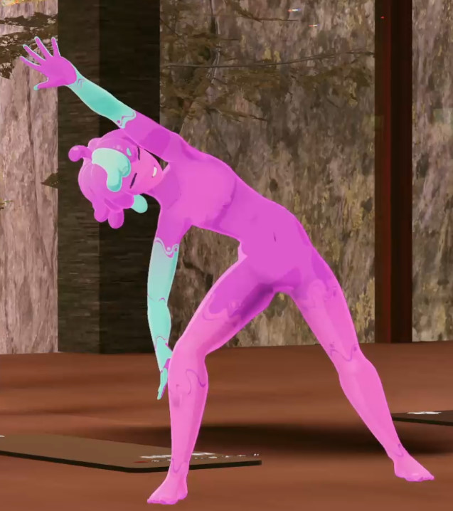

Hiyo slime gang~! Spazzwan<:SKC_SpazzwanLogo:1369048981102919742> the professional yapper is back with another cool update lovingly crafted just for you. Yes you, {USERNAME}. So sit back, relax, and chill!
-# You thought you escaped me, but *I always come back* <3
## Shipment update <:nighty_nom:1314209503276699708>
### Shipment 14
GOOD NEWS: S14 has finally (mostly) arrived in the cave. Everything but the 700ish Full-body sets still being assembled by chain (and 60 Deluxe sets) are stacked up and ready to send to Crowdsupply. Once tariff negotiations with UPS are finished and the rest of the trackers arrive, they will be catapulted towards the land of freedom at maximum velocity, so expect an update in the coming days with a shipment tracking number to stare at for a week or so (takes around 8-12 days to arrive and get through customs).
TL;DR: We are on track for shipping S14 to USA mid next week. This means that crowdsupply will receive shipment 14 late august. After processing (1ish weeks) they will be sent express (1-3 days worldwide, is crazy fast) and you will find a cute little slime box on your doorstop inside a less cute other box with the shipping label on it.
Still TL;DR: You and slimes will kiss in 2-4 weeks.
Show me in emoji: <:LambPoint:1015733610013278301>➕<:slimeBlep:892960080348217374>🟰⏲️🔜<:m_number_2:894804463557173268>➖<:m_number_4:894804467550130237>🗓️➗4️⃣
### Shipment 15
S15 had a minor hiccup that shouldn't affect the timing, but gave us a little heart attack. We were notified the incredibly expensive chunk of metal we use to make the cases had an issue, but it turned out to be very minor and will be fixed ASAP. It only set case production back 1 week, but I think that news took more from our lifespan <a:haj_sweat:850897889806909490>
As usual, this can change so keep an eye on weekly updates here, and <#1129107343058153623> for specific shipment info.

## Mumo ICM-45686 Breakout boards
Some of you have been really missing Meia's ICM breakouts, and now we're happy to announce that they're coming back! Since Meia is now working full-time for SlimeVR, we're taking over her modules and they will be sold on <https://shop.slimevr.dev> soon! We already received more than 3000 of them, and finishing the tester to make sure that every board that leaves our warehouse works as intended <:nighty_heart:1314209486390427659> We'll try to get them in stock by the end of the next week, and restock some other items in our store.
## <3
That's it for now <:nighty_heart:1314209486390427659> We'll be back next week with someone else again! Probably Spazz <:Laugh:863878108130050078> Though there have been other slimes that wanted in on the fun of weekly yapping!
See ya, and thanks again for all your support <:nighty_heart:1314209486390427659>

## Constellation Tracking!
Yesterday I blew the lid that we've started working on Constellation Tracking - IR tracking with cameras and IMUs that, if we manage to pull it off, should combine everything that's good about IMU tracking and base stations tracking for fraction of the cost of SteamVR base stations and Vives, and with all good things about SlimeVR like easy setup with Quest.
There is a lot of work to be done, we have just stared, and I don't want to share everything cool we want to do, because we need to have some proof of concepts first, and because there are at least two different things we'd want to try. But! First development board is already on the way from China <:slimepcbnom:839133114931347486> It's basically a big slime with ICM-45686, ESP32-C3 and 10 individually-addressable IR LEDs. Hope it's a powerful enough platform to do some R&D. We don't know yet the size of the tracker we need to have, or how many LEDs it might need, or how much power it will draw. Or when it will happen... But we're very hyped about it <:nighty_yay:1319261631217143910>

## Shipment 14 News
Chain Assembly told us that they will be done next Thursday (August 14th). That's way later than we were hoping (August 1st), so I'm not sure when it will get in your hands. I don't think UPS will be able to pick it up before 18th, and then they usually take ~10 days to get to Mouser <:nighty_flop:1314209488429121556> Still hope for end of August delivery?
We asked Chain to ship what they have (everything except half of FBS sets) ASAP, so I hope they ship what they have on Tuesday and we will prepare all the paperwork and can ship everything to Mouser on Friday <:firBless:785674502243090492> Tight schedule, but worth a try.
## Shipment 15
We got batteries and straps for S15! And also USB cables, boxes, extension enclosures. Extension cables are on the way, main tracker enclosures are in production, PCBs are in production. Everything will arrive by the end of the month, it seems, and will go into assembly in September. S15 is set to be way smoother sailing than S14 or shipments before it, even though it will be the biggest.
Speaking of straps, the new straps are a tiny bit better - we reduced the length of the nylon hook part, which makes longer straps way easier to handle. Obvious solution to an obvious problem, should've done it right away, honestly! <:transportbelt:875150947532279828><:transportbelt:875150947532279828><:transportbelt:875150947532279828><:transportbelt:875150947532279828>

## Butterfly News! 🦋
Revision 8 testing is going well, the hardware works great, and firmware is catching up too. We had a few VRChat sessions in them, and everything seems to be good. At the moment we're working on the charger, and we might redo USB port and shave 2 more millimeters of width from each wing. How smol can it get? As small as reasonable, Pareto's principle and all that.
We're also back to work on accessories, like straps, clips, socks, and such. We'd love to launch them at the same time as butterfly campaign, so we gotta hurry with sampling and iterating <:nya_a:847203539352551544> Lot's of work, but for now [subscribe to the crowdfunding page](<https://slimevr.dev/smol>) 🦋

