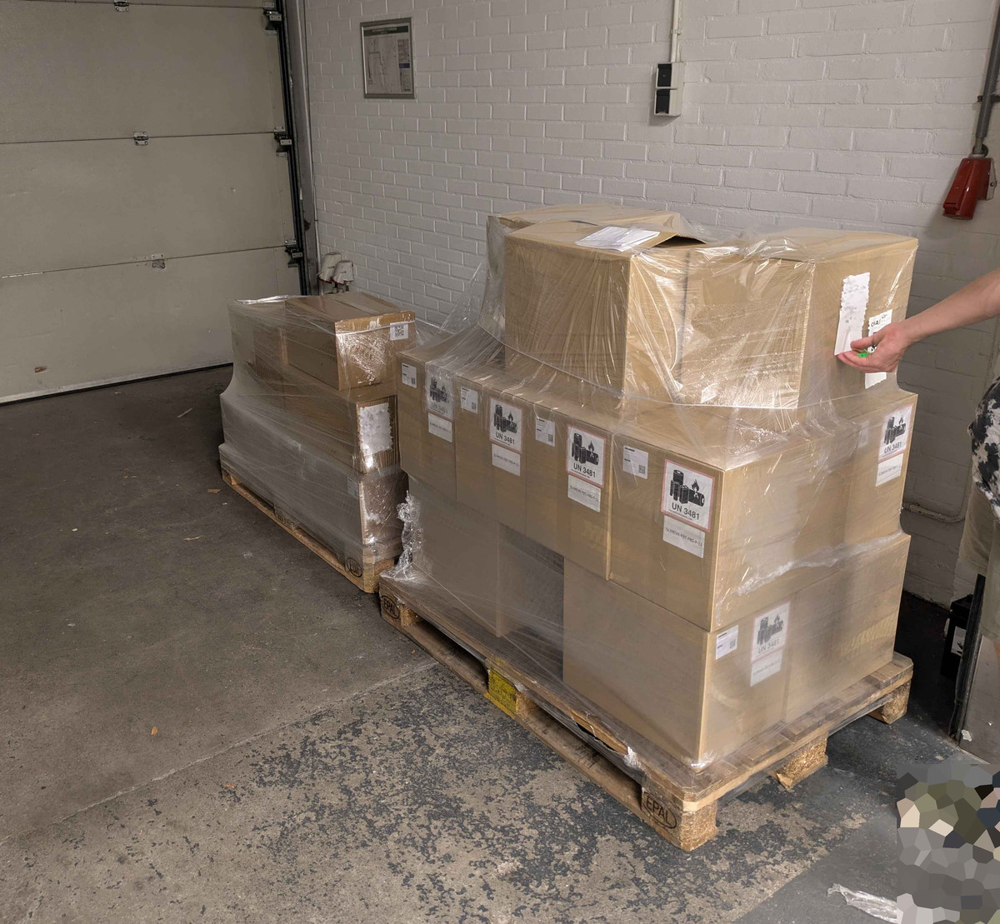
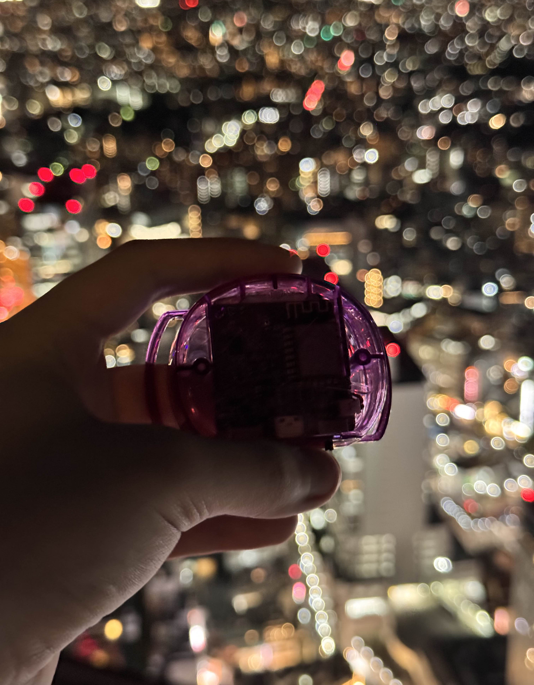

## Rapid Roundup <:nighty_art:1314209500709781524>
Ready yourself for a barrage of small SlimeVR news nibbles to nom on:
* Our second sheet of contributor stickers has finally been filled up, and we are ordering a LOT of them. They will be included in shipment 15 onwards, and I'm sure available in the store at some point. Very good news for sticker enjoyers (altho my slime isnt on that sheet <:SKC_SpazzSlime:1318179225483874314>).
* With the aide of Jabberocky and Uriel, Butterscotch has been hard at work digging through the code to stomp a mysterious **feet IK rotation bug** that was causing feet to snap left and right when close to the ground in VRChat in very specific circumstances. This has plagued our server for a while, so well done gang! Expect this in 0.16.3 soon™
* We have begun work on our proof of concept for haptics. Once it's complete, we can begin on an official implementation in our software. Having a known hardware stack lets software development tailor the solution specifically for the use-case rather than a generalised solution. Way easier to do and can be expanded upon later (Just like SlimeVR trackers were).
* On butterflies, this week was mostly optimizing our charging station solution, with a heavy focus on durability testing. Very rigorous insertion testing is being done to ensure both the tracker and dock hold up to the rough treatment we expect you slimes to put them through.
* As mentioned yesterday, there are still Core Sets (6+0) and Enhanced Core Sets (6+2) in shipment 14 that are unsold and available. If you order soon there is a good change you will be in shipment 14, so if you hate waiting this is a great opportunity for you to skip the long wait.
*Thats it for this week. Thank you for reading to the end, hope you all have a lovely week and weekend. See you space catgirls~! <3*

