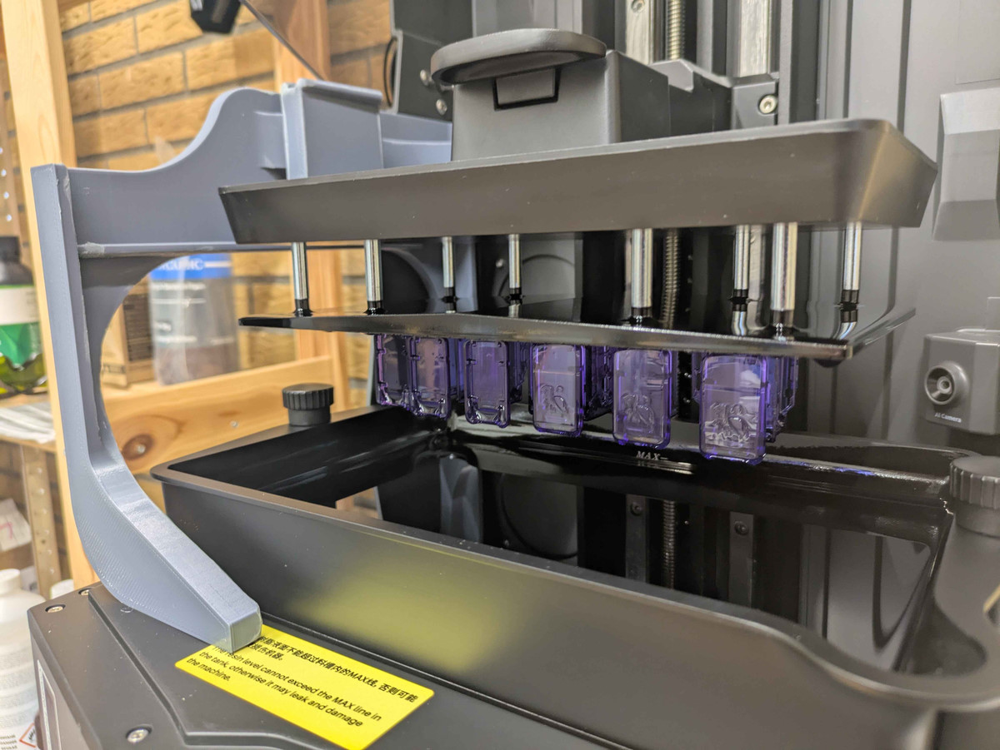
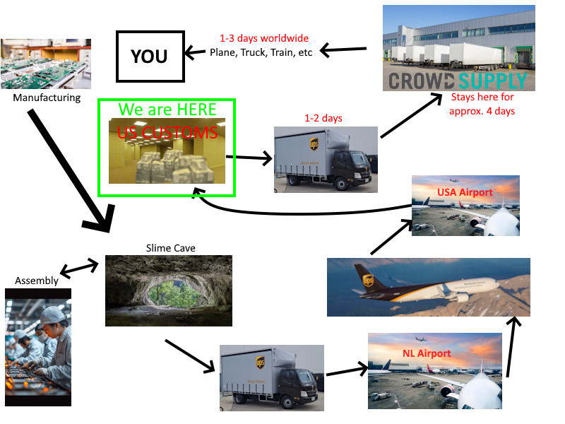

## Rapid Roundup <:nighty_art:1314209500709781524>
Ready yourself for a very tiny cup of SlimeVR news soup to sip:
* Meow meow, meow meow meow. Meow meow meow, meow meow (MEOW).... meow... ||:3||
* Our remote workstation has finally been complete, so we can have nerds from across the world do highly technical work spinning things on the Spinny. SlimeVR employs people from all over the place (like me, token aussie), so stuff like this really helps us make cooler vr tech.
* I started poking at the code.... be scared. I am very slowly working on making finger tracking just a bit more viable with suboptimal setups by attempting to adapt our skeletal constraints system for fingers.
## Feedback
A few weeks ago I asked for feedback, and a grand total of 0 people responded... T_T
Why do we need feedback? There is a huge disconnect between the core devs and the general userbase, so responding to requests like this is one of the best ways to get what you want into slimevr (assuming its feasible).
I have made an anonymous SlimeVR feedback form (link below), so if you can spare 2 minutes please tell us your thoughts on our software; what you like, what you want, what do you dislike. Anything, plx, even if its just to say thank you. It really helps <3
**------>** https://form.jotform.com/252402817442856 **<------**
-# Some examples of things I really want:
-# Custom themes/sounds
-# Add per-tracker toggle to disable mounting reset
-# Ping tracker button to help with diagnosing wifi/firewall
-# Manual serial command input in the serial log window
*Thats it for this week. Thank you for reading to the end, hope you all have a lovely week and weekend. See you space catgirls~! <3*
## SlimeVR Cave Holiday <:nighty_nom:1314209503276699708>
Most of SlimeVRs core cave crew just landed in Japan, the homeland of vocaloids and instant ramen, for a hard-earned vacation as well as maybe a business meeting or two. As such, news around here might slow down a little bit, but this wont slow down any of the shipping so the 5 of you at the back ready about to type an angry letter up, you dont have to worry. Have fun gang, dont get up to too much mischief~!
## SlimeVR Avi Progress <:nighty_hug:1314209493747241011>
The progress on our mascot avatar, Nighty, has been going amazingly. Both ZRock35 and Summer have been running it through its paces, with ZRock doing general avatar testing, while Mr Babble Summer has been testing the face tracking. I have attached demo's below for you to check out. Work should be finalised pretty soon, so hopefully we can get it available for everyone to use. It is scaled to our default skeleton so should be amazing to test tracking with.
## ICM Modules <:slime_wow:1341418344544211045>
The ICM45686 module tested is up and running, and we are testing up a storm to greenlight the giant stack of chips so they are ready for sale. "When" I hear you screaming? I have been told sometime next week, but no promises as im expecting a little longer than that. Keep an eye out if you are after these cuz I get the feeling a lot of people have been waiting for this. When they are available, you will find them on the slimevr store at https://shop.slimevr.dev/

