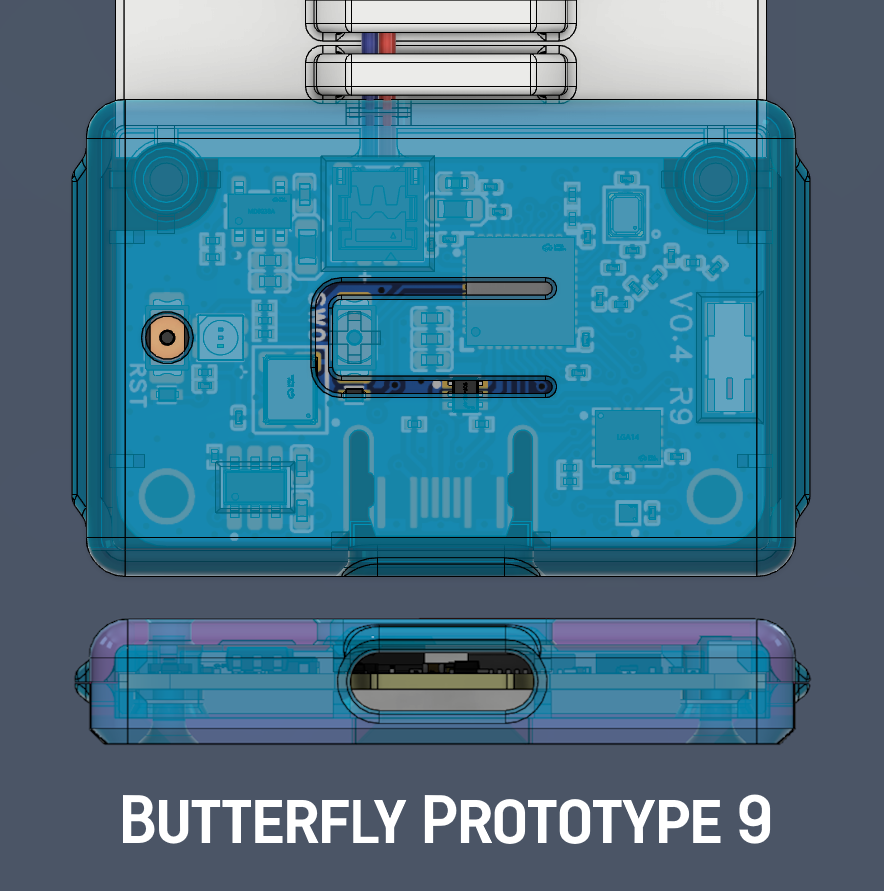
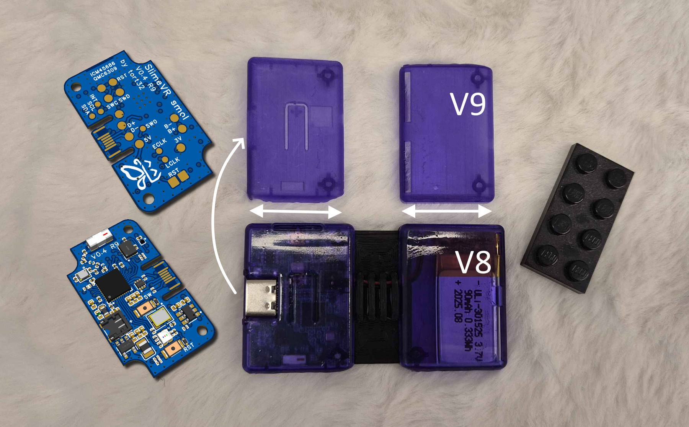
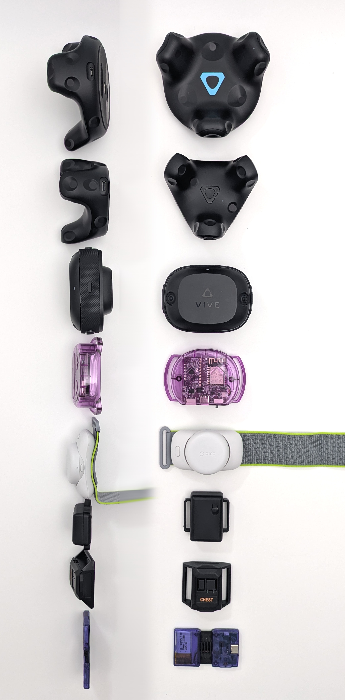

## Rapid Roundup <:nighty_art:1314209500709781524>
Ready yourself for a very tiny plate of SlimeVR news nibblets:
* There is a UI bug in VRChat at the moment that means it is impossible to enable OSCQuery. It has been reported and marked as tracked, but if this affects you please help signal boost it by upvoting here: https://feedback.vrchat.com/bug-reports/p/osc-wrist-and-head-tracking-wont-enable-on-quest
* The Spinny™ has been hard at work spinning.... too much actually. One of our remote operators managed to spin it too hard and broke it. Luckily it was minor and it has been since repaired! We love you, Spinny™ (also for the one person that asked what spinny is in the feedback form, check here: https://discord.com/channels/817184208525983775/1411044983926165636/1411103116807503882)
* Zrock has been putting our new Nighty avatar through its paces, and has made a cute little tutorial on how our new feet tracking reset works. Check it out on our bluesky, here (or below): https://bsky.app/profile/slimevr.dev/post/3ly2iysys2k23
## Feedback <:nighty_heart:1314209486390427659>
A giant and genuine <a:CB_hearts:585549869046038539>THANK YOU<a:CB_hearts:585549869046038539> to everyone who has submitted feedback so far. There was some really good stuff in there and LOTS of love for what we already have. It has been so nice to read through all the positive stuff, as well as the constructive feedback that has been submitted.
I will leave the form open for 1 more week, so if you havnt responded and want to then follow the link below. Next update, I'll collate the feedback into a little picture of what people said (anonymous, dw).
**------>** https://form.jotform.com/252402817442856 **<------**
*That's it for this week. Thank you for reading to the end, hope you all have a lovely week and weekend. See you space slimethings~! <3*
## Butterfly Launch 🦋
So some minor bad news, the expected launch of 31st of August was pushed back for a whole bunch of reasons. We are sorry to those who were eagerly expecting it, but we want to make sure the launch is perfect. This means the campaign start will be pushed back to a later date. I dont think this will affect the shipping date, and I am not sure when exactly the campaign will start, but as usual I will give you the info when I know it. For now, follow on crowdsupply so you are emailed the moment it happens: https://SlimeVR.dev/smol
The good news is the next version of the prototype board, R9, has been ordered and should arrive in the cave soon. Full pics in the next updates, for now check out the prototype cases below~!
## ICM Modules <:slime_wow:1341418344544211045>
The ICM45686 breakout.... **IS NOW AVAILABLE~!** DIY peeps: Order now, party later. So far we have sold 113/6000 and counting...
They are available on the slimevr store at https://shop.slimevr.dev/products/slimevr-mumo-breakout-module-v1-icm-45686-qmc6309?1
(Still can't ship to the USA though, sorry...)
For those of you confused by what this means, this breakout is the tracking part of slimevr trackers called the IMU, and each tracker has one. This IMU is the one official trackers use, and people have been waiting quite a while to get their beans on them.
## Constellation Trackers <:nighty_hug:1314209493747241011>
Work on our Constellation trackers is slowly progressing. After a few weeks of begging Summer for a video demo, I finally have something cool to show~! Check it out below <3
And more good news, the official dev boards I posted pics of last week have been sent out to the devs working on constellation. Hopefully having the official prototype boards on hand will help get this from the concept to a working demo. Stay tuned for more on this soon, I hope!
Just to re-state this, this is a currently a conceptual design and not a product.. yet. But I love showing the progress <3

