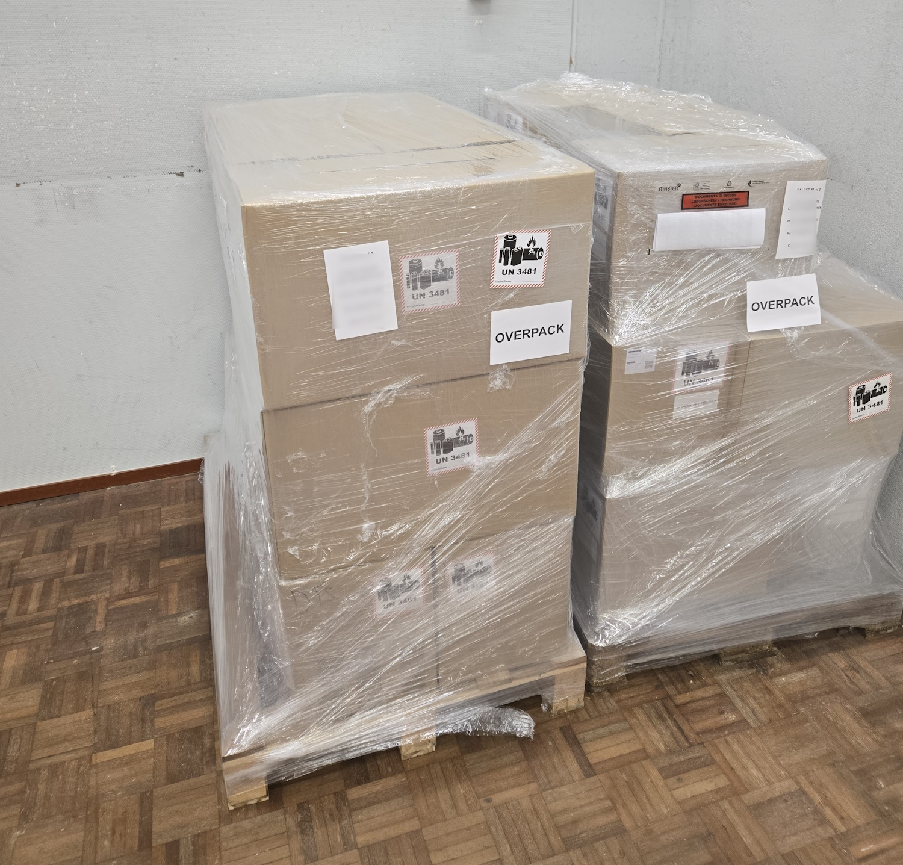
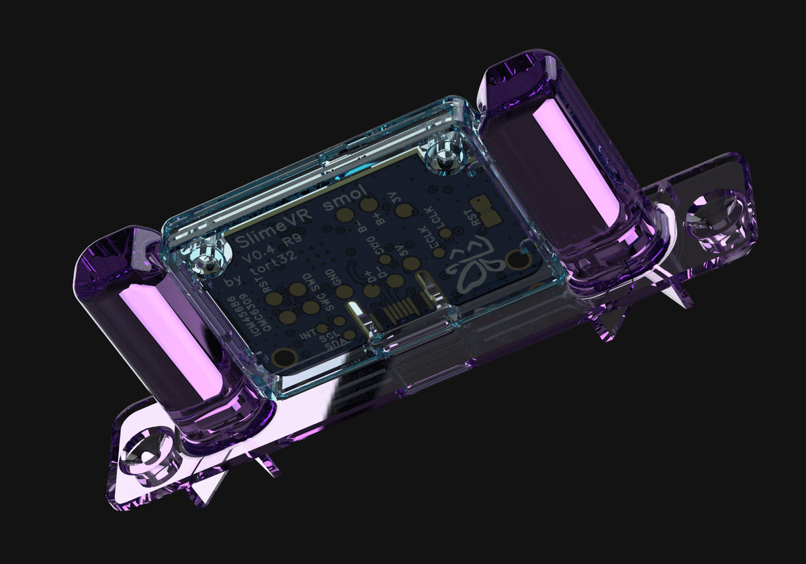
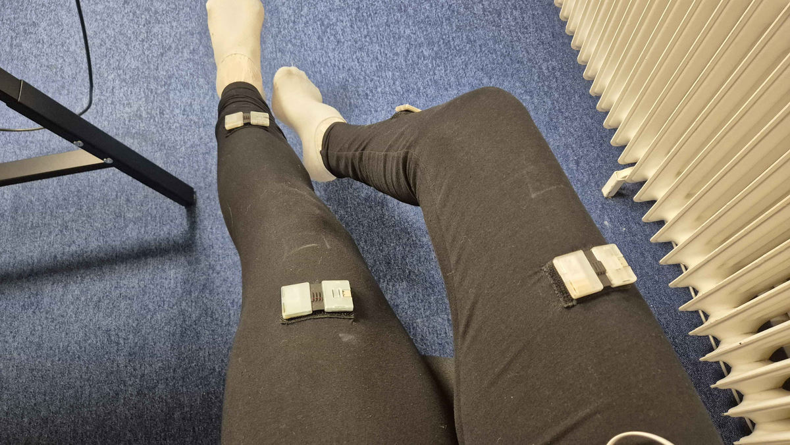

## Rapid Roundup <:nighty_art:1314209500709781524>
Ready yourself for a series of short SlimeVR news snippets to paruse:
* The bug in **VRChat** that made it impossible to enable OSCQuery has been marked as "available in a future release" now, so big pat on the back to all the people who helped signal boost this and get it on the dev radar <3. **Patch soon?**
* The core **SlimeVR team** that went on vacay for the last week or so **has returned** and is adjusting back to their regularly scheduled programming. Expect lots of new, cool, stuff to resume in the coming weeks as they get back up to full speed.
* Butterscotch summoned some dark furry magic and directed it at our **android** server's **USB serial** implementation. I've been told "It's like magic it all just works" due to a bunch of changes on how the server requests and communicates over USB, even on headsets!! Its on track to be included in 0.16.3
* **Mocap**ers rejoice! BVH files are about to get a lot easier to use, as the way we manage the armature is being improved to make **retargeting** a lot less of a pain by having the **root** now be the **hip**. Big thanks to....*checks notes* butterscotch again? heck they have been busy.
* The long awaited arrival of our **low latency steamvr driver** is finally on schedule for **release**, with the release candidate now available for final testing in the beta forums here: https://discord.com/channels/817184208525983775/1415787792121856130. If you want the most responsive tracking ever, id suggest giving it a look~!
* Finally, the discord server Development section has been renovated, so if you think a channel disappeared, check <#1024359261360373839> now, as there is likely a thread for it.
## Feedback Digest <:nighty_hug:1314209493747241011>
So I will be collating the feedback into a more actionable plan for our devs, but for now I will just go through the most common topics people shared with us from the feedback form. Again, thank you all so much for this, its very helpful and hopefully I will get some good stuff done with it~!
**User Wishlist:**
* Personalisation: The most common thing people want is more personalisation, such as custom reset sounds, themes
* User experience features: Streamlined calibration and mounting tutorials (including more visual guides or pose options), as well as clearer information when issues arise (battery levels, error logging, error alerts)
* Accessories and expansion: You slimes really wanna spend money huh? People really want tracking enhancements and accessories, like outside-in drift correction and charging docks. Also gloves, people seem to really hate vr controllers.
**What we can do better:**
* Clearer Guidance & Documentation: Better documentation and in-app explanations of what settings and buttons do. Additionally, better tutorials, visuals, and guides. Kinda similar to above.
* More community support and education: People just generally dont want to rely on asking in discord for help to get tracking good. Common mistakes should be more prevalent in docs or guides outside discord.
**What people love:**
* Software: People love our software, including how easy to use the UI is and how usable it is in VR. Features like the setup wizard and Stay-Aligned were mentioned frequently.
* Tracking: People love how accurate the tracking was for how low cost it is. Value for money and battery life were common themes.
* Overall vision: Users admire the dedication and passion of the project, and really love how distinct it is compared to competitors, as they feel like they are a part of a community driven, evolving, and open VR ecosystem rather than a cold corporate product.

