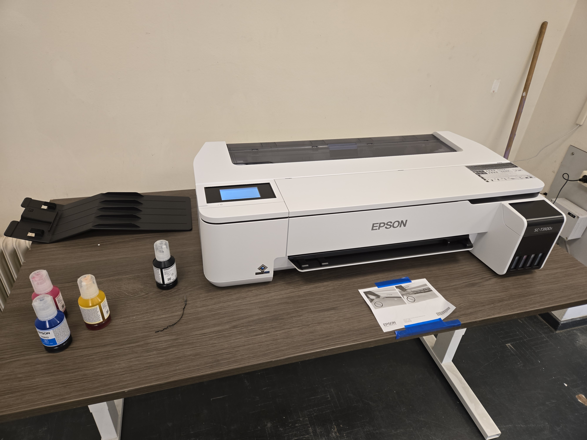
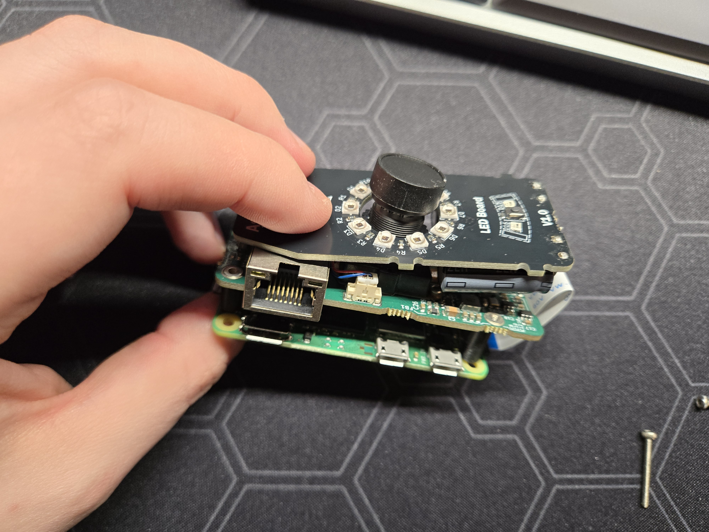

## Rapid Roundup <:nighty_art:1314209500709781524>
Ready yourself for a bunch of SlimeVR news bits to bite on:
* Our Moth™ haptics design proposal has been finalised internally. This means we have a unified front on what needs to happen, and there's some super cool tech to do with how skin works that I hope I can show off once its a little more cooked. Here is hoping its soon~!
* Development on the Slime gloves is progressing steadily in the background, with our team in the cave prototyping and testing various hardware solutions to work out what's best to focus our main efforts on. I cant post pics just yet but hopefully ill have something fun to show off in the near future.
## Special Notice <:nighty_gun:1314209484440338474>
So with S14 shipment notifications about to start flooding everyones eager inboxes, there is going to be a lot of people wanting to post in <#903962635161174076> to show off.
I implore you: Please ***DO NOT POST PICTURES WITH YOUR NAME , TRACKING NUMBER, OR ADDRESS VISIBLE***!!
We get you are excited, but take 10 seconds just to check before sending it. We will delete it on sight if it has personally identifiable info.
*That's it for this week. Thank you for reading to the end, hope you all have a lovely week and weekend. See you space slimethings~! <3*
## Butterfly News 🦋
As mentioned above, we now have native android support for Butterfly trackers. This is big news for anyone who likes the freedom of being untethered from their PC. The dongle will work with any android device, which means nearly all VR headsets will be able to have the receiver dongle plugged in directly to your headset. https://bsky.app/profile/slimevr.dev/post/3lzc3nwysic27
Even cooler than that, our new prototype board is being put to good use for its very own charging dock. Check out the cool render and video of the current design below. It has a very satisfying ***snap*** https://bsky.app/profile/slimevr.dev/post/3lzhcrncmes2w
Lastly, tests on mounting options continue. We want to get this perfect so trying it out in practice is key to filtering out the working ideas from the ones that only work in theory. This week is pants! Yoga pants with mounting velcro are in testing to see how they fair. They certainly look comfortable, check it out below in the pictures.
As usual, please follow the campaign to be notified the moment major stuff happens direct to your in box: https://SlimeVR.dev/smol

## New driver and 0.16.3 RC1 <:nighty_hug:1314209493747241011>
**NEW BETA NEW BETA NEW BETA** *shakes your bed*
https://discord.com/channels/817184208525983775/1419799871442915479 is out now for testing and includes a few cool things that might tickle your fancy, including a **fix for the weird foot twisting issue** thats been haunting us for a while, massively **improved android USB** serial that now should *always* work (even more reliably than PC), a few minor **UI and firmware update tweaks**, and..... *queue drumroll* **USB HID support for android**...... *"whats that even mean?"* i hear you saying. It means our butterfly dongle works natively on your headset or other android device. **Butterfly standalone is real!** More info ~~on page 3~~ in the next section.
Additionally, the infamously long awaited 'low latency' driver is now released. Among other things, this version (0.3.0) features a much lower latency method of communicating between SlimeVR and SteamVR, which means tracker info gets from your tracker to any SteamVR game much faster. Highly suggest checking this one out if you have a good network environment and want to squeeze out every last drop of performance from your trackers. They actually get faster than vive trackers if you have low enough ping! Get it here (Manual installation instructions are inside) : https://github.com/SlimeVR/SlimeVR-OpenVR-Driver/releases/tag/v0.3.0
