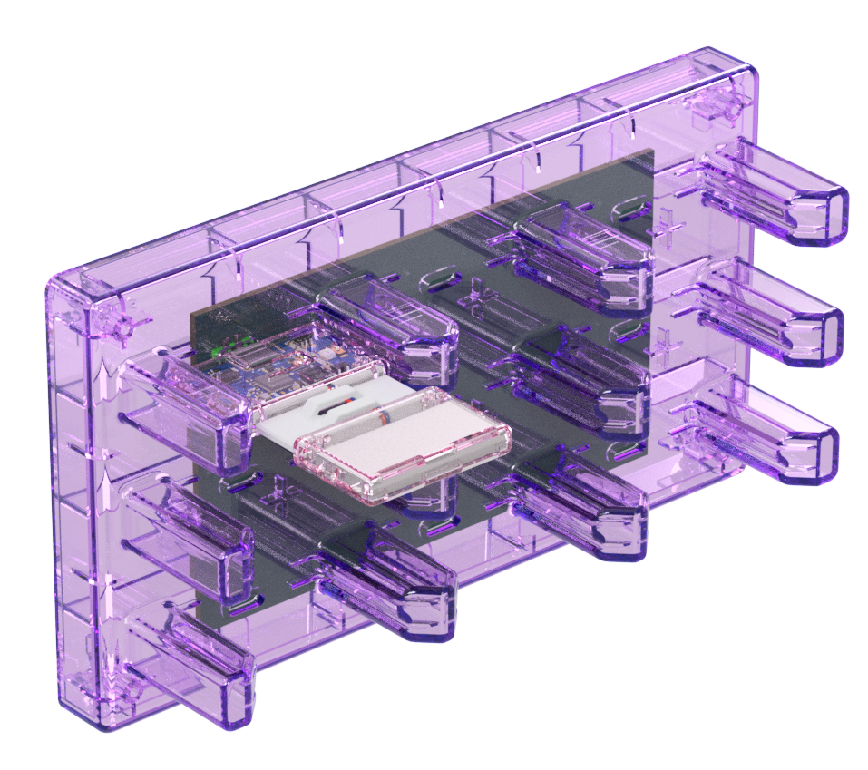
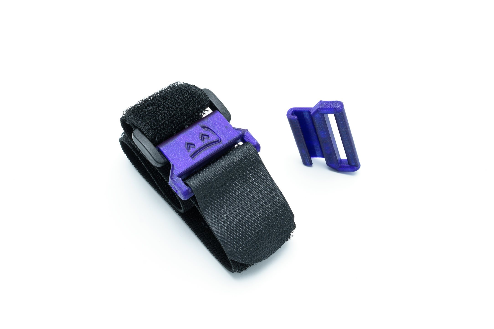
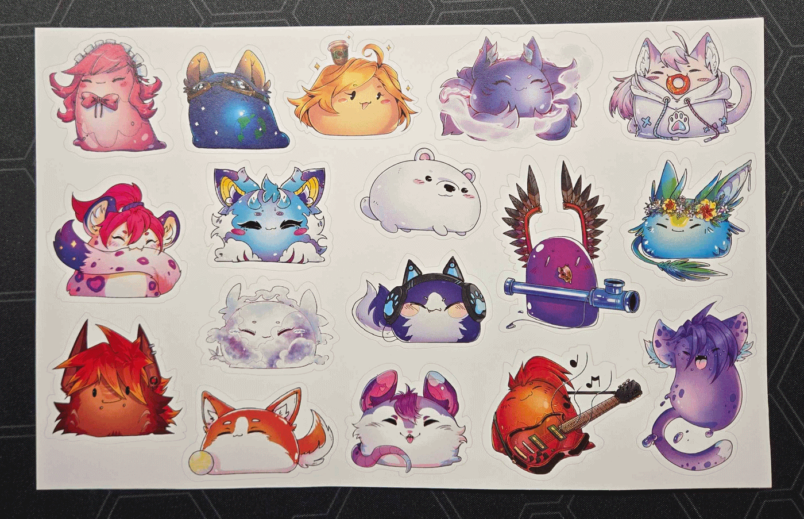

Hiyo slime gang~! Spazzwan here, back from a very long holiday and ready to get you the latest cutting edge slime news, so make sure your seats are in the upright position and tray tables are stowed while the slime light is lit.
## Shipment update <:nighty_nom:1314209503276699708>
**Shipment 14:**
So the rollercoaster ride that is Shipment 14 is nearly over. With the overdue news that Crowdsupply has fixed the bottleneck in their warehousing, we are told the remaining orders "will be shipped today and tomorrow". I hope everyone who was tall enough to ride enjoys their slimes!
Missing straps: All the labels for these were painstakingly printed and are on the way to Chain now. We expect Chain will finish and ship them out to affected customers early next week. Affected customers will be able to see their tracking number **late next week** in their Crowdsupply order page.
**Shipment 14.1:**
Stuck at customs... who could see this coming? Hopefully it gets through soon but its just a waiting game now while UPS and their customs friends battle it out. Fingers crossed it gets out soon.
**Shipment 15:**
Some good news! We now have all the pieces of ~~exodia~~ the trackers. Chain is now assembling tracker sets! Half the cases are en route to chain from the manufacturer, but that shouldn't slow down assembly as this shipment is enormous. It's all down to how fast Chain can assemble everything, now.
**Shipment 16??**
So with shipment 15 being effectively sorted, S16 begins its metamorphosis from fiction to reality. Talks with mouser have already begun, expect this shipment to be big.
Finally, the Slime team will now be slightly bigger, with a dedicated logistics officer joining the ranks. This means we will have an extra vigilant set of eyes double checking every part of the shipments to ensure everything goes smoothly--from parts to packaging to posting.
## Server Update
**0.16.3 is coming soon!** We're doing final testing, update tomorrow or something. Then **0.16.4 is coming right after!** We already have a few things that we have fixed for it, but we didn't want to delay 0.16.3 that has a lot of fixes for Android, so they're pushed to 0.16.4.
And then 0.17.0 - that's gonna be big <:nighty_yay:1319261631217143910>
## Random Stuff
We got a big printer <:nya_umu:850498715617198080> Do you think it will work better than our old smol HP? I hate HP printers... Maybe we will print posters on it <:firPog:785701297478959104>
Also for constellation experiments we're setting up [Astertrack](https://www.seneral.dev/astertrack.html)! It's a very cool open-source IR tracking system on retro-reflectors that might get support in SlimeVR ecosystem and/or we might collab with them on constellation trackers. Look how packed their cameras are! So cool <:pcbnom:833469925980110908>
Okay, enough yapping for today, i'm not Spazz, i'll keep it smol <:nya_umu:850498715617198080> See ya in the next one, maybe by Spazz, maybe by someone else! <a:owlwave:586779817106604051>

## Shipment 15
The mold was fixed and first half of the order of main tracker cases are on the way to us! Shipped just today. They should arrive by the end of the week, and next week Chain should start assembly of trackers. This week they're assembly extension trackers, and we're testing main boards <:slimepcbnom:839133114931347486> Finally, this shipment is turning back on track... We're waiting for new stickers batch, but that should be here soon too (third version!).
## Butterflies
I can see you're not subscribed to news on https://slimevr.dev/smol <:nya_gun:957426272030576671> Plz subscribe <:bingus_gun:1404234276630958080>
We're squishing bugs and finishing butterflies 🦋 Look how they track now, video by ! <:firPog:785701297478959104> No more snapping! It's not a final fix, but it's way better now. This isn't a final firmware, so if you have smols, hold your horses to updated. @Lexie and I are still working on a proper fix, it will be even better and more robust!
**Also revision 10 is on order!** This time we ordered 75 butterflies so we can send them to more developers, and maybe even some reviewers? 👀 Stay tuned~ Campaign launch soon! <:nighty_yay:1319261631217143910>

