## Rapid Roundup <:nighty_art:1314209500709781524>
Ready yourself for a bunch of SlimeVR news bits to bite on:
* The team is *still* working on getting a stream up and running. We want it to be engaging, so expect loads of interesting stuff, including but not limited to: Me, Q&A with Slime Team members, Live Butterfly demos and testing, 1.2 SlimeVR testing, Spinny testing, and maybe some stuff you havnt seen before...
* Our injection moulding machine is now online and ready to fire up prototype shells and doodads for our eager cave team. This is cool as heck, as it lets the team test 3d printed designs rapidly and cheaply directly in the office. First under the pump is a solid TPU central piece for our butterflies to replace our prototype 3d-printed one. All hail ||i||N||j||EK||t||O! (pic below)
* *wiggles their fingers at you* New glove prototype gloves have been put on order for devs. A bunch will be sent out to core devs to help give them the tools to properly work on this stuff. Did you know Erimel made finger reset with just a single normal slime tracker? Smort fox <:erimel_sticker:1295100057598562385>
## Call to arms <:nighty_gun:1314209484440338474>
We have a huge amount of stuff that is being jammed into the server in the coming weeks, and if you want to help make SlimeVR even more awesome we need your help. "But I cant code" I hear you whimper. Well there is more to life than floats and bools, as we always need more yappers like me... The language nerds.
So if you are fluent in a language other than English and want to contribute, consider checking out our translation site here: https://i18n.slimevr.dev/
Even just 5 minutes of checking others work can help out tremendously to ensure your native language gets the love it deserves.
*That's it for this week. Thank you for reading to the end, hope you all have a lovely week and weekend. See you space slimethings~! <3*
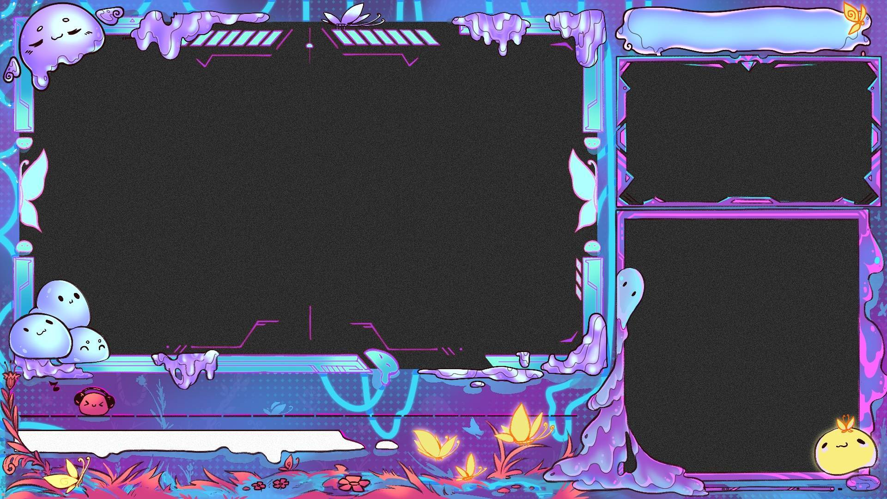

## Server Spotlight <:nighty_data:1314209491365007360>
So, a cool feature you might not have heard about is heading our way in the SlimeVR Server. WiFi provisioning is being worked on by none other than the planet guy himself, Gorbit. This handy feature allows you to plug one slime in and set all your slimes up in one go. You even get a dropdown box for the WiFi name, so no more misspelling or phantom spaces causing you endless headaches. This will likely be included in a patch shortly after 0.17.0 (aka "the flightlist patch"), along with a whole host of other features aimed at making initial setup and session calibrations a breeze. You remember the flightlist, right? Futura has been diligently perfecting this amazing server refresh for months now, and its looking amazing!
Check out the preview below, lets hope its ready for beta soon.
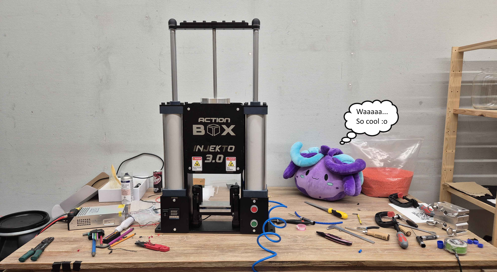
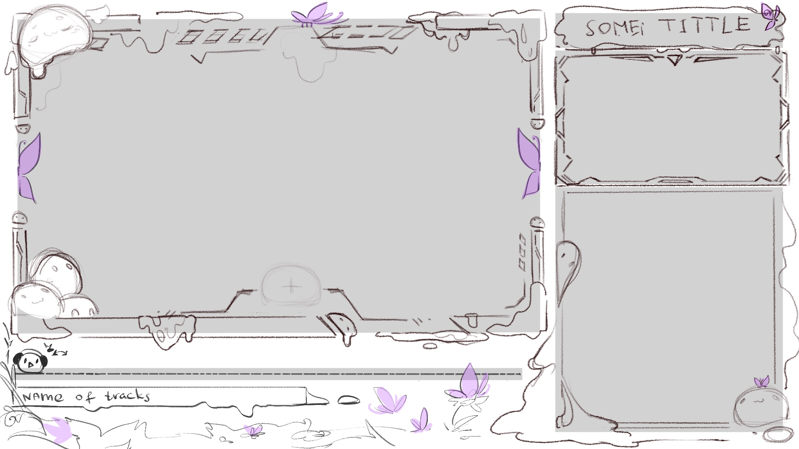
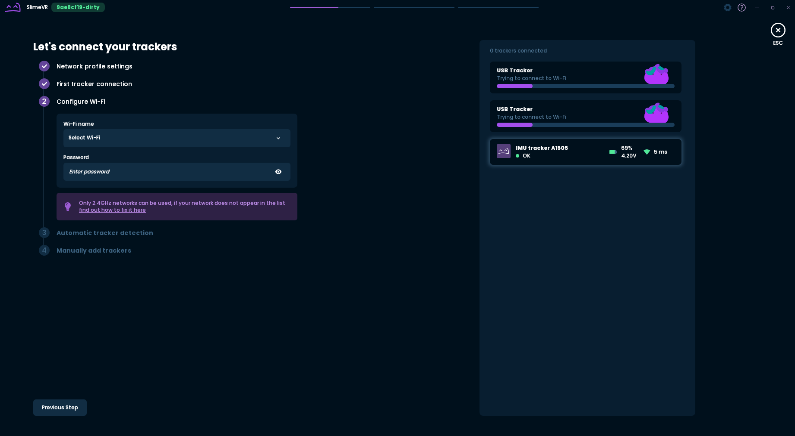
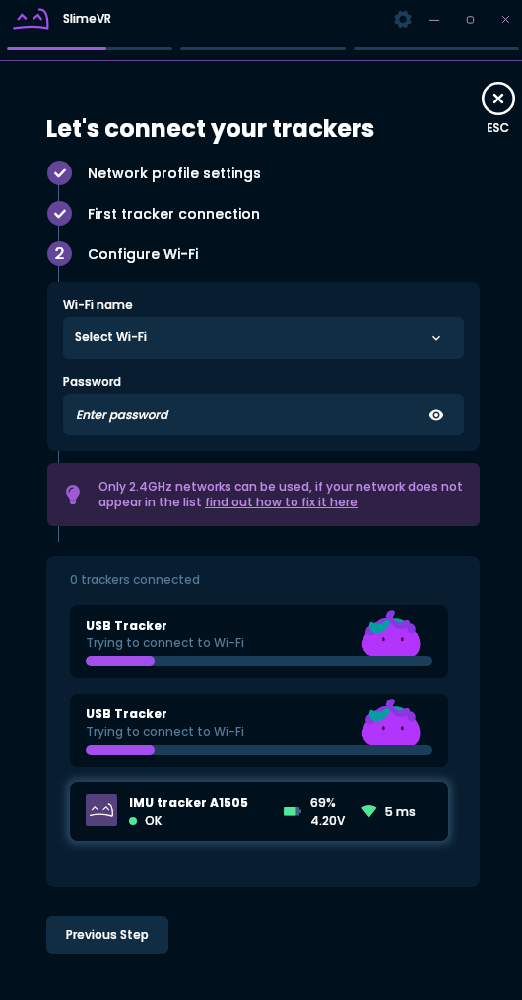
## Butterfly Trackers 🦋<:nighty_hug:1314209493747241011>🦋
Butterfly trackers is now at **Revision 10**, with fresh boards in the paws and claws of our design team. This marks a fairly major point, where we are confident that the overall dimensions and design is locked in. As such, the hardware teams' attention turns to refinement, optimization, and preparation for production, while the product design team can now really kick into gear, crafting and sculpting cool accessories for the newly perfected form. You can see the fruits of our labour below, including renders and photographs of our newest **Butterfly tracker, the Butterfly Receiver dongle, charging docks, and fancy new clippy straps**. All these are work in progress, so these *may* change, but this gives you a vision of where the Butterfly trackers are heading. Hope you all love them.
I'm helping write an in-depth behind-the-scenes story on butterflies, so if you want the inside scoop on what's going on in the slime cave, [**Click here to sign up for campaign updates**](https://slimevr.dev/smol) ... You know you want to <3
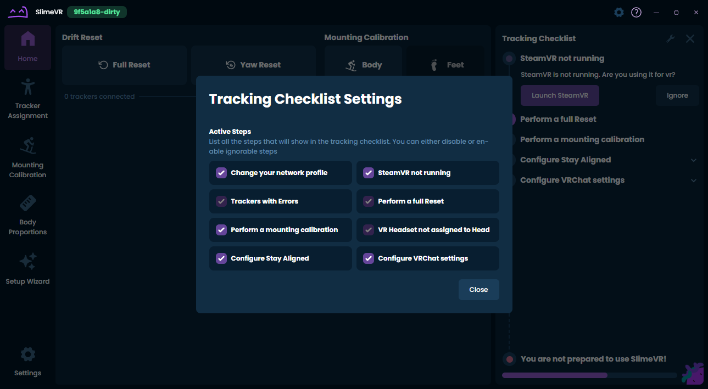

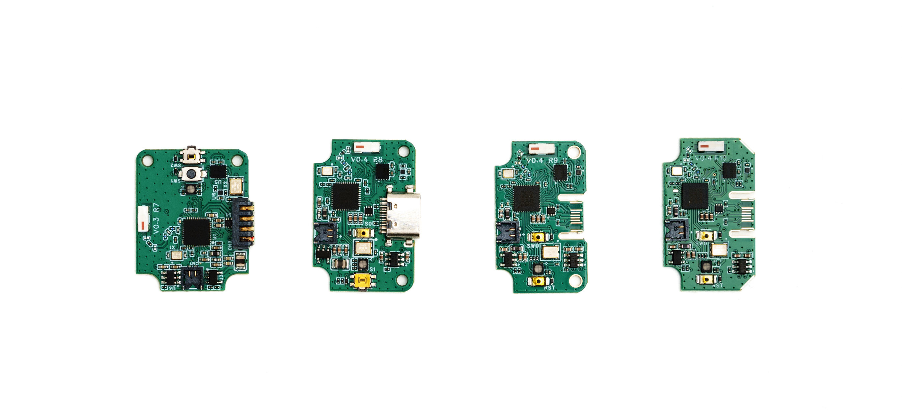
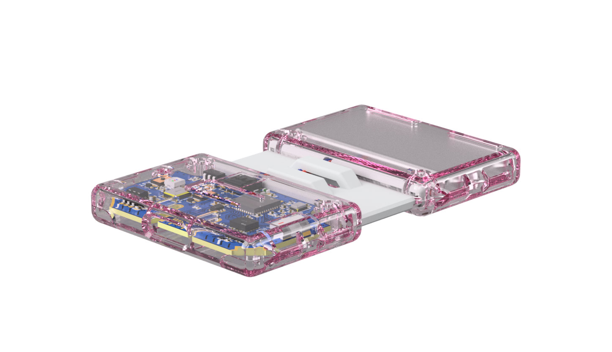
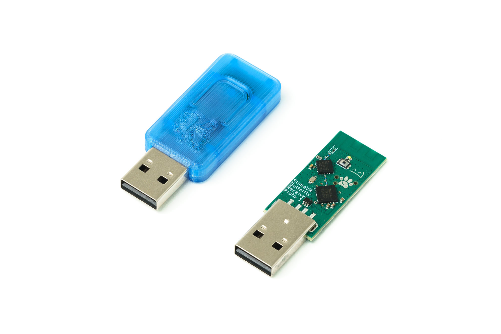
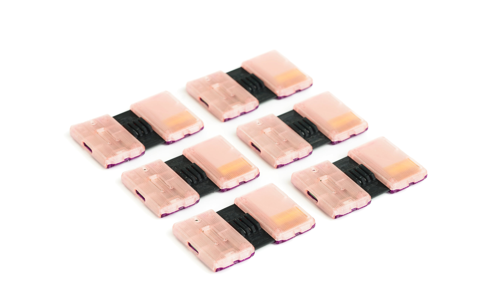
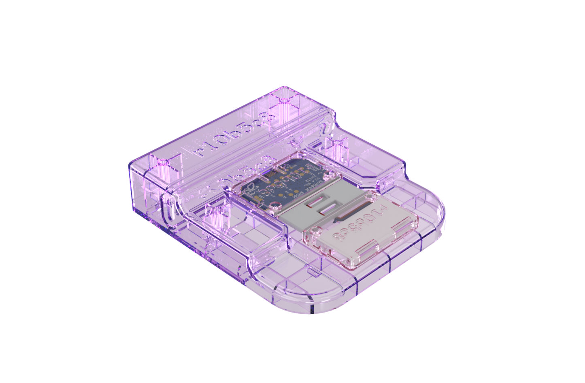
