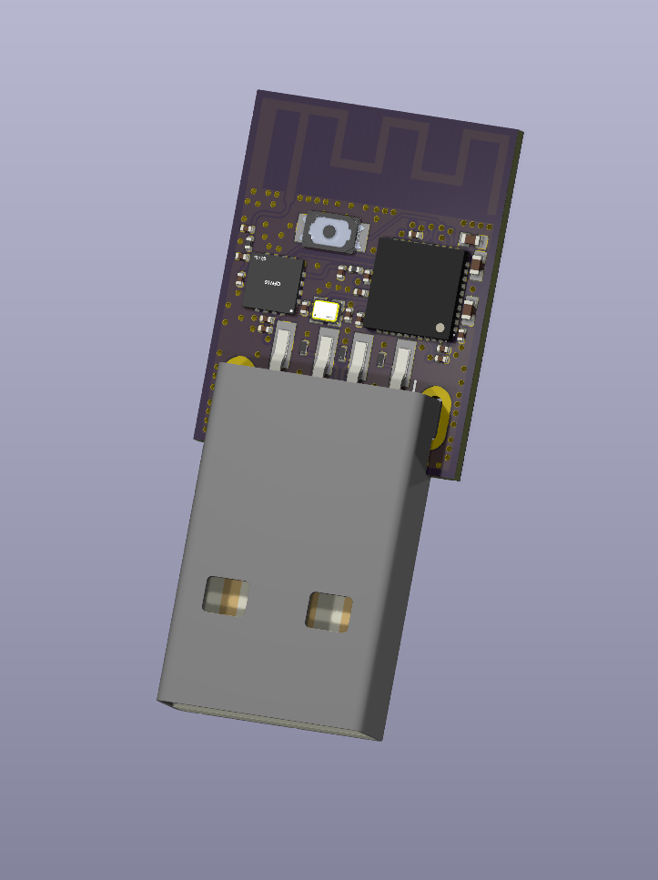

## Rapid Roundup <:nighty_art:1314209500709781524>
Ready yourself for a bunch of SlimeVR news bits to bite on:
* There is rumblings of 0.16.4's imminent release, even as I write this. Keep an eye on the beta channel for a beta or release candidate in the next hours or days (or week).
* Our stream art has been finished! We still have no ETA on this, but check out the cool artwork for our stream overlay. This was commissioned from our amazing regular artist, Flarchik.
* The team is rapidly firing out prototypes for accessories, for both normal SlimeVR trackers and Butterfly trackers. With the new injection moulding machine finally ready to go, expect to see some cool stuff in the not-so-distant future... some of which will be purchasable upgrades directly from our store!
*That's it for this week. Thank you for reading to the end, hope you all have a lovely week and weekend. See you space slimethings~! <3*

## Server News <:nighty_hug:1314209493747241011>
### Motion Mounting™ Beta <:nighty_data:1314209491365007360>
Our house skunk `Butterscotch!` is at it again with another cool idea :"Step Mounting". This cool new feature concept is set to replace our ski pose (or at least be an option alongside it), and involves automatically setting your mounting rotations by taking 1 step forward. The video below explains it well, but if you want to try it out, you can help test it and give feedback on the very early version by going to the beta thread, here: https://discord.com/channels/817184208525983775/1433418765957337180
The beta is still *very rough* right now, so if you want the polished version you can expect to see it sometime after 0.17.0 gets released (and somehow mysteriously show up in competitors' software shortly after <:nyaflop2:1369612021267693610>)
### Firmware updater <:nighty_question:1314209482133209088>
Our firmware updater is heading for a V2 with lots of cool new features. Not only will it be more robust and reliable, but it will also be customizable. Users will be able to update using pre-defined choices, or load custom info directly through a JSON file. This is great news for third party sellers and buyers, as both can load in the exact settings for their trackers regardless of how custom it is.
### Artwork Overhaul <:nighty_art:1314209500709781524>
"I'm a visual learner", well lucky for you we are doing a big refresh pass over all the settings, poses, and guides in the server. We will be completely overhauling all the current artwork with pre-rendered scenes, featuring our wonderful new Nightly model. This will be spearheaded by Rames and myself, and we are expecting to have all the parts we need in the next week or so. Hopefully this will help with reducing the friction in settings and setup for users. Like... what the heck is "forward mounting reset"?

## Shipment update <:nighty_nom:1314209503276699708>
**Shipment 14:**
As mentioned last week, all the sets have been shipped.
If you are still waiting for a 5+0, 6+0, or 6+2 set:
* That has an October postage estimate
* Still has not received shipping notification
* Does not show tracking information in [your account info](https://www.crowdsupply.com/account)
* And you have not ordered other things in the same order that were not included in S14 (such as upgrades)
I would recommend sending Crowd Supply a message, [here](https://www.crowdsupply.com/contact/status-pre-shipment)
> **Missing Straps**: These have all been shipped. Check your crowdsupply account for tracking numbers. They are a bit slow in adding these, so it might take a while. They were sent using PostNL `parcels with track & trace`, so check [this PDF](https://www.postnl.nl/api/assets/blt43aa441bfc1e29f2/blt30da7c391826a806/63da80c6fa95b02aa5a7be61/20220420-brochure-bezorgtijd-buitenland-eng_tcm9-23680.pdf) for postage times (in **working days**). Allow a little more time for US deliveries, for obvious reasons.
**Shipment 14.1:**
We have been informed by Crowd Supply that Mouser has started, and are somwhere in the process of sending these out now. They may already all be sent, or might be about to be shipped. We won't know until Mouser gets back to us tomorrow with more details. I will update this post as soon as I get the new information (likely Monday).
**Shipment 15:**
Business as usual here. Nothing new, Chain is still hard at work sorting these out. We still estimate these will be shipped out before the holidays, again: sometime between late November and mid December.
In related news: Sickhekker, our new logistics manager, has been hard at work this week getting up to speed with everything, getting familiar with our inventory management and ordering systems, and liaising with the various companies we deal with. Hopefully with their help this section of the news will get smaller and smaller.
