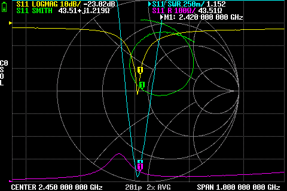
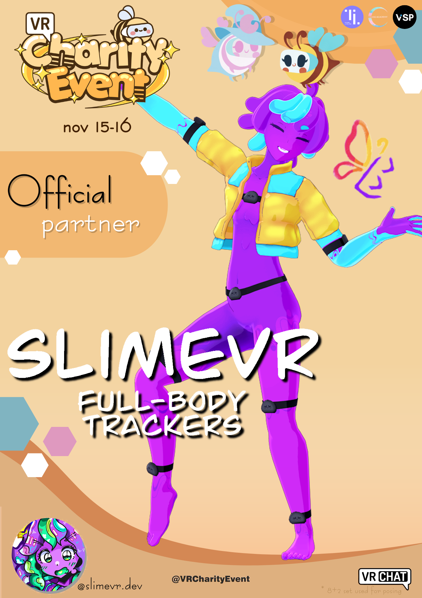
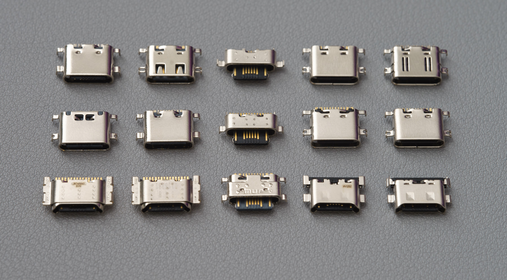
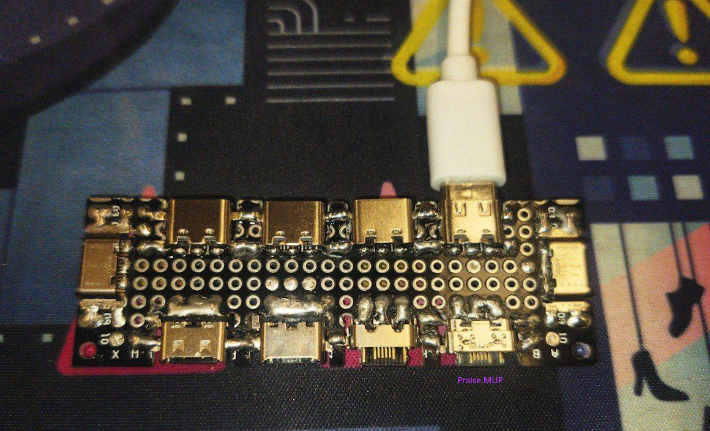
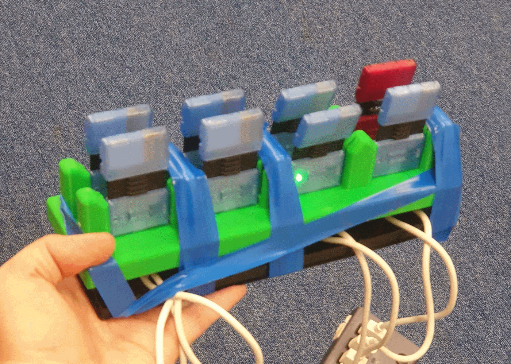

## Rapid Roundup <:nighty_art:1314209500709781524>
Ready yourself for pack of news nibblets for you to munchify:
* Our Flight list system is just around the corner. The main things holding it up at the moment is all UI stuff like SFX, art, and a few minor tweaks to how trackers are listed. Its on the horizon and rapidly approaching! Keep it up Futura!
* Our much neglected IOS client is getting a potential renovation, with Maya leading the charge to improve the currently lacklustre apple experience. Good luck, Maya!
* Our resident silly skunk Butterscotch has been deep diving so far into the server and tracker maths that they see the world in quaternions and Euler angles now. Not satisfied with just a motion mounting reset (see last weeks update for info), they have brainstormed up a new, even easier, method. Unfortunately for now it's purely theoretical. A step too far? Only time will tell.
* Our WiFi provisioning system is nearly done, as Captain planet himself, Gorbit, slaves away polishing it up so its ready to be released into the wild. Soon...
## Special Notice <:nighty_gun:1314209484440338474>
Do you love pressing FBT calibration and doing T-pose *every single time* you go in to VRChat?
For those of you that said No, please go to here and vote it up: https://feedback.vrchat.com/feature-requests/p/save-full-body-calibration-when-closing-crashing-the-game-benefits-imu-based-tra
In-game calibration is entirely un-necessary if VRChat adds the ability to save your last calibration. This feedback post has been up for a while, but is not getting enough traction for VRChat devs to care. If you want to remove an entire step from getting into VR with your friends, please consider going to the link and upvoting it.
There is also one for toe support, if that interests you: https://feedback.vrchat.com/feature-requests/p/slimevr-toe-support-integration
*Thank you for reading to the end, hope you all have a lovely week and weekend. See you space slimethings~! <3*
## Ecosystem News <:nighty_data:1314209491365007360>
### Server
0.17.0 has a Release candidate (RC2 now!), which is kind of like a beta but cooler. What began as a bunch of minor fixes has snowballed into a whole new release number, *over 30 additions and bugfixes*, including:
* Firmware updater 2.0 - Way more reliable, with custom JSON loading for pre-defined tracker settings.
* Positional tracker support - IK (Inverse Kinematics) has finally joined the party, after 2 years of being in beta. This makes mixing positional trackers (like Vive) with SlimeVR trackers a viable option. Video below by the amazing ZRock35.
* UI Tweaks and fixes - A multitude of minor UI quirks were fiddled with, such as padding, text wrapping, more verbose errors, and my favourite; a serial input in the console page.
* Bug fixes- Lots of minor fixes, tweaks, and version bumps. Notable additions are fixes for the IMU calibration tutorial, and measures preventing soft-locks from specific OSC settings.
Check it out before launch, here: https://discord.com/channels/817184208525983775/1437420937975697519
### Technology
*sighs* ...So toe tracking is a thing. Sebby has been working on it, and has finished an initial integration with the server, which includes 3 'groups' of wigglers with bending and splay. This is not included in the server yet, but maybe soon. Its cursed and upsets me a little. If this interests you, check out the demo here: https://discord.com/channels/817184208525983775/903962635161174076/1436246416195452960 (then seek help /s)
Meanwhile, Summer has been learning FPGA things for potential use in our SLAM and constellation systems. What no earth does that even mean? Well this type of camera technology uses the whole picture rather than pixels, which makes it crazy fast and perfect for tracking systems. Basically lagless video with no processing delay and low CPU load. Video below shows off where we are at. Winamp visualisations eat your heart out!

## Butterfly Development <:nighty_hug:1314209493747241011>
Butterfly trackers are approaching their 11th(!!) revision, and with that comes modifications to the USB port, yet again. Cake is leading the charge here, and ordered over 30 different USB-C ports to find the goldilocks connector that's just right for us. You can see a spread of the top contenders below that are being tested for insertion force, durability, and more. I am partial to the MUP one. In MUP we trust <:pray:988889856614735913>
Additionally, Cake has been working on testing and tuning various antenna types, and deep-diving into interference patterns and tuning. This hard work will hopefully come to fruition in the final design of our dongle.
Speaking of dongle, Meia set out on a challenge to make the dongle as smol as possible. You can see the final design of this below. This very likely wont be the final design, but it was a fun challenge that helps with understanding what parts are mission critical in the design of the dongle. And cuz its hecking cute.
Furthermore, we are rapidly designing, printing, and testing various new designs for our charging and storage dock. You can see the latest of these experiments below. I kind of fond of this 2x4 configuration, myself, but who knows what this will end up looking like. We will have to wait and see.
And while not specifically butterfly news, Aed's contribution to the small ecosystem is worth talking about here, as their smols web flasher is rapidly shaping up to its final form. This GUI based flasher has support for custom firmware and an array of prebuilt firmware's, and will make flashing butterflies super simples. Check out the demo below.
I have co-written a newsletter with the prime slime themselves, Eiren, detailing the history and future of butterflies. We will likely have it up sometime next week, so if that interests you or you are thinking of buying butterflies, go sign up for campaign updates at https://slimevr.dev/smol

