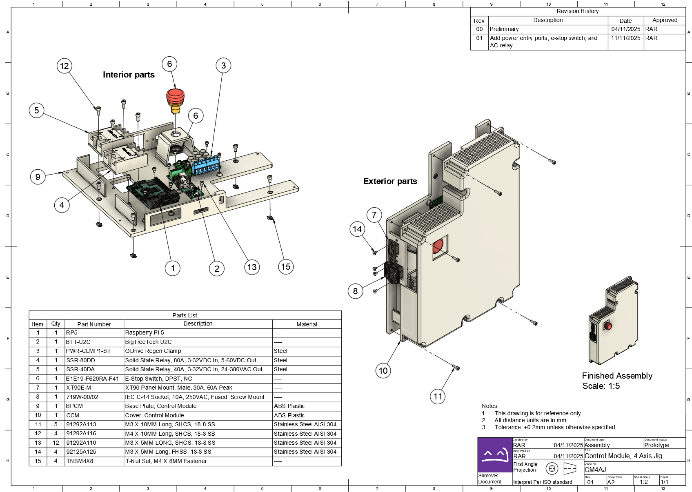
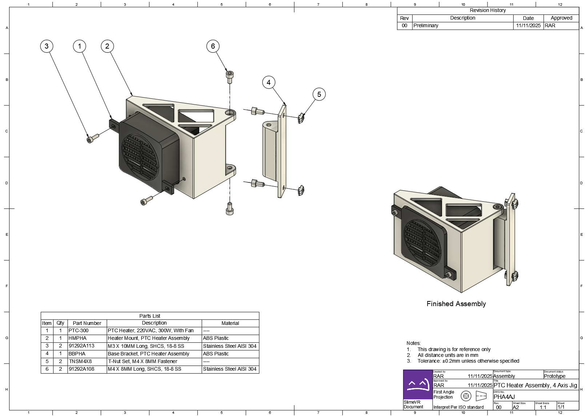
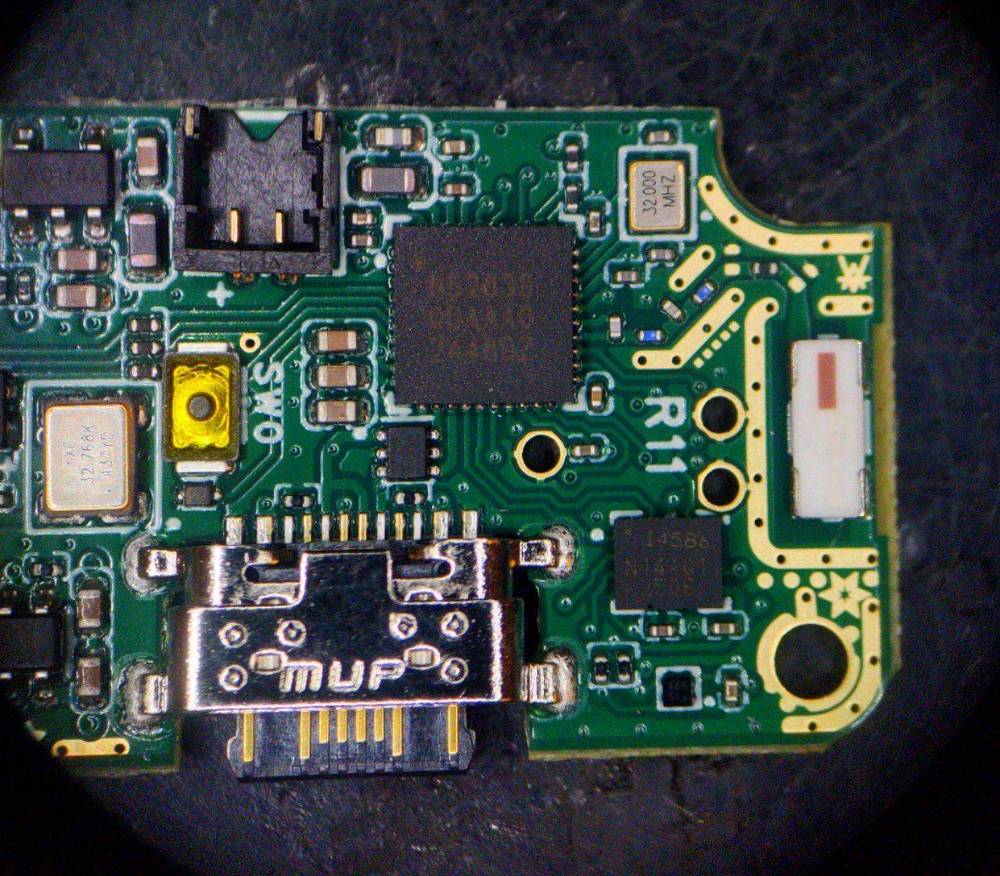
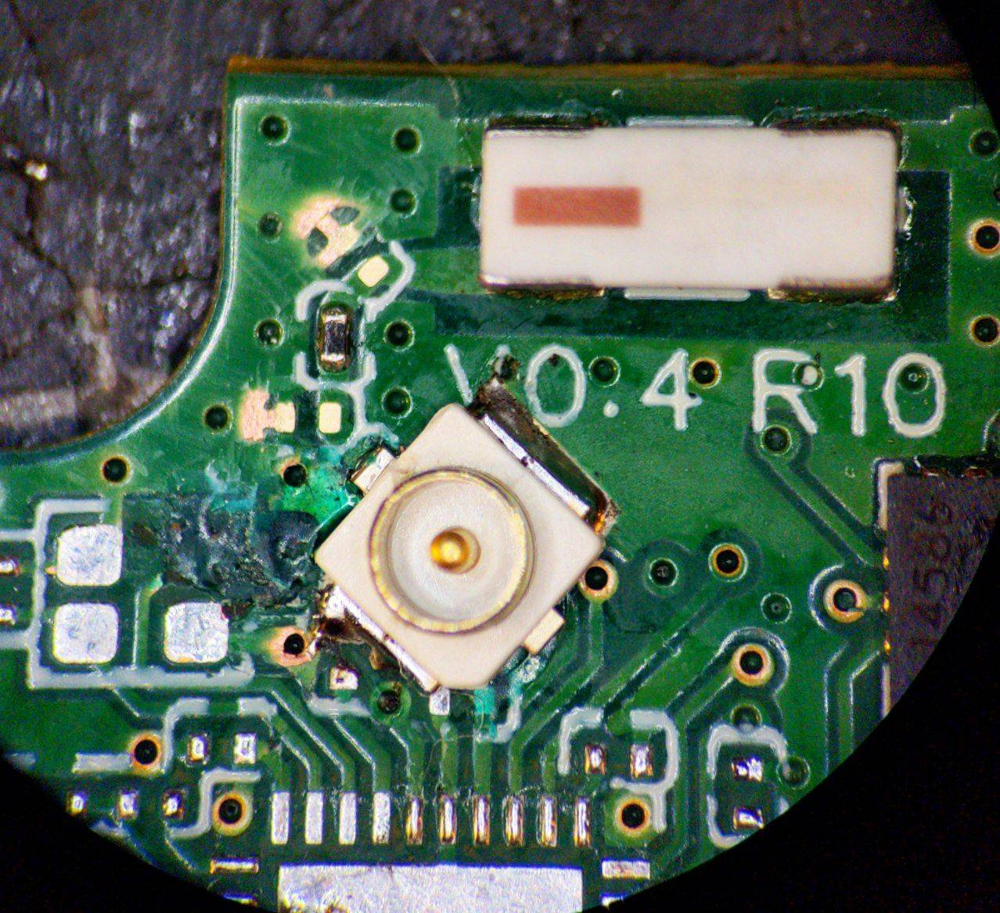
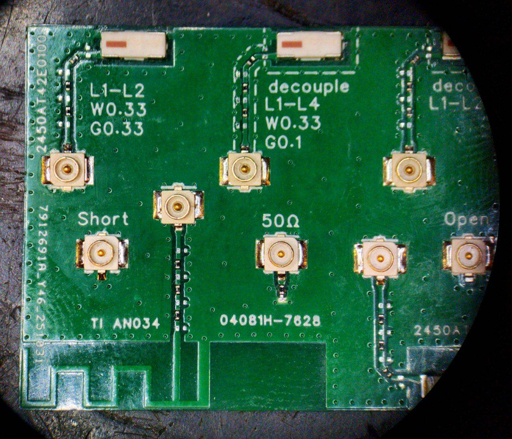

## Butterfly Progress <:nighty_nom:1314209503276699708>
Butterfly development continues along as usual, with our team of slimey smarty-pants slaving away in the cave to perfect these colourful little tracking nuggets.
Cake has been laser focusing their efforts on the airwaves. Specifically doing microsurgery on some R11 Butterfly trackers, as well as making a VNA (network analysis) PCB with an abominable mess of antennas. All this in the name of science!
This is all to help tune our antennas, and helps with isolate interference sources and ensure the best possible tracker experience.
On the other side of the cave, Meia's ceaseless search for the perfect charging solution continues, as a new Butterfly dock design is metamorphosing into reality. Unfortunately its too early to show off, but hopefully soon we can see the fruits of their labour.
Furthermore, the newest iteration of the receiver, V2, has been ordered. This one has all the tweaks and changes we have made over the last few months. Its a big step towards a finished product, and lets us finally put all the theoretical work that was done into practice through meticulous testing. Well done team!
Last but not least, keep an eye on Crowdsupply for our next official update post for butterflies. Eiren and I just finalised a big 'history and future' of butterflies, so if you want to read up on more detailed info on current the state of the progress, it should be up soon at https://slimevr.dev/smol (*pssst* sign up for updates while you are there)

