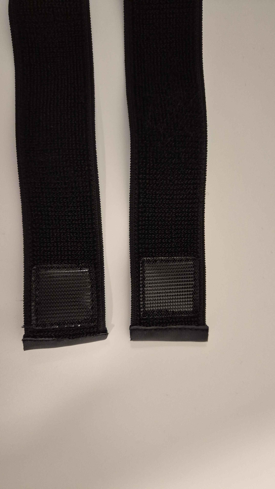
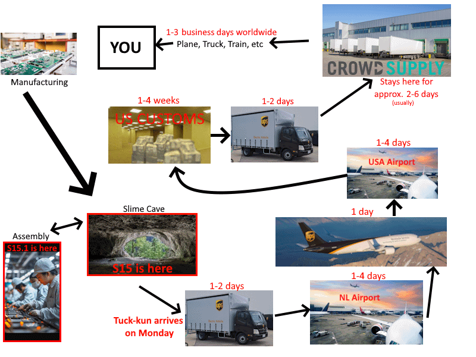
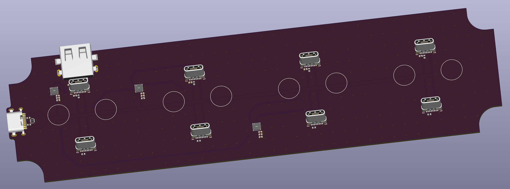
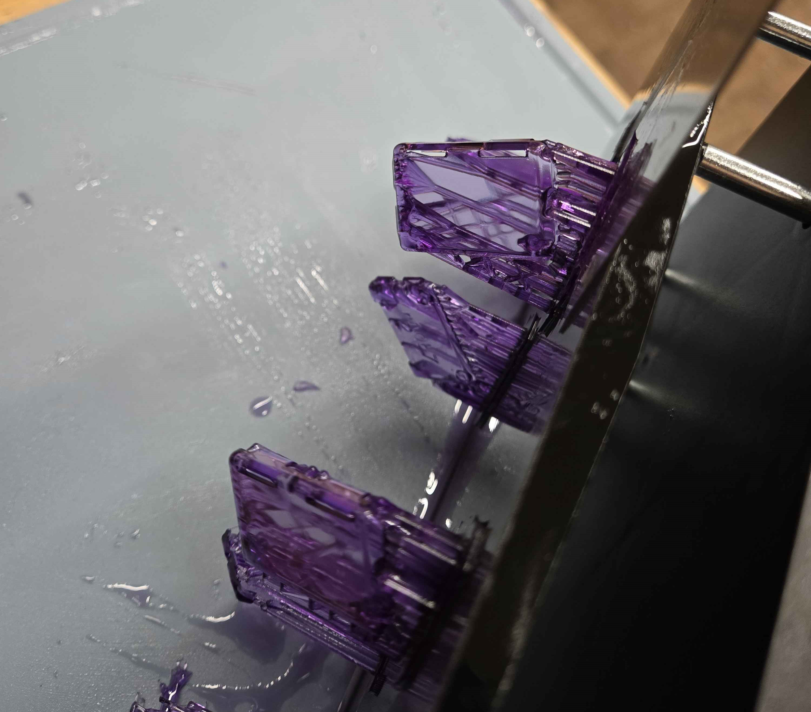

## The 'Big' Update <:nighty_data:1314209491365007360>
So our huge Flightlist update has the team buzzing with excitement, but the features just keep growing and growing. Futura has now remade the scaled proportions setup page and fully automated it. Now instead of setting your floor *and* standing position, it automatically grabs the low and high points of your playspace with a single click. You will still need to bend over, but you needed the exercise anyways, right? If auto mode isn't for you, manual height input is now accessible without going through the hoops of closing SteamVR. Love it!
Additionally, by popular demand, he has turned back time into the dark ages and added INCHES for you freedom loving folks. smh... The art and GUI pass on this hasn't been done, so its a little barebones atm. With that in mind, check out the video below of the process.
## Rapid Roundup <:nighty_art:1314209500709781524>
Ready yourself for a bunch of SlimeVR news bits to bite on:
* If you didn't notice already, SlimeVR server v0.17.0 has officially launched. It includes the new firmware updater that now supports v1.2 slimes, along with the giant list of changes I went over in previous updates. Go get it!
* Aoki was busy roleplaying in our secret staff furry RP channel. I am not sure why they wanted that to be in the news but they use arch so who knows with them. Lost cause tbh.
* Sylvie meowed at Maya. It's been a bit of a slow week apparently.
## Special Notice <:nighty_gun:1314209484440338474>
I just wanted to remind everyone that we have multiple events held every week, most hosted by the indomitable ZRock35. Come hang out in social events, perfect your tracking at calibration or tech support events, or fold yourself into a pretzel at yoga events.
Interested? Join the group https://vrc.group/SLIME.1346 and keep an eye on the events tab.
*That's it for this week. Thank you for reading to the end, hope you all have a lovely week and weekend. See you space slimethings~! <3*

## Butterfly News <:nighty_hug:1314209493747241011>
Progress steadily moves forward on butterflies, with a lot of small things each week by our amazingly talented and creative team in the Slime cave.
First up, our new dock prototype is being finalised by Meia, who is speed running the latest design of the PCB that will dock and charge all the adorable little Butterfly trackers. I have attached a render below, and the observant among you will notice a bunch of features are included that you might not have expected, including both a USB-C and USB-A port. This lets you charge the trackers and give a nice home for the transmitter dongle. How cool is that??!
Next up, we finally sorted out a pesky issue with our resin printer, which turns out needed a new vat. This means we can start pumping out even more prototype shells, which in-turn lets us finally put the NEKO injection moulding machine to good use with resin negatives. Pics below of the cute little purple resin shells.
And finally, the first butterfly newsletter was finally published, written by both Eiren and I, it covers all the cool stuff that's been happening with the Butterfly trackers as a whole over the last 6 months. Check it out **and sign up at the bottom** if you haven't already: https://www.crowdsupply.com/slimevr/slimevr-butterfly-trackers/updates/state-of-the-project-report
With that all said, these are the current projected timeframes for our Butterfly campaign:
- Start of campaign: Early December 2025
- End of campaign: Mid January 2026
- First shipment: Mid 2026
To quote myself: "These dates are not final. As you know, things can change, especially so in 202X… but we will try our best, and keep working day and night to craft tech that shakes the VR world!"

