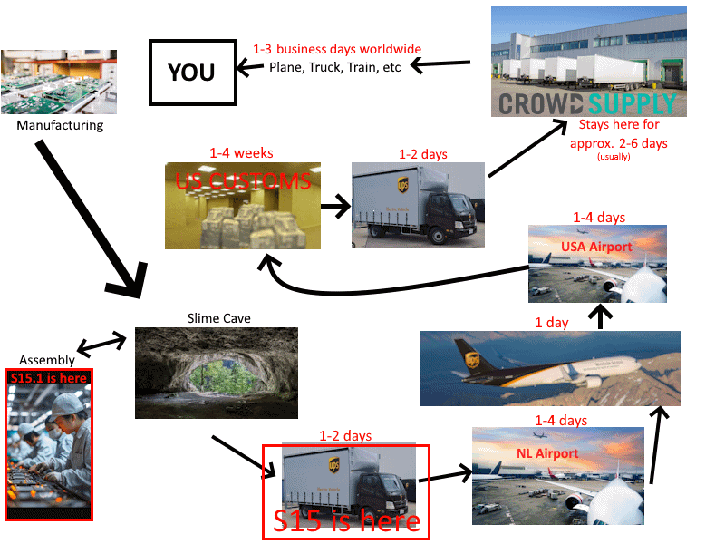
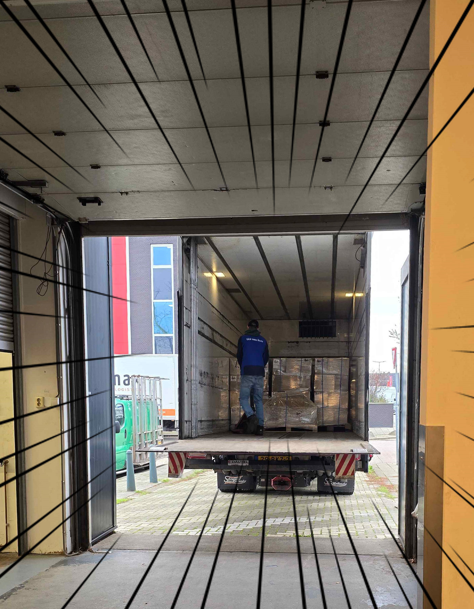
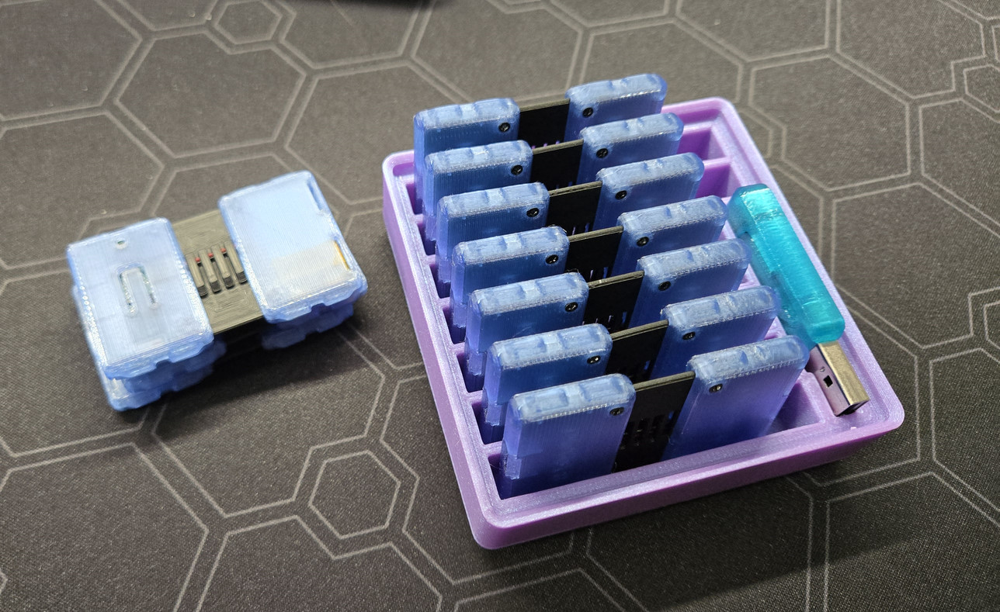
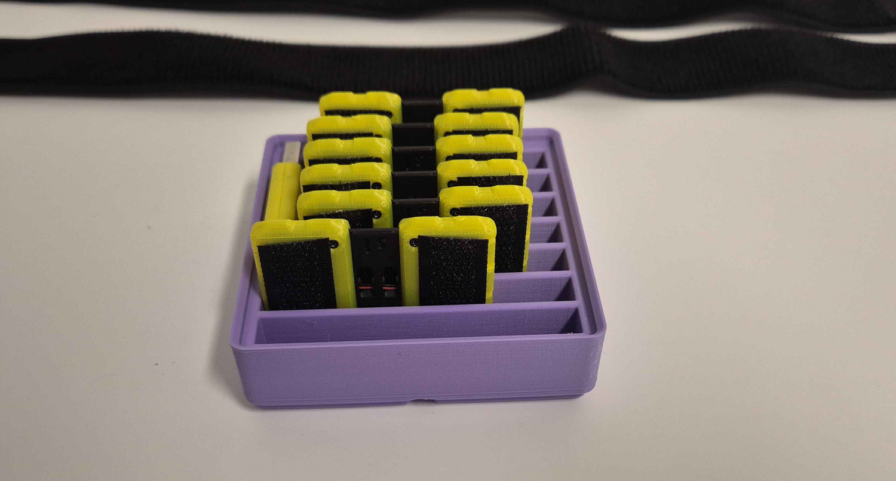
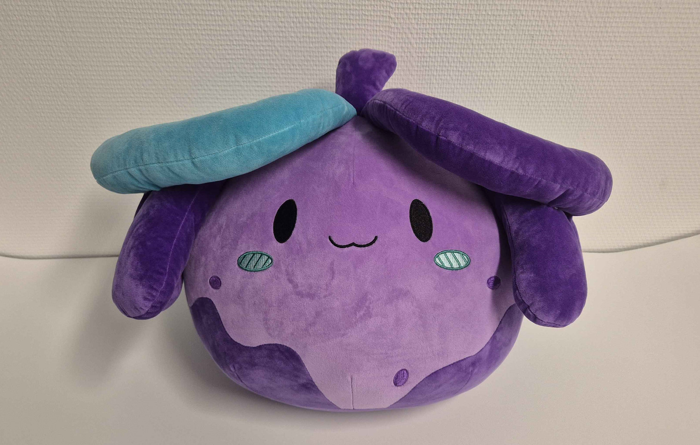
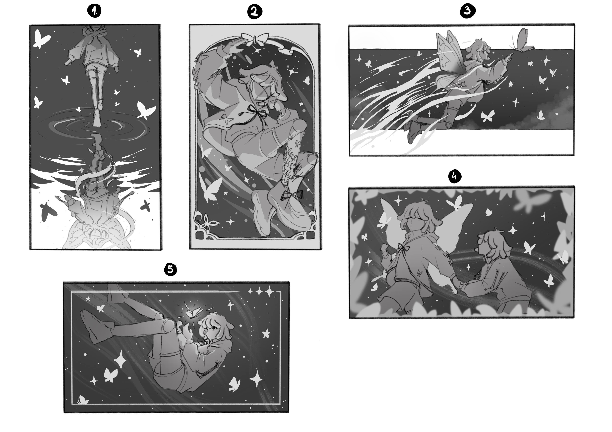
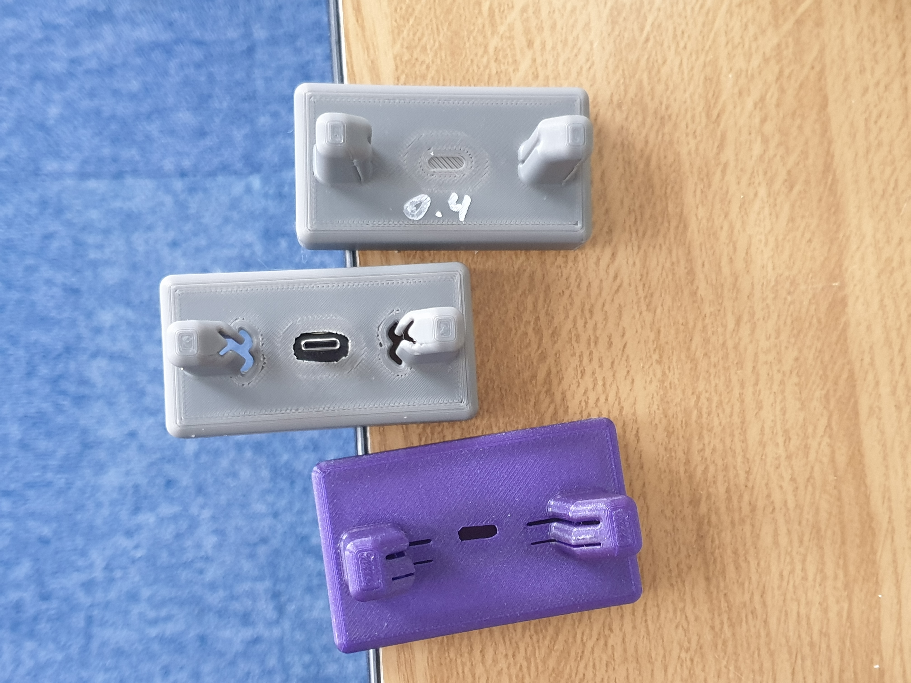

## Side-Slime <:nighty_a:1314209496029204572>
SlimeVR is now on sidequest! If you have been wanting to have the SlimeVR server on your Meta headset but was accidentally forced to auto-update, well now you can install our server using sidequest.
Special thanks to Meta for so kindly patching out all the ways people can install apps on the hardware they bought. Really doing a good job there protecting your customers from the evils of the world. /s
Check it out at the following link: https://sidequestvr.com/app/45270
*Note: The initial install of sidequest requires a PC or Android phone.*
## Rapid Roundup <:nighty_art:1314209500709781524>
Ready yourself for a bunch of SlimeVR news bits to bite on:
* Our new server is NEARLY ready for launch. Beta or Release candidate next week, mayb? It includes the flight list and a new height configuration page expertly crafted by Futura, along with all new reset sounds by Polymoria (meow :3). Its gonna be BIG. Video of the new height config is demo'ed below by the Astounding ZRock35 (thats their magician stage name).
* Even in their off-time, our silly slimes are making butterfly stuff. Check out pics of the gridfinity holders the team made to neatly hold all their little bits.
* Sebby has been hyper focused on toes for another week, and has assembled a unity script that adds the toe bits needed for wiggling on your avatar. For now it requires a custom form of the server. More information can be found, here: https://discord.com/channels/817184208525983775/1419768366620479559/1442651828452855982 Demo here: https://www.youtube.com/watch?v=0ZlbZNa8OS0
* The latest prototype of our Nighty slime plushie has arrived at the cave. This new version is even squishier and has a little more slime-tendrils on its head to fill out its form. Check out the pics below.
*That's it for this week. Thank you for reading to the end, hope you all have a lovely week and weekend. See you space slimethings~! <3*

## Butterfly News <:nighty_hug:1314209493747241011>
Work on Butterfly trackers marches on towards its rapidly-approaching release date. Lots of work is being done to perfect these little nuggets of goodness, with the whole team combining their powers to form a dream-team of technological wizardry.
**Aura** has been hard at work fiddling with firmware code to integrate a **TDMA** system, hopefully the last piece of the puzzle to ensure tracking is smooth as silky slime. This will be used in our dongle and tracker firmware to ensure packets don't step on each others feet and every tracker gets equal air-time. The plan is for each dongle to support up to 10 trackers, and multiple dongles will be able to work in tandem to support more, if required.
Meanwhile, in other parts of the Slime Cave, **Snaila** has been designing and testing various methods of the 'clicky' mechanism for the dock that snaps the trackers into place. The goal is to have a smooth, durable, and easy sliding action with a satisfyingly tactile click in the compliant mechanism--all while perfectly aligning and marrying up the USB port with the charging plug. Oh, and it has to be also suitable for injection moulding, which introduces a whole slew of design constraints. The various current top-contenders can be seen below.
Another cool thing I want to show off is the new strap prototypes that will be included with each Butterfly set. The goal for these is to address the main concerns that customers and ourselves had problems with in the original straps, while retaining comfort, flexibility and also aiming for the perfect balance between cost and quality. The main change is on the ends, with the large Velcro 'tongue' being replaced by a much smaller square of hooks. This, in conjunction with a new grabby tab on the end, makes removing and adjusting the strap way easier. Pics below.

