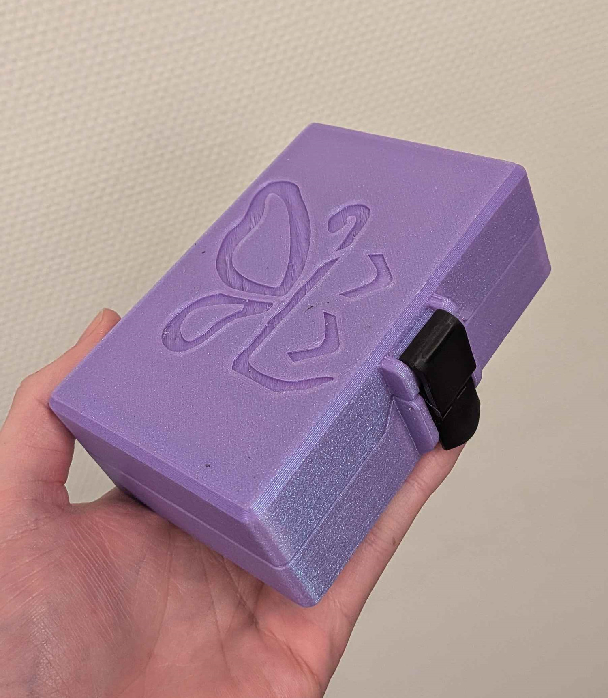
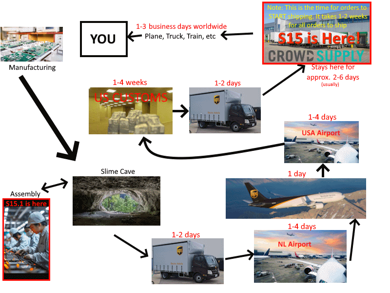
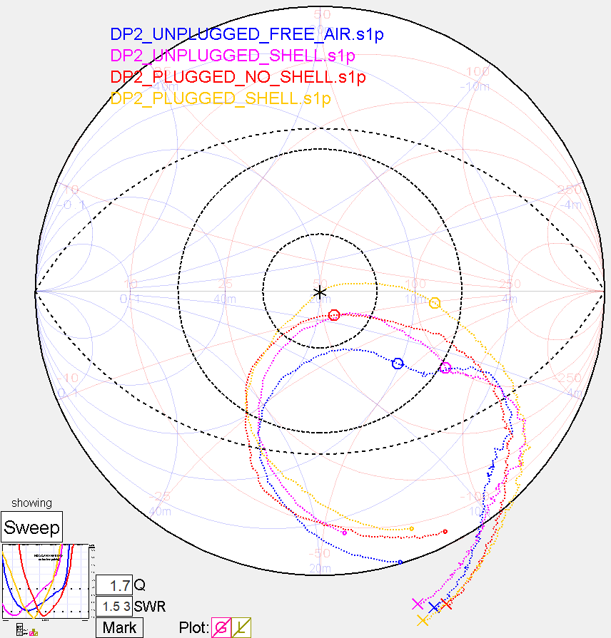

## Rapid Roundup <:nighty_art:1314209500709781524>
Ready yourself for a bunch of SlimeVR news bits to bite on:
* Not distracted by the flurry of activity all over the cave, Cake has been heads down and focusing on tuning and optimizing the dongle antenna for butterfly trackers. See their research in graph form contains in the pictures below. Hopefully those smarter than me can understand these crazy squiggles.
* A mysterious furry engineer snuck into the code over the last week and jammed in a spiffy theme customization hue slider. Those of you that have been hankering for some personalization on the server will be delighted with their progress, check it out in the video below.
* Due to hardware failures, our primary event manager and mascot, ZRock35, has been out of commission for the past few days. Big thank you to the lovely community members that have been helping cover for them <3
* There has been a storm of tweaks, edits, and additions to our documentation by our loyal swarm of wordsmiths spearheaded by the venerable Amebun. There is far too much to list here, but hopefully if you need it you will appreciate their hard work maintaining the sacred texts.
*That's it for this week. Thank you for reading to the end, hope you all have a lovely week and weekend. See you space slimethings~! <3*

## Butterfly Campaign SOON™ <:nighty_hug:1314209493747241011>
The team is shifting into high gear prepping for the launch of our second ever crowdfunding campaign. The cave is on fire with activity, recording and making media, assembling and shipping review sets, making tracking demo's, and all kinds of shenanigans. Expect huge news **very very soon**!
As usual, sign up for the campaign to get notified the moment we go live: https://slimevr.dev/smol
## Server Update Again <:nighty_hug:1314209493747241011>
As you likely have seen, the server was updated to 18.0 over the last few days, then hastily re-updated to 18.1 to fix the kinda major bug that slipped through the cracks. Someone silly added an UN before the Aligned. **Stay Aligned is now working again**, so if you turned it off in the 24h period of stay *un*aligned, **update to 18.1 and turn it back on**!!!!
**Android:** Additionally, Butterscotch has been hard at work plugging up the holes and bugs in the android and side-quest versions, which I have been told is stable and awesome now. Sorry about that. <a:CB_alfa_bow:600259677686857758>
There is also more checks in place to make sure future android releases are faster, smoother, and without issue. **Update to 18.1 **on both those platforms if you use it there.
If you are new to the 18.X party, this is a very brief overview of the cool stuff that was added/changed:
- New home screen layout
- Tracking Check list
- New sounds (The Mew returns!)
- Simplified Setup wizard, less pages
- New Assignment pages & Art
- New User Height calibration wizard
- Improved OTA updates
Update by re-launching the server and clicking the little update prompt at the top, or:
Going to our website https://slimevr.dev/#download
Updating through Play store https://play.google.com/store/apps/details?id=dev.slimevr.server.android
Or reinstalling through Side quest https://sidequestvr.com/app/45270
