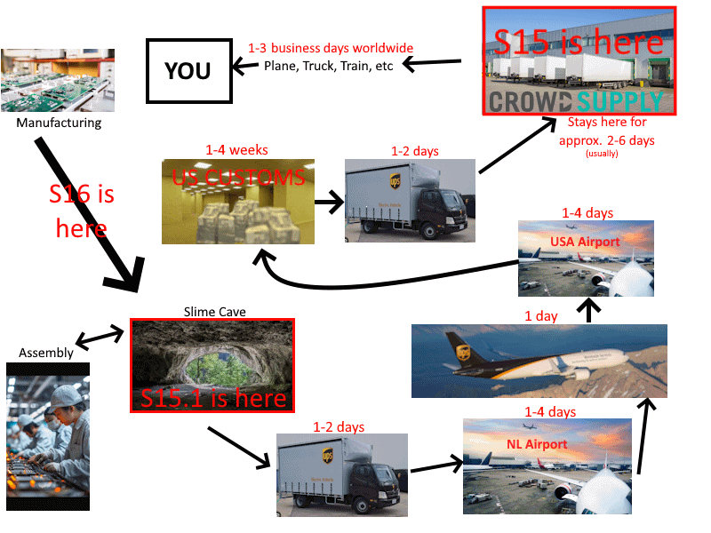
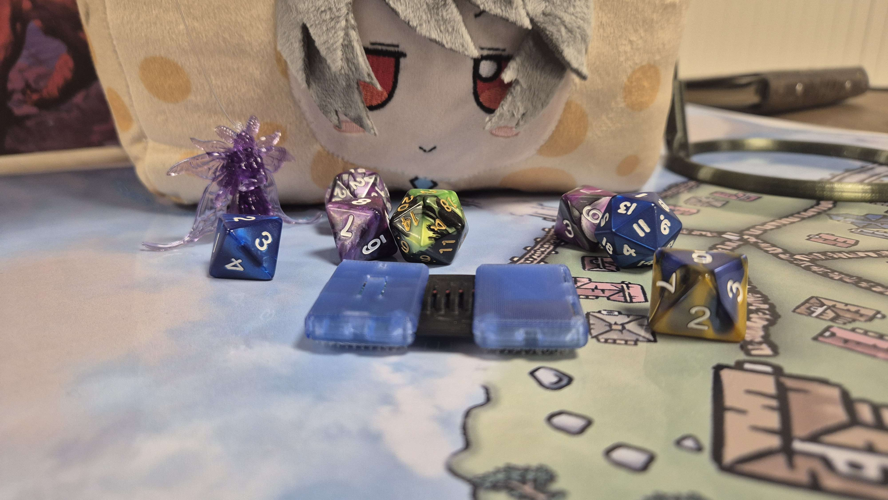
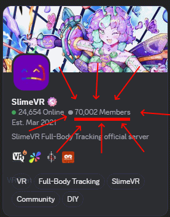
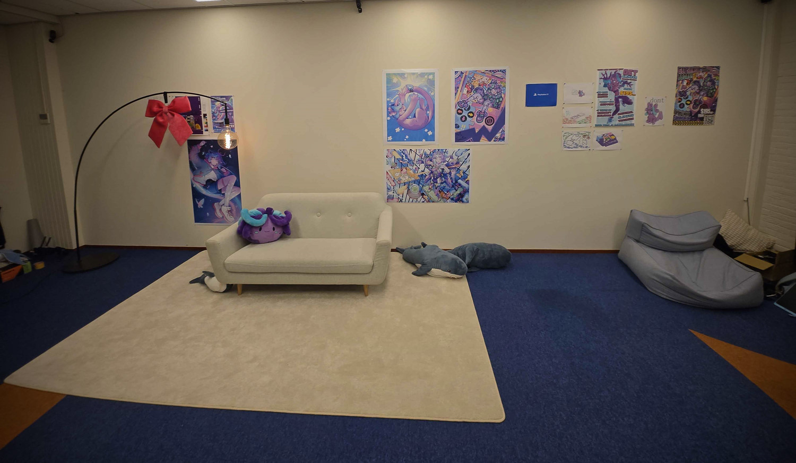
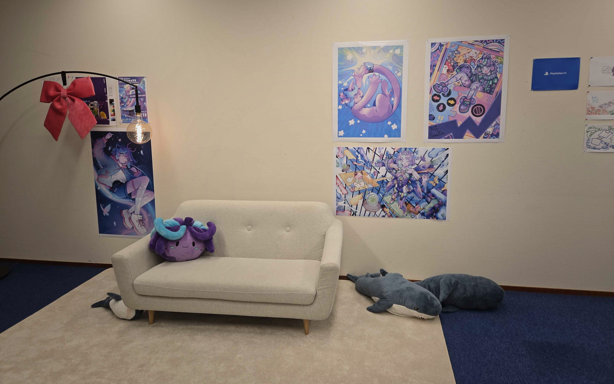
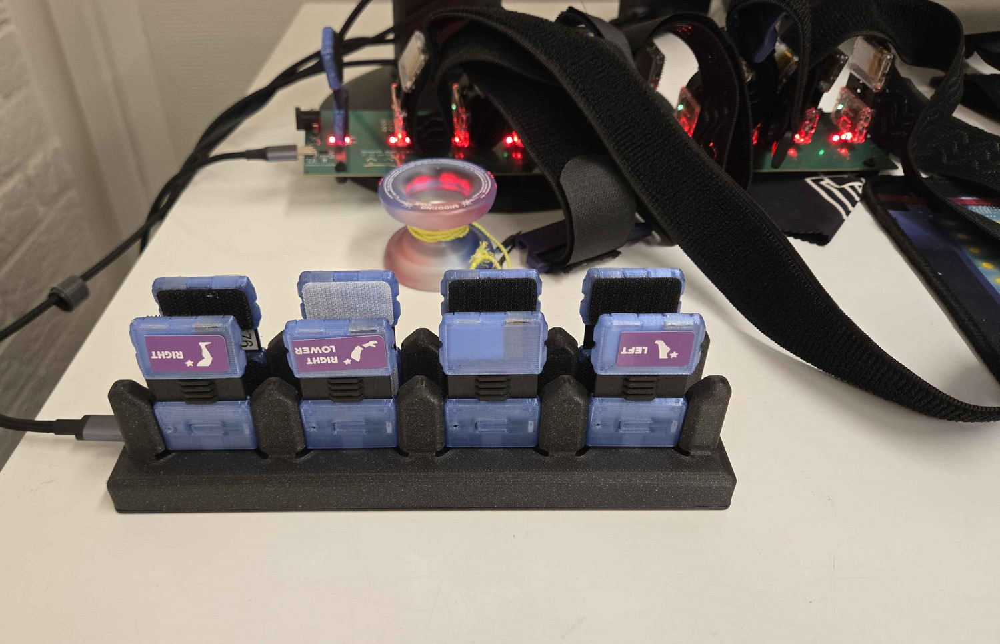
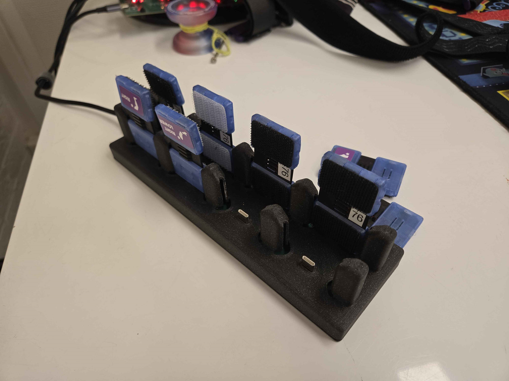
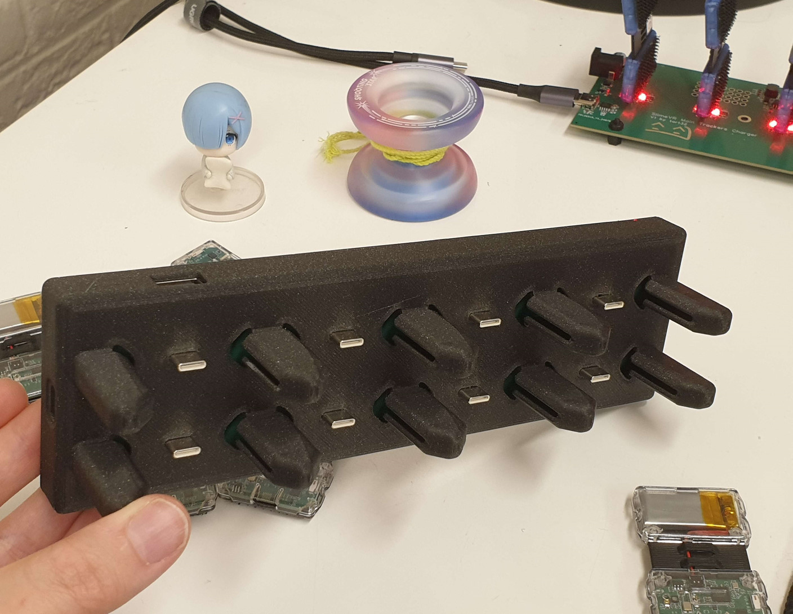
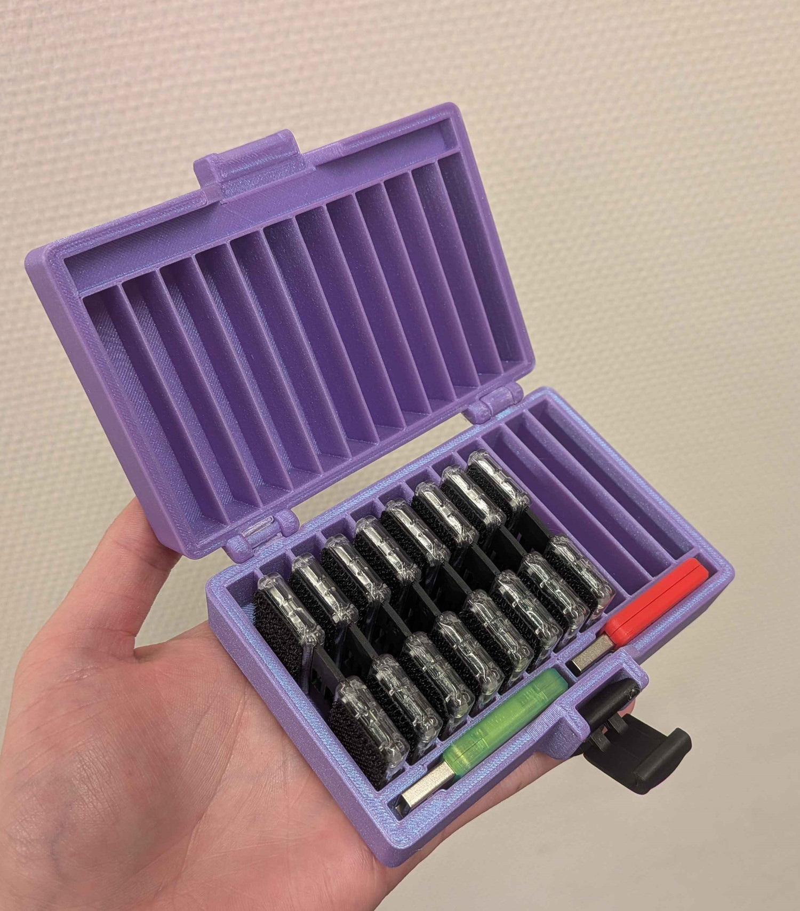

## Rapid Roundup <:nighty_art:1314209500709781524>
Ready yourself for a bunch of SlimeVR news bits to bite on:
* ZRock35 has returned to their regularly scheduled events, having finally fixed their PC woes. Go say Hi some time!
* In the dark corners of the SlimeVR cave, the spinny is slowly awakening from its long slumber. Check out the video of our V2 Spinny below, in all its ominously glowy glory.
## Happy Holidays! <:nighty_yay:1319261631217143910>
Wishing you Big love and a Happy Holidays from everyone on the SlimeVR team. We know the holidays can be a mixed bag, but love it or hate it; we hope you get to spend some quality time with the people you hold close to your hearts; virtually or in person.
As a holiday surprise, we have a slew of adorable new Nighty emojis drawn by the talented Shoyu. Check them out:
<:nighty_laugh:1451711536870719592> <:nighty_nerd:1451711628595691560> <:nighty_sleep:1451711244703891456> <:nighty_shy:1451711734992601249> <:nighty_tired:1451711351469637692> <:nighty_fear:1451711695256031352> <:nighty_dizzy:1451711473062772910>
SlimeVR is a community at its heart. A community of amazing people. So I just wanted to personally extend a special **Thank you** to all the people, creatures, and things reading this. You are appreciated, whether you bought a set or not, contribute or not, lurk in here or yap, or are just are here for the vibes. Thanks to all of you **we just broke the 70,000 user mark**! Thats a lot of slimes!
**Notice**: The SlimeVR team will be on holiday break between 24th Dec - 3rd Jan, so expect slime news to slow down around that period as they take their much deserved time off. Send them lots of love!
**2026 is gonna be year of the Butterfly!** <a:s_pinkButterfly:819624405549711401>
*Thank you for reading to the end, hope you all have a lovely holidays. See you space slimethings~! <3*

## Butterfly Campaign SOON™ <:nighty_hug:1314209493747241011>
The SlimeVR cave team continues to flutter around in fervent preparation for the grand launch of the Butterfly Trackers. I have a bunch of behind the scenes photos to share with you from the team below, check them out.
The first picture is the VR recording area that has been spifified for the recording of Butterfly tracking and footage demos. So many cute posters!
Next up we have the latest iteration of our charging dock, being diligently worked on by the team to charge 8 trackers simultaneously and give a neat little home for the dongle. Very cool stuff.
After that is a slime travel case being brainstormed up and tested. For those of you who need to take your slimes with you or just want them to be encased in the cold embrace of plastic, this is an accessory you will want to get your mittens on.
As usual, sign up for the campaign to get notified the moment we go live: https://slimevr.dev/smol

