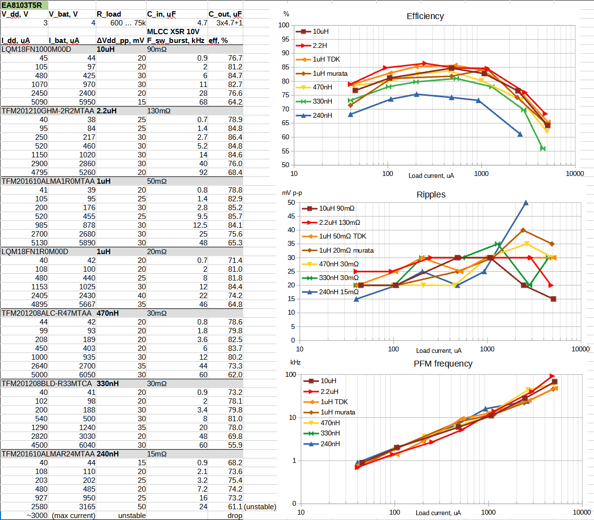
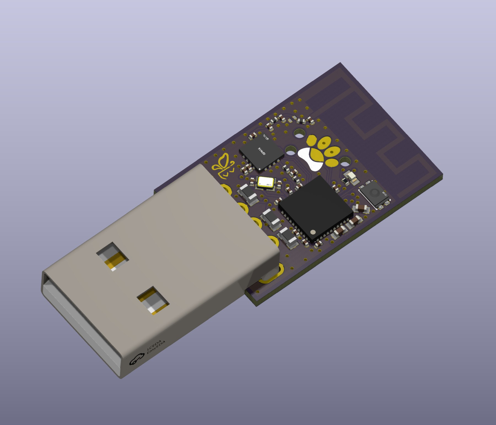
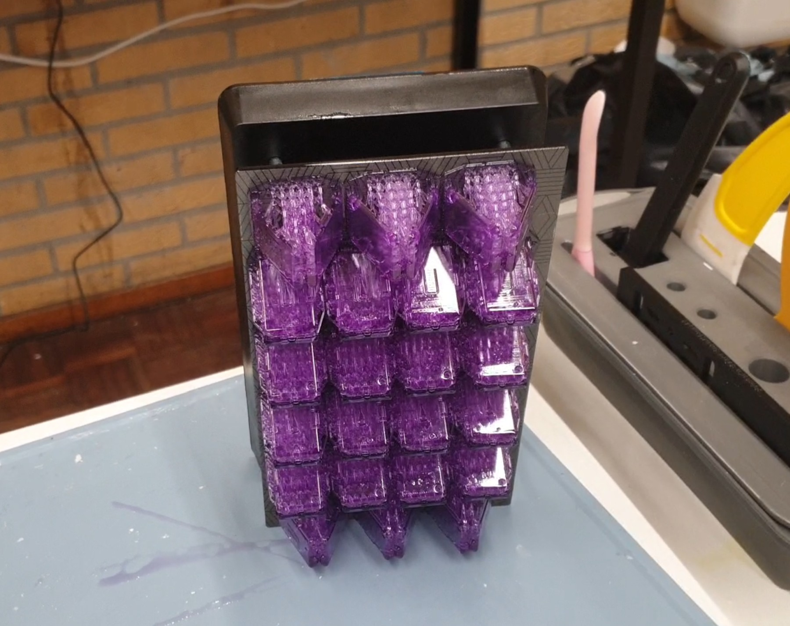
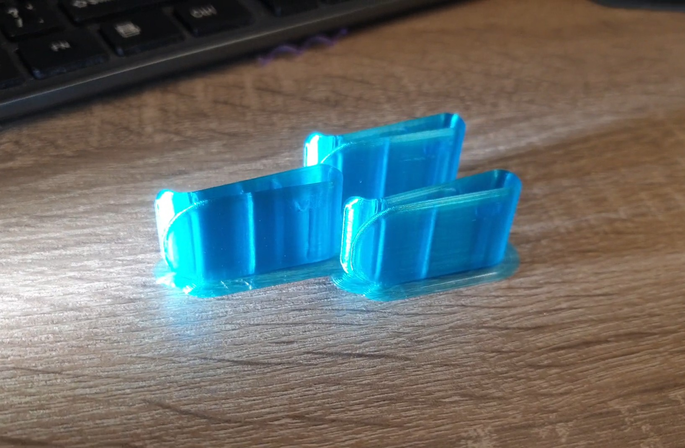
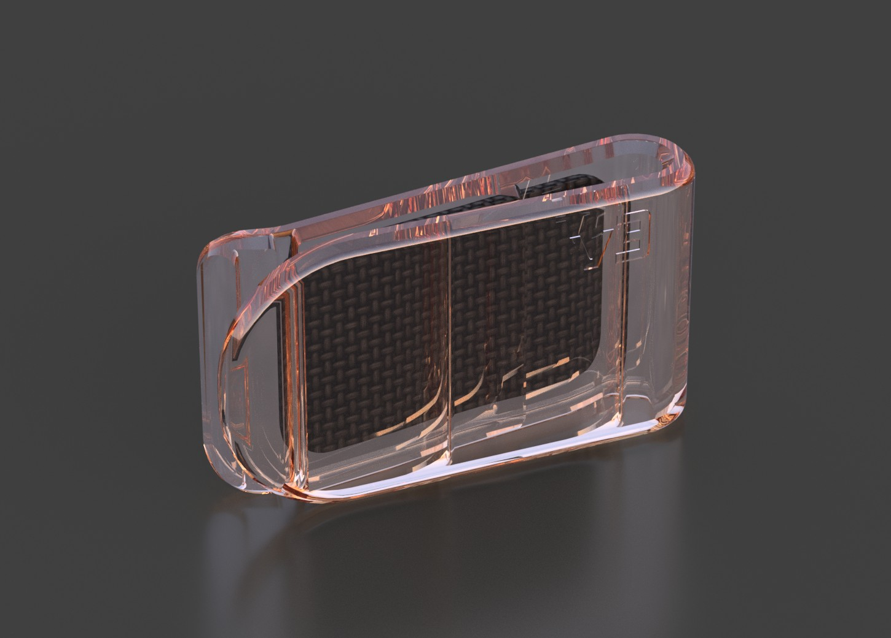
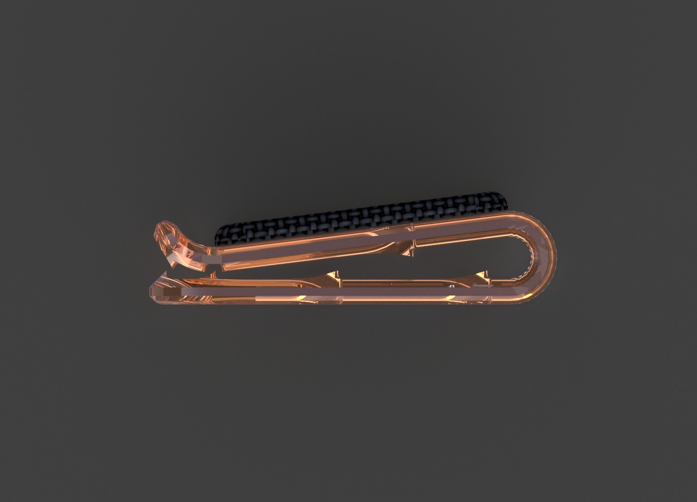
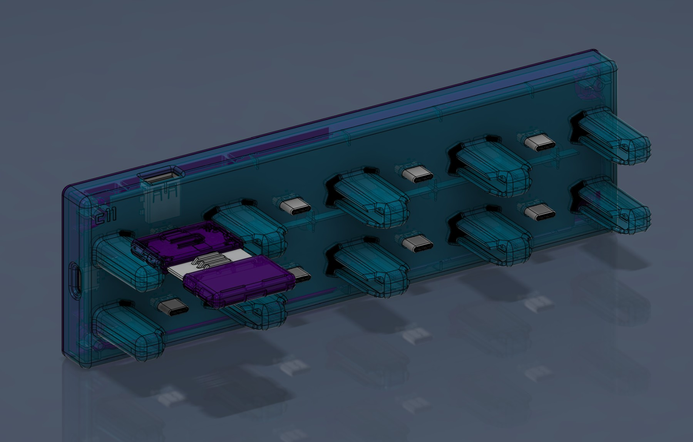
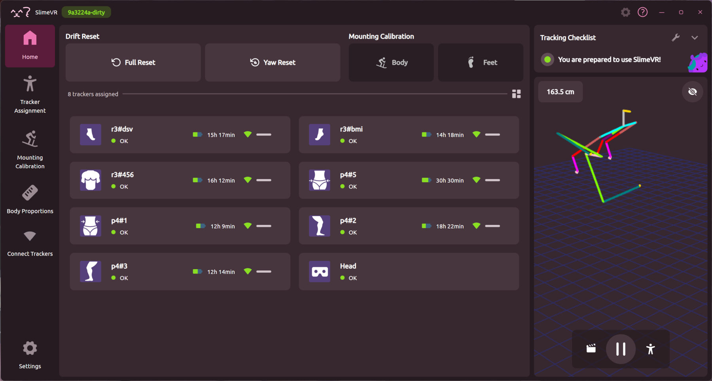
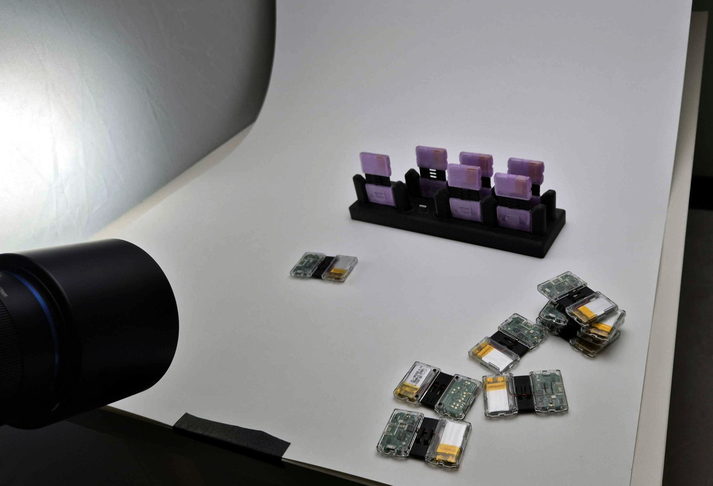
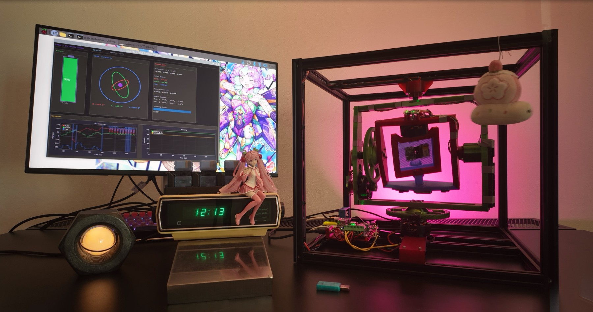

## Butterfly News continued... <:nighty_hug:1314209493747241011>
Last but not least, the design team has been prototyping and refining a whole bunch of stuff. Meia has continued working on the teemny dongle, which is now up to prototype 3. Its very cute, pics below. Meanwhile Snaila has been toiling over triangles to find the their perfect arrangement for our Butterfly tracker cases, the clothing clippies, and the compliant mechanism that holds the tracker into its little charging dock. All these are being tuned for our in-house printing solutions during the prototyping phase, but will need to be adjusted for injection moulding when the designs are finalised. Luckily with out new injection moulding machine we can test this in-house before committing to expensive moulds.
Sign up to stay in the loop at: https://slimevr.dev/smol
## Rapid Roundup <:nighty_art:1314209500709781524>
Ready yourself for a bunch of SlimeVR news bits to bite on:
* Resident skunk Bubblesconch has been busy tinkering with a whole slew of server-related things, including squashing android bugs, updating their 'step mounting' beta (now based off 18.1), and doing a thorough clean and rewrite of a bunch of OSC-related code that will hopefully make OSCquery work way better!
* Ever wanted to know how long till your slime battery runs out? Well a smart little snow kitty has managed to shove Runtime estimation into the server so you can get a rough timeframe of how long your battery will last. Preview picture is below, look for this in a future update.
* Resident mad-scientist Sebby has managed to bootstrap a custom tracker forwarding system to their butterfly prototype dongle output, allowing them to forward tracker data over the internet. Check out their youtube video here: https://discord.com/channels/817184208525983775/903962635161174076/1459051543666884726
*That's it for this week. Thank you for reading to the end, hope you all have a lovely week and weekend. See you space slimethings~! <3*

## Butterfly News <:nighty_hug:1314209493747241011>
Butterfly campaign launch is *just* around the corner. I know I've said this a few times but the team is really pulling out all the stops when it comes to this release to make sure its amazing. Development chugs away in the background un-hindered too, so even though our launch date has slipped a little it shouldn't affect the shipping date *too* much. With that all said, lets get into the cool stuff that's been going on by the team!
First up is kind of a big deal. We have officially secured the IMU chip stock for the butterfly trackers in the volume we expect to ship. That's a huge deal, as its one of the biggest potential sources of delays out of the picture.
Next, the team has been frantically making promotional materials and organising marketing in preparation for the campaign launch. There is a lot more work than you might think that goes on behind the scenes for this stuff, including but not limited to: sending review sets out, recording and editing the trailer and demo videos, and finalising the amazing artworks. Check out the amazing box art by Emilia. Since the trackers are much smaller, the box will be too. I am really looking forward to display this on my 'cool stuff' shelf! I've put a few other behind the scenes pics below, so check them out on your way down. The setup for the spinny v2 time-lapse is particularly cool, expect to see that soon.
-# *Continued below*

