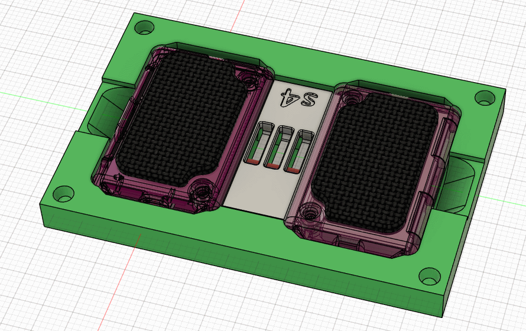

## Slimes on stage @ FOSDEM! <:nighty_data:1314209491365007360>
SlimeVR is heading to Brussels, Belgium to attend FOSDEM 2026! Open on 31st of January and 1st of February, part of the SlimeVR team will be traveling cross-country to demo our cool open-source tech. If you ever wanted to meet the team, or are just interested in free and open-source software and tech, the event is open to anyone who wants to show up in person, and also streamed online to watch on their website.
SlimeVR will be presenting on the second day, [<t:1769941500:F>-<t:1769943000:t> in the 'Gaming and VR devroom'](https://fosdem.org/2026/schedule/event/TBFSCP-slimevr/), so if you want to see us specifically that's the day! Come share your love for SlimeVR or tune in to ask some questions in the chat room!
Event info: https://fosdem.org/2026/
SlimeVR panel: https://fosdem.org/2026/schedule/event/TBFSCP-slimevr/
## Rapid Roundup <:nighty_art:1314209500709781524>
Ready yourself for a bunch of SlimeVR news bits to bite on:
* The planet guy, Gorbit, has been busy testing the limits of our SPI protocol to see how many IMU's can be effectively piped to one microprocessor. This is vital work for our glove project, as fingers have a whole lot of bones inside them to track.
* Do you like open source stuff and VR? Well so does Rexa, who has been busy fusing our tracking into a prototype game constructed in the Godot engine. For now, its just over VMC, but they hope to be able to pull tracking info directly form our interoperability protocol, SolarXR, to get a native tracking layer for games to be able to use slimes directly. Check out their demo video below.
* Steam is cool right? Slime on steam would be cool... right? Well we now have an internal beta for steam we are testing, and expect to have a public beta available in the near future. More news on this soon.
*That's it for this week. Thank you for reading to the end, hope you all have a lovely week and weekend. See you space slimethings~! <3*

## Butterfly News <:nighty_hug:1314209493747241011>
The team in the Slime Cave and remote slimes are working tirelessly to get our Butterfly campaign ready for launch (even on the weekends, smh take a break). Our **trailer is nearly done**; a critical part of the campaign as its the main overview the majority of people will see and needs to answer most questions people have while being enjoyable to watch. No small task as we love talking about Butterfly trackers. *~jingles keys~* Still with me? The script is finalised, voice-over nearly done, its mostly just down to editing work now. We look forward to showing it off!
Speaking of showing it off, Butterfly **review sets** have begun being released into the wilds. We have hand-picked a bunch of big, small, and in-between creators that stood out to our team as honest and entertaining creators. More sets will be sent out in the coming weeks, so expect lots of reviews to trickle out around our campaign launch.
Our boffins have been busy blasting power through our boards, with Cake torturing various power regulators on our boards in order to find the best ones in order to squeeze out every last drop of power efficiency possible. Power noise is also under the microscope, with various buck converters being fiddled with to find the one with the lowest signal noise. Clean power is good power! Check out her cool results below.
A few other production milestones are happening in the background, too. Our newest prototype is being ordered this week, and is *very* close to what we expect the final form of our Butterfly trackers will be. We expect one to two more iterations before we are confident the design is ready for production. Meanwhile, dongle v3 has been ordered and is en-route to the cave for thorough testing, and our charging dock prototype is being tested thoroughly by the entire team as the office Butterflies are being relentlessly abused in testing and recording for our campaign materials.
https://slimevr.dev/smol
