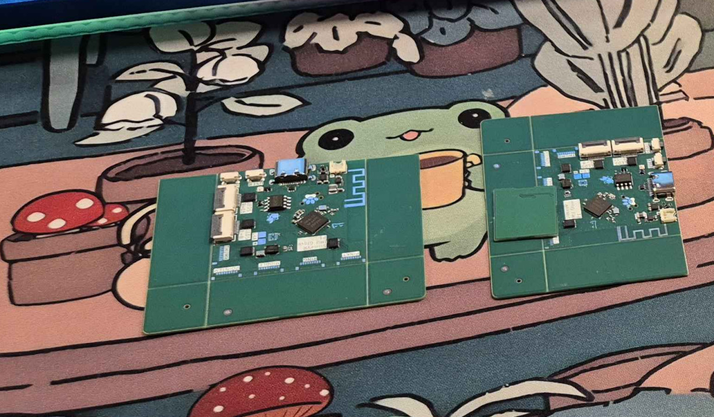
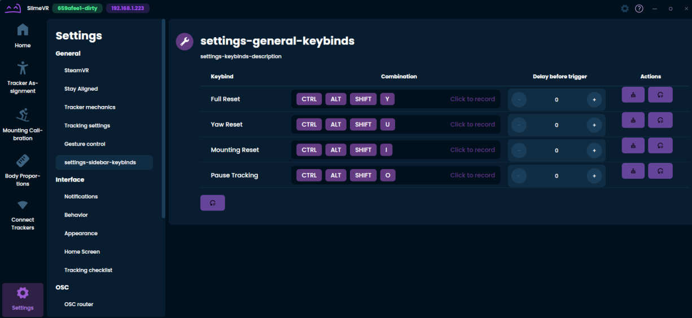
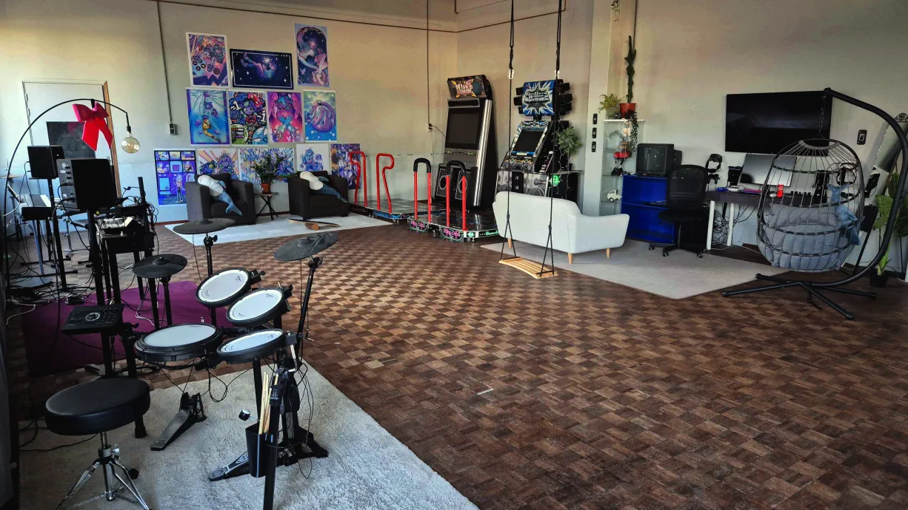
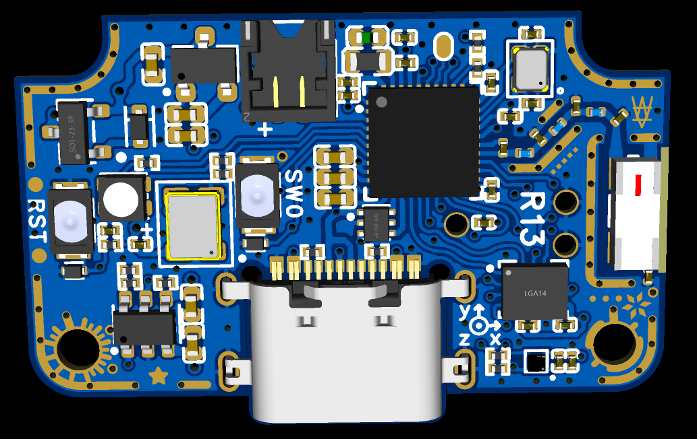
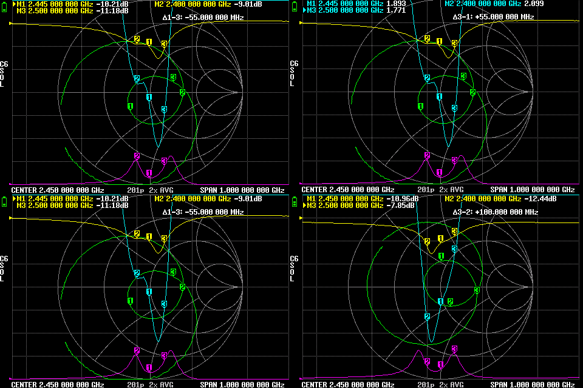
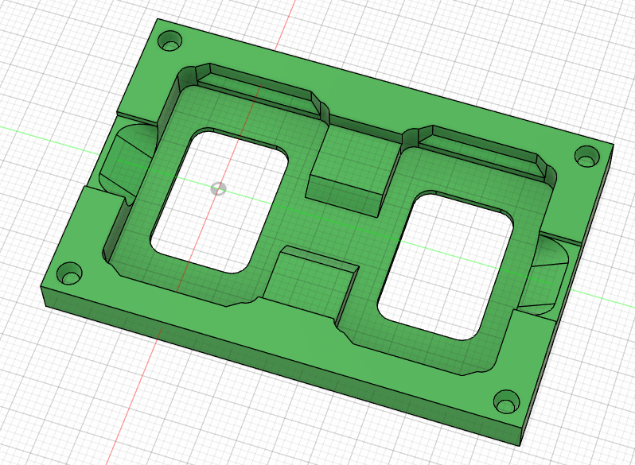
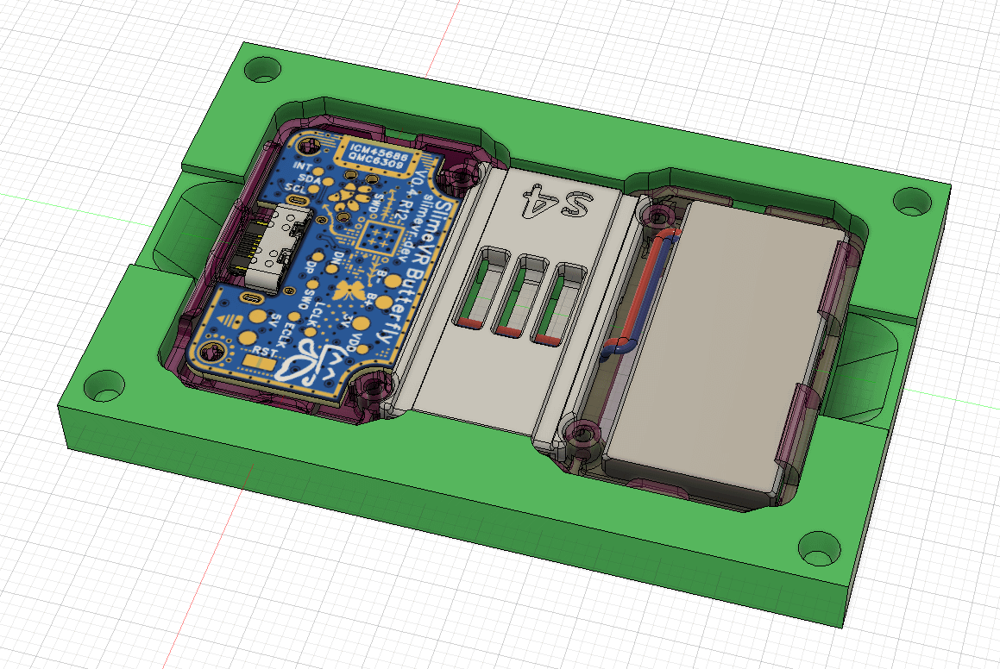

## Slimes on stage @ FOSDEM! <:nighty_data:1314209491365007360>
Just a reminder, many of cool people from the SlimeVR cave team in NL will be shuttling over to Belgium this weekend to attend and present at FOSDEM. It's basically a convention celebrating all the cool free and open-sourcey stuff happening in the world. Over 1000 lectures are blocked in, so its packed with cool nerdy stuff.
SlimeVR will be presenting on the second day, [<t:1769941500:F>-<t:1769943000:t> in the 'Gaming and VR devroom'](https://fosdem.org/2026/schedule/event/TBFSCP-slimevr/), so if you want to see us specifically that's the day! Come share your love for SlimeVR or tune in and ask some questions in the livestream chat room!
Event info: https://fosdem.org/2026/
SlimeVR panel: https://fosdem.org/2026/schedule/event/TBFSCP-slimevr/
Livestreams: https://live.fosdem.org/
## Rapid Roundup <:nighty_art:1314209500709781524>
Ready yourself for a bunch of SlimeVR news bits to bite on:
* Our ICM Glove prototype has gone from concept to reality, with a PCB prototype ready to test in the cave and various developers lairs'. Expect to see more info on this soon. Check them out below.
* Hannahpadd has been flexing her coding muscles by adding new GUI additions for customizing key bindings and associated reset delays. See the fruits of their labour in the pics below.
* Resident mad-scientist Sebby has created a SlimeVR input system to use a controller as... a controller.. but ***also*** a tracker. At the same time! See their handiwork here: https://discord.com/channels/817184208525983775/903962635161174076/1463513388234575883
* Steam release of our SlimeVR server is steadily coming together. This week I'm showing off some of the cool graphic designs by Leraine for the icons, banners, and other pictures that are required for Steam. Check them out below.
*That's it for this week. Thank you for reading to the end, hope you all have a lovely week and weekend. See you space slimethings~! <3*

## SlimeVR Tip Corner <:nighty_nerd:1451711628595691560>
Its cold for a lot of you in the upper half of the world. You may or may not have noticed some changes in your slimes. We tend to get a lot of reports of increased drift during winter time, and that's not a coincidence. IMU's--the things that 'track' inside slimes--are basically microscopic springs, and temperature affects how those springs move.
### **Why does that matter?**
Put simply, when booting up the trackers you need to do **'rest calibration'** where you place the tracker down for 10+ seconds. This is a type of IMU calibration that teaches the tracker what being completely still "feels like", then they use that plus some maths to zero out the bias (errors). Since they behave differently at different temperatures, its best to calibrate them at operating temperature since the bias changes with temperatures
### **OK... How can I Fix it?**
Just warm them up a little before use. 5 mins on your lap under a t-shirt or blanket should be plenty. Turn them on to get them to operating temp faster. After that just plop them down and leave them completely still for 10-20 seconds as you usually would before use to trigger self-calibration.
If you want to be extra certain, you can see the IMU temperature by switching to ⁨⁨`table view`⁩⁩ (Video below shows how). Try to calibrate the trackers between 30-40°C, or whatever temperature they sit at after 1 hour of normal use.

## Butterfly News <:nighty_hug:1314209493747241011>
Still burning the midnight oil, the Cave team is fervently prepping the Butterfly tracker promotional materials for their debut in the Crowd Supply spotlight sometime very soon (picture of the recording studio below). Even so, improvements are still being made in the background by our busy team of engineers.
Our Butterfly PCB has entered its 13th revision, with PCB changes and tweaks being made by Cake based on her extensive antenna testing and research as well as a few other improvements such as coordinates on the silkscreen and a spare GPIO pad for shenanigans. I'll include some pics below of their findings, but they are way too complicated for me to understand. This new PCB has been ordered for testing and should arrive in the near future.
Not to be outdone, Meia has been head down with designing another iteration of our charging dock. The new design will sport 10 charging slots and include a nice little spot for the dongle to sit. Speaking of dongle, the newest design prototype just arrived at the cave and is ready for more extensive testing.
Meanwhile, Spinny™ has been doing its thing twirling around Butterfly trackers to limit test their usage against the theoretical limits. As a result, our 25+ hours estimate for battery life was confirmed, with testing showing over 28 hours of *continuous movement* on a tracker before it died. Crazy numbers considering the constant movement meant the integrated battery conserving code never even had a chance to kick in. Real world usage should be even higher, as the battery conserving stuff turns on/off opportunistically whenever they stop moving.
Last but not least, we have a prototype assembly jig now! It might not seem like much, but its a crucial step for efficiently turning pieces of trackers into a Butterfly Tracker. A good jig makes assembly faster and easier, and is a key piece to the production puzzle. Pics below!
Sign up here: https://slimevr.dev/smol

