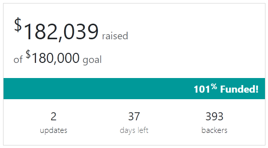
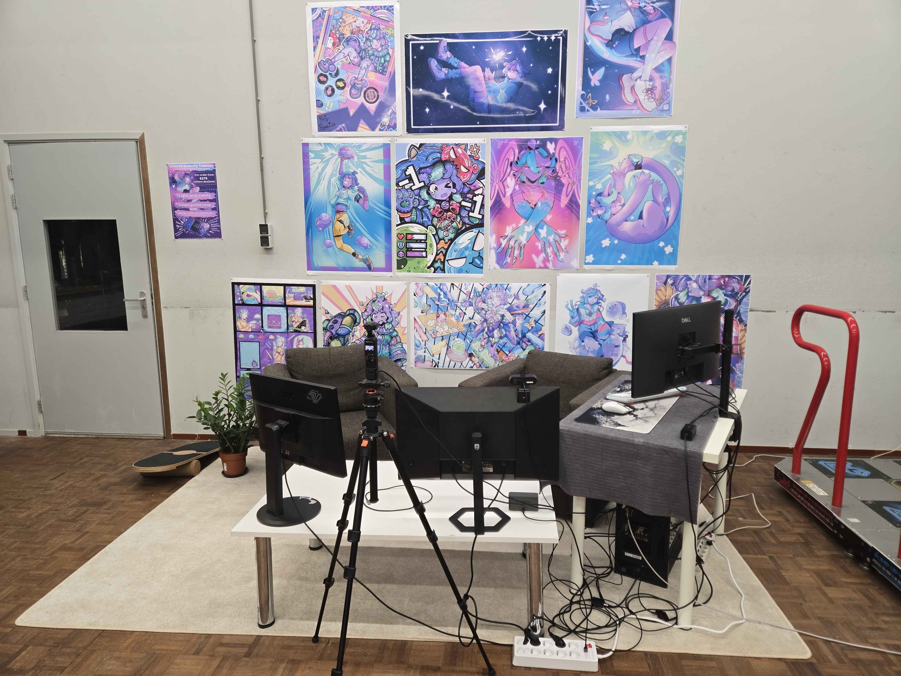
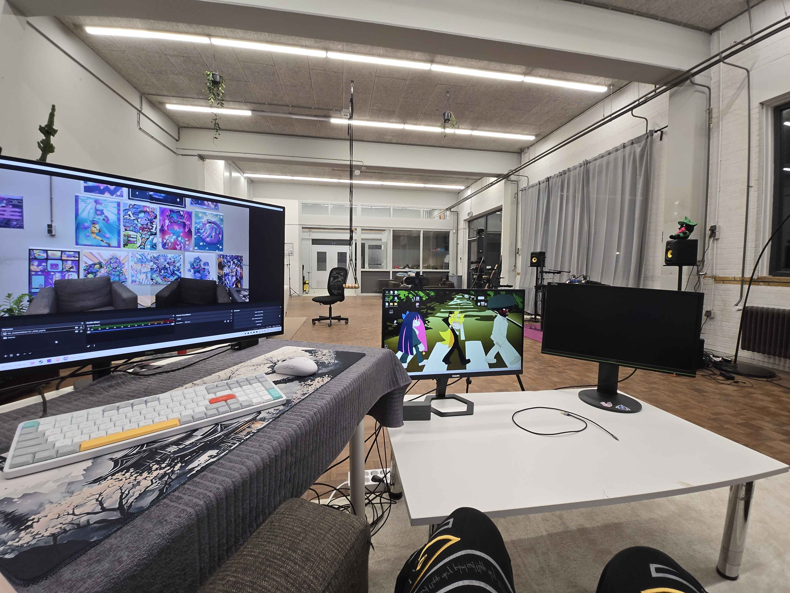
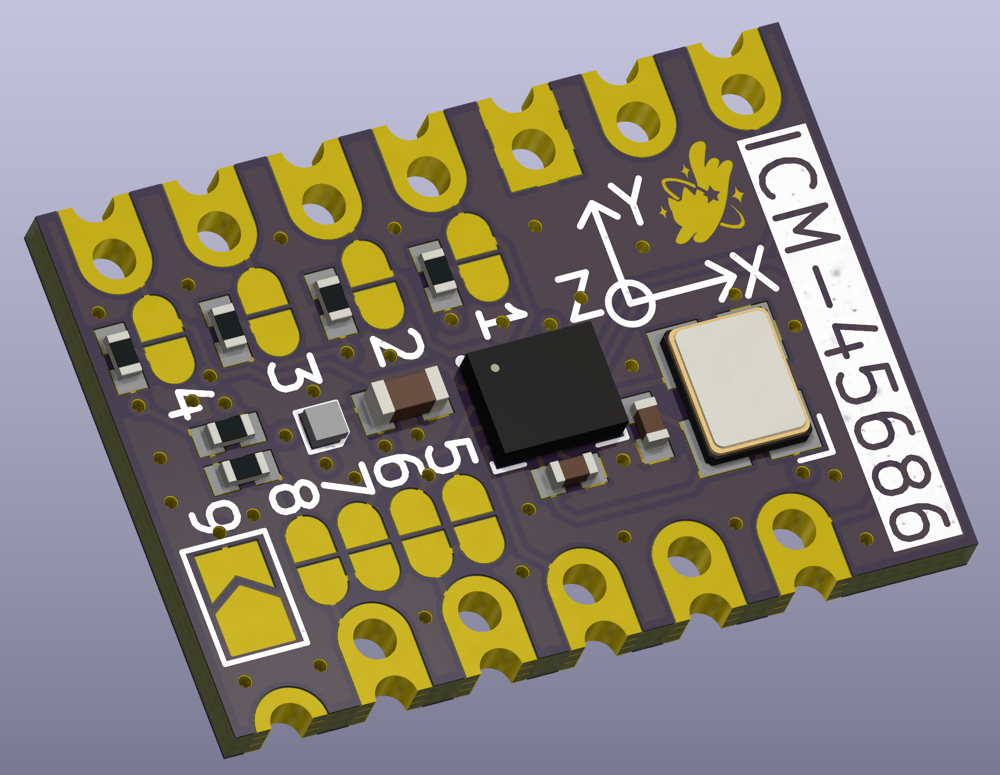

## Rapid Roundup <:nighty_art:1314209500709781524>
Ready yourself for a bunch of SlimeVR news bits to bite on:
* Aed has begun working on a setup onboarding quiz, similar to how discord does it, where users will go through a small series of questions to set up the server for them. Standalone users will have OSC enabled automatically, while a mocap artist might have mocap mode enabled if they dont have a headset.
* A new MUMO has entered the battle! Well not really completely new, but Meia has a shiny new revision of her ever-popular ICM module. Check it out below.
* Speaking of new, the cave team has two new physical members at the cave, with Meia and Em now able to physically touch the beacon at the SlimeVR HQ in Netherlands. SlimeVR is one step closer to amassing an army of catgirls now.
* Our steam release progresses quietly in the background, with Hannah working on getting it ready for release, mostly focussing on linux which will help make it much simpler to get going on the Steam Frame one day.
*That's it for this week. Thank you for reading to the end, hope you all have a lovely week and weekend. See you space slimethings~! <3*

## SlimeVR Tip Corner <:nighty_nerd:1451711628595691560>
**Trackers lagging or ping going wild? **The main reason for this is packet loss, and is usually caused by interference on the radio bands your 2.4ghz WiFi is using for the trackers.
### How do I fix it?
There are three main strategies to resolve this issue, all are found in the 2.4ghz settings of the router:
* **Change the router channel to one that has less interference**
The simplest method to do this is by rebooting the router, but manually changing it is ideal. 1 and 11 are considered the better ones to try, followed by 6. You can use a phone app like ⁨⁨⁨⁨⁨⁨⁨⁨⁨⁨⁨`WiFi Analyzer`⁩⁩⁩⁩⁩⁩⁩⁩⁩⁩⁩ to check for WiFi sources of interference, but non-WiFi sources of noise like 2.4ghz controllers, video streams (security cams, baby monitors), and microwaves wont show up on these apps.
* **Reduce channel width to 20mhz**
This makes your WiFi more likely to 'miss' sources of interference at the cost of maximum bandwidth. Think of it like a motorbike riding between lanes in a traffic jam.
* **Lower 2.4ghz tech level as low as possible**
This is mostly for routers with WiFi 6 and higher, as Wi Fi 6 uses both 2.4ghz and 5ghz together to boost the speed of main devices. The downside is it can cripple things that rely on 2.4ghz, like Slime trackers. Ideally set to "b/g/n" or lowest you can set it that includes those versions.
Accessing these settings is different for every router, but it can usually be done by following this guide from Nintendo and navigating to either 2.4ghz WiFi settings, advanced WiFi options, or WiFi security options: https://en-americas-support.nintendo.com/app/answers/detail/a_id/657
## Butterfly News <:nighty_hug:1314209493747241011>
2 DAYS LEFT UNTIL BUTTERFLY CAMPAIGN!! 2 DAYS LEFT!! *2 DAYS LEFT!! 2 DAYS LEFT!!* **2 DAYS LEFT!! 2 DAYS LEFT!!** *shakes you*
*Ahem*... Sorry about that. I am just very excited about Butterfly trackers....
Our campaign starts in 2 days, and even if u don't care about the trackers its still good news for you, as we are planning a big STREAMING EVENT sometime next week for you to come hang out, ask questions, and see cool in-development tech we have. We don't have an exact date just yet, so sign up for the ⁨⁨⁨`Streaming notifications`⁩⁩⁩ role in <#844382850845376521> , subscribe to our [Youtube Page](https://www.youtube.com/@SlimeVR), and be on the lookout for more info in the coming days.
On the Butterfly front, the team has collectively been maniacally preparing for campaign day, touching up and finalising all the art, media, pages, information, documents... you name it. Everything is getting a final polish in prep for our campaign launch on Feb 9. We are very excited, and hope you are too!
Oh and obviously goes without saying, but if you are interested in Butterfly trackers, sign up for the campaign here: https://slimevr.dev/smol
We hope you can feel all the love and passion the whole team has poured into this over the last few years.

# Go to <https://slimevr.dev/smol>

# Get Ready For Butterflies
@everyone we have the date! **Our crowdfunding campaign for SlimeVR Butterfly Trackers launches on February 9th!**
Put it in your calendars! **Preorders will be open at <https://slimevr.dev/smol>**, go there and subscribe to get notified when it launches! (There is no exact launch time)
**Core Set Bundle of 6 trackers, straps and a dongle will be $279 USD** (without tax and shipping). This time you will have an option to buy even a single tracker if you want, though we recommend getting one of the bundles for the best experience.
* **Core Set**: 6 trackers and 1 dongle. $279 USD
* **Enhanced Core Set**: 8 trackers and 1 dongle. $364 USD
* **Full-Body Set**: 10 trackers and 1 dongle. $449 USD
* **Special Edition Sakura Set**: 10 trackers and 1 dongle in translucent pink + charging dock. $499 USD
* **Motion Capture Set**: 17 trackers and 2 dongles + a set of Iron-On patches. $783 USD
* **Charging Dock**: $49 USD
## We expect the preorders to ship in August 2026!

# Small Fosdem Update
To those attending Fosdem this weekend that were planning to come see us:
We booked an additional BOF room (birds of a feather) after our main presentation.
So if the devroom is too full or you want to come say hi, meet or talk to us after the fact you can find us from 12:00 till 12:55 in room UD2.119 (Sunday)
The actual talk/presentation is H.1302 from 11:25 until 11:50
Hope to see you all there!
Link to the BOF room:
https://fosdem.org/2026/schedule/event/ZWWMB7-slimevr_full_body_tracking_bof/
Link to the main dev room:
https://fosdem.org/2026/schedule/event/TBFSCP-slimevr/
