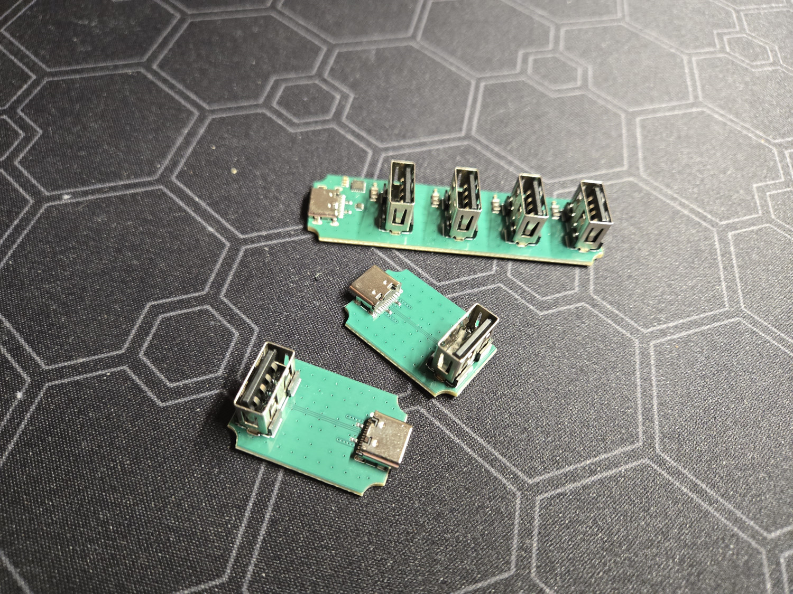
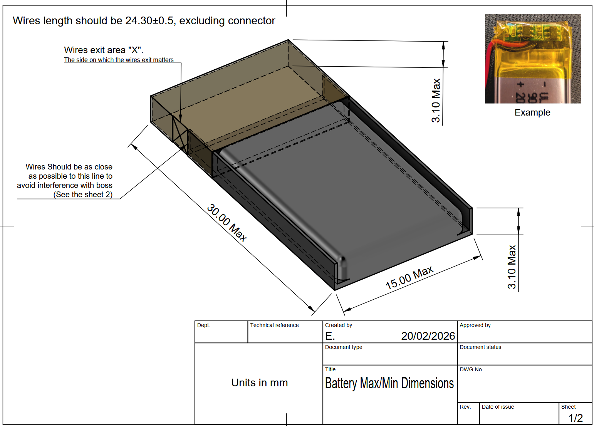
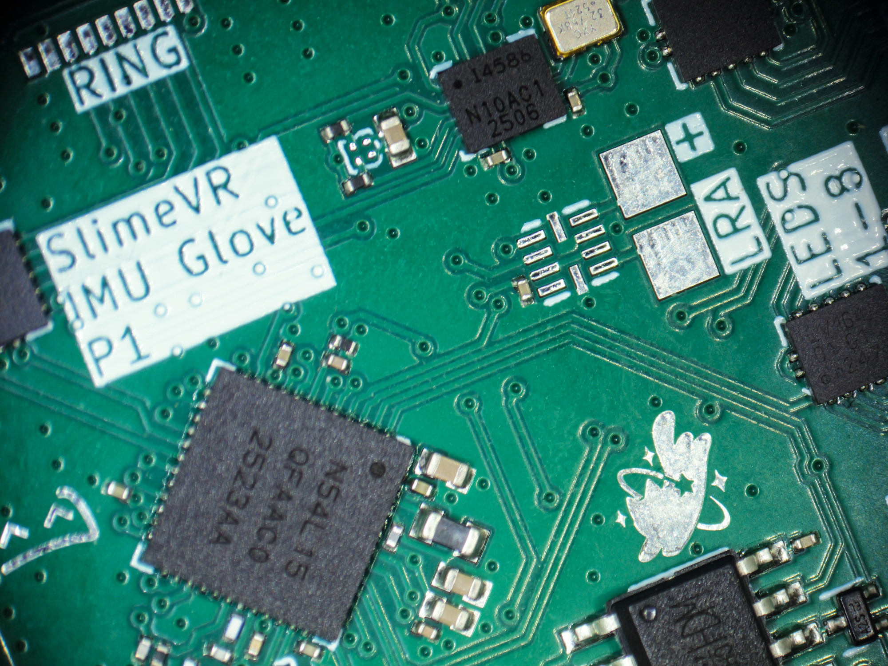
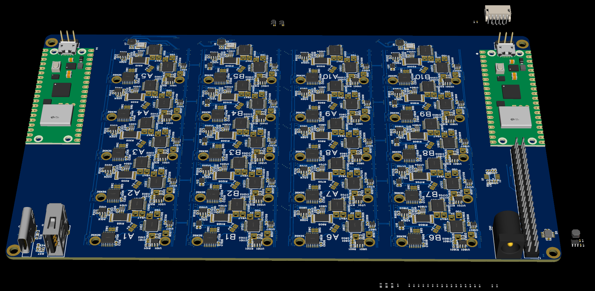
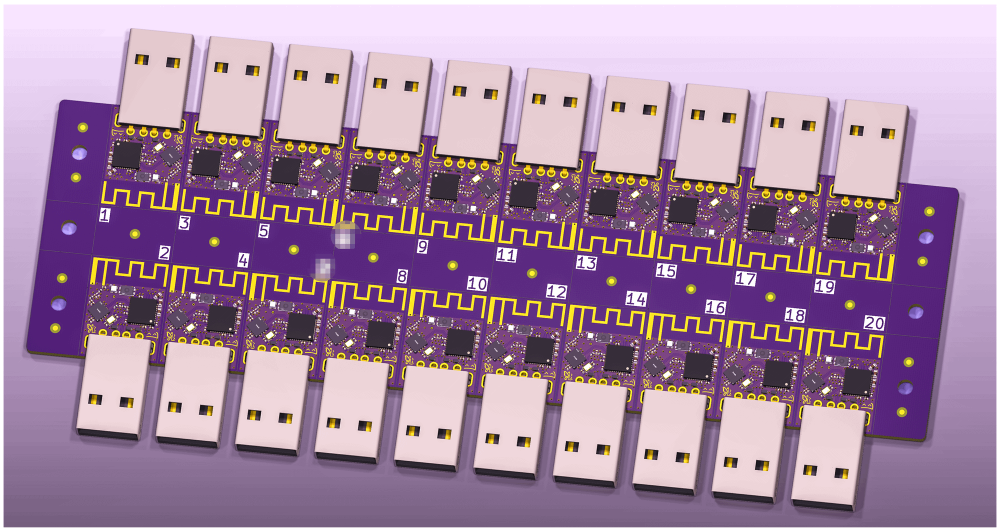

## Rapid Roundup <:nighty_art:1314209500709781524>
Ready yourself for a bunch of SlimeVR news bits to bite on:
* For those of you who missed the announcement on our Livestream the other day, our Plushie is finally heading to the store! Expect it to show up in our official slime store in the next few weeks for $60 USD https://shop.slimevr.dev/collections/all
* Our new SlimeVR Glove PCB arrived in the cave (pic below). This bad boy can fit so many IMU's on it *slaps the top*. Capable of running up to 23(!!!) IMUs at full speed, this new model fixes one of the biggest issues that was holding us back, as older versions that relied on I2C would get slower for every IMU added. Big team effort to this point, way to go team!
* Big scary things are happening in the coding channel. In order to get SlimeVR to behave on Linux, we are moving away from our current Tauri backend to something more reliable. The goal of this migration is to make multi-platform development much more simple, so our Linux, Windows, Apple, and Android releases will be much more consistent. Great news if you are planning to get a Steam Frame!
* Hannah has been grinding away getting our behind-closed-doors Steam release and has a build successfully running on Linux. Big milestone for this hitting a public release. Way to go! pics below
* Sebby is at it again, this time using slimes to emulate a controller to play Halo and Terraria. Why? To prove she can. If you are at all interested in using IMUs as a game controller, check out her demo posted in the media channel here: https://discord.com/channels/817184208525983775/903962635161174076/1472910637259686041
*That's it for this week. Thank you for reading to the end, hope you all have a lovely week and weekend. See you space slimethings~! <3*

## Butterfly News Continued... <:butterfly:1470467583323930685>
On the hardware design side of things, we have had two strong advancements. Firstly, Cake has been hard at work on our Butterfly tester, which is now approaching design completion. It's one of those weird pieces of the hardware development puzzle, but VERY important for quality assurance, so it's good to see it slowly fleshing out. Similarly, Meia has been working on our Butterfly Dongle PCB, which has been fully panelised and is also coming along fantastically.
Our Livestream kicked off a few days ago; the first in over 2 years, hosted by none other than Nighty themselves!! We had Live Q&A, mocap demos of Butterfly Trackers, and guest appearances by a bunch of the Cave team! It was a little jank and a lot of fun, so thank you to everyone who tuned in and said 'Hi'! We will try to get the VOD up soon for those who missed out, I will edit the link into this post as soon as it is available.
Speaking of, Butterfly Slime Rave is three words that I wasn't expecting together, but here we are. If your dreams have an EDM soundtrack, then this is the event for you! This event is a combination of virtual event and live performance; hosted on Twitch by live DJs mixing in the Slime cave in NL, and virtually by ZRock35 simultaneously in VRChat. Come hang out with the gang and let loose, or join the stream and enjoy the beats! For event timing, see the event card below, or find more info in our events channel here:
https://discord.com/channels/817184208525983775/941879974808416306/1472683373611847942
As always, if you are interested in Butterfly Trackers, head over to the campaign page here to secure your own set or just read more:
# https://slimevr.dev/smoldc
...............................................................................................................
-# https://discord.com/events/817184208525983775/1472683026164219924

## Butterfly News <:nighty_hug:1314209493747241011>
Wow.... what a week. It has been 6 days since we launched the Butterfly Tracker campaign, with the campaign officially hitting 100% a little over a day after starting. We are incredibly humbled by the love and support that you slimes have shown us and the community, not just by pledging but by commenting on our trailer, our posts on social media, and in this discord. After such an exhausting lead-up to the launch, it was a breath of fresh air to see all the positivity. Thank you all <3
With that all said, let's get to the meat of the news.
We have posted our first campaign update since it was launched. You all had SO many questions, and although a lot of you reading this will already know the answers (since you're cool and read updates), we collated the most common ones into a big list and answered them all in one go. If you need to find clarity on something you saw in the trailer, it's very likely answered in here:
https://www.crowdsupply.com/slimevr/slimevr-butterfly-trackers/updates/were-funded-plus-q-and-a
Next, we have shipped out even more review sets! The first wave of sets were sent out a few weeks ago, more were shipped out this week, and we have even more going out this week. There is still over 30 days left in the campaign, so expect a bunch of reviews to start streaming out in the next few weeks from the amazing creators we hand-picked. I am really looking forward to seeing them.
# 100%, we're funded in 30 hours!
<:nighty_yay:1319261631217143910> **Thank you everyone~** This is huge <:nighty_heart:1314209486390427659> It'll be so cool~ Glad to have you all on board the second time around too <a:watame_bounce_Nod:854100337090756648>
There will be a Crowd Supply update tomorrow with answers to a bunch of questions we've been getting since the launch, stay tuned.
(Now that it's funded, your cards will be charged shortly and all new orders are charged immediately)
Discussions are still happening in https://discord.com/channels/817184208525983775/1470474507553607721 thread! Come on in~

