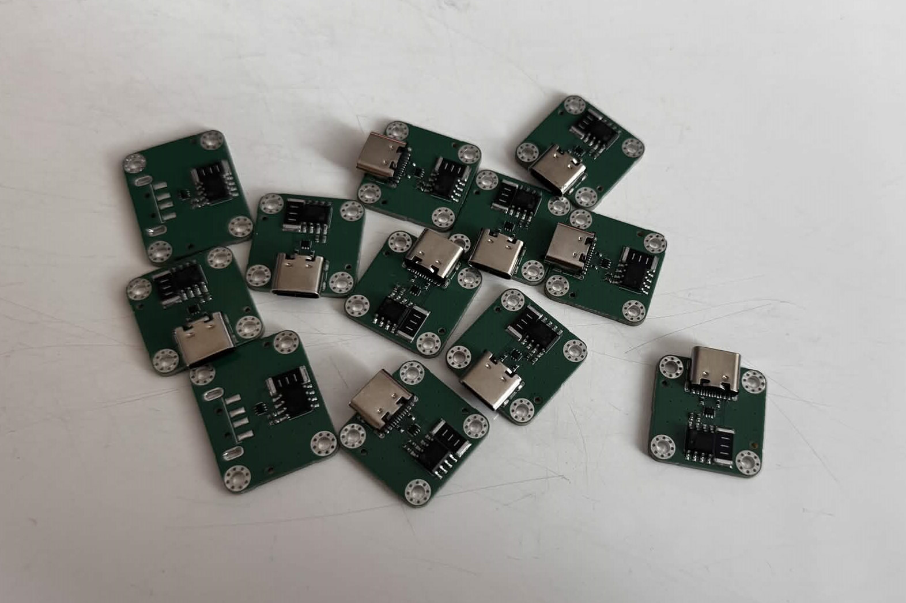
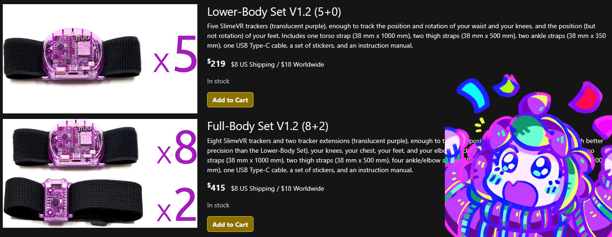
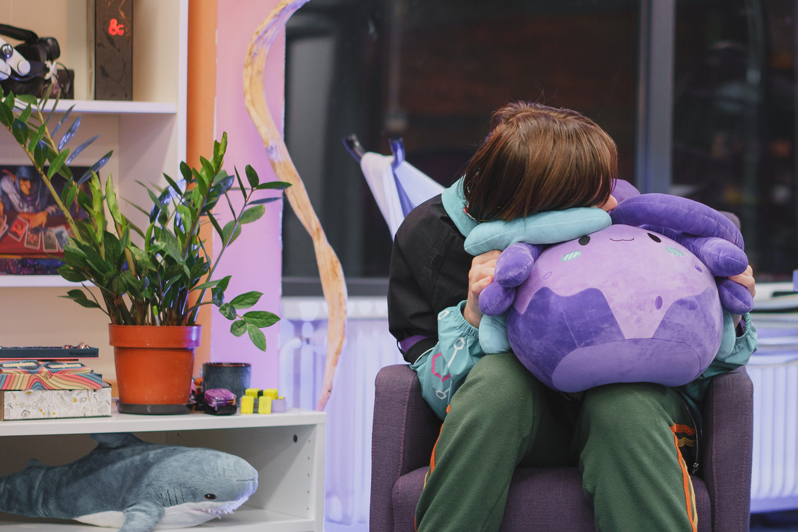
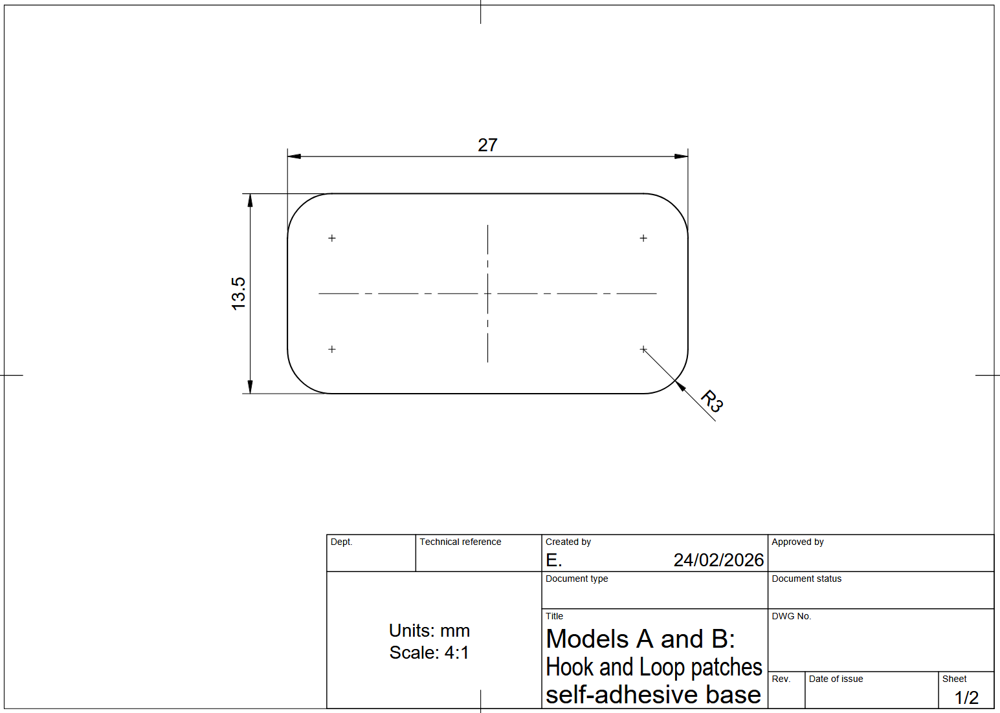
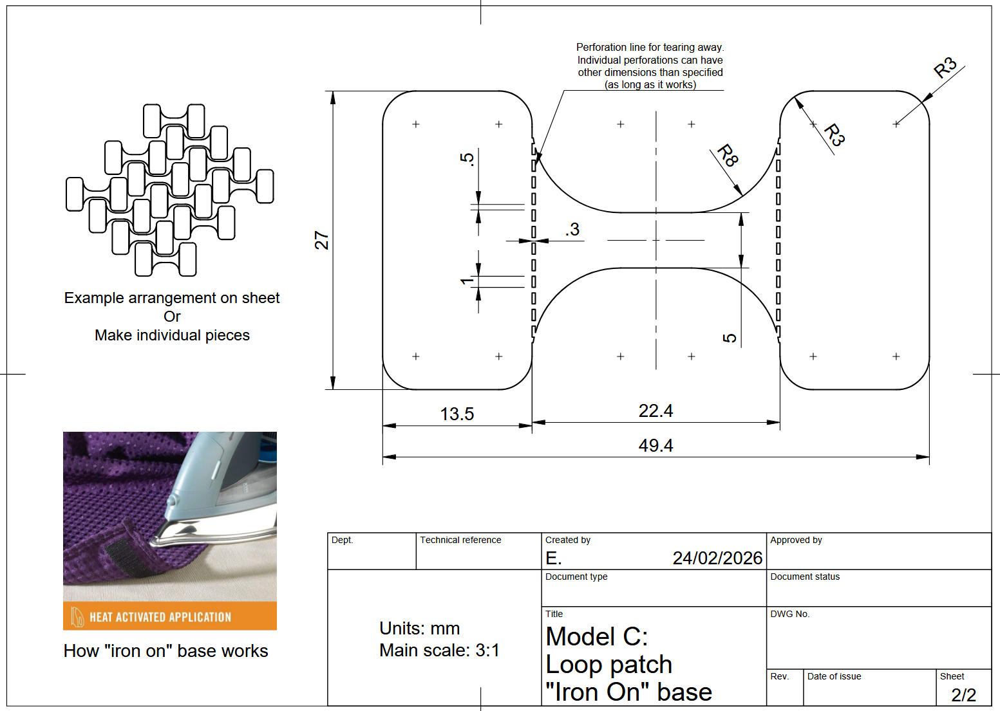
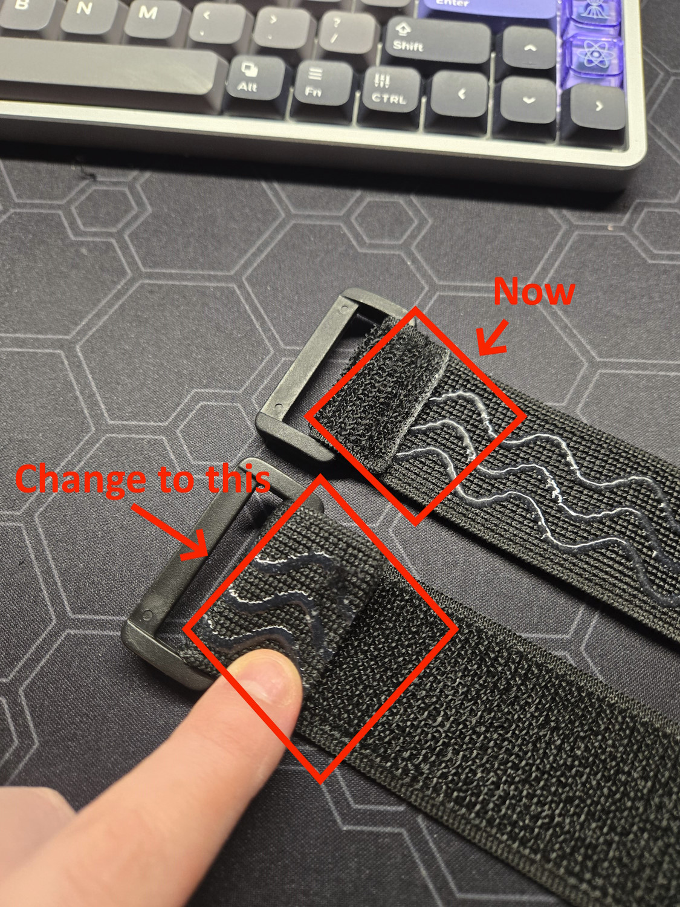
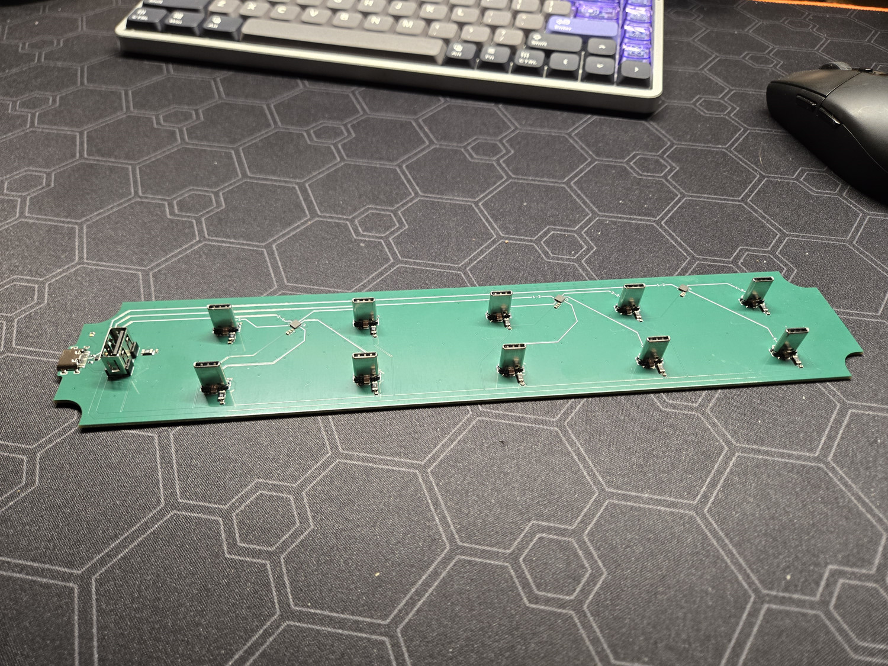

## Merch News <:nighty_hug:1314209493747241011>
We are finally about to launch our first ever official SlimeVR Merch!!
Yup, we finally have a plushie! After nearly a year of back and forth with our designer and manufacturer, we have arrived at a finished design which we are extremely excited to announce, and it’s available for pre-order now on our [Butterfly Trackers campaign page](https://www.crowdsupply.com/slimevr/slimevr-butterfly-trackers#products) under "Accessories & Parts" for $59usd + p. Custom designed by CorgiBeans and based on our mascot, Nighty, this big soft slime is the perfect size for cuddling up to and protecting you from all the spooky things lurking under the bed. Very friend-shaped!
## Rapid Roundup <:nighty_art:1314209500709781524>
Ready yourself for a bunch of SlimeVR news bits to bite on:
* Once again Sebby has been conceptualizing her outlandish ideas. While its early on in development, she is messing around with using SlimeVR trackers as fallbacks for headset hand tracking. Again, this is basically just a proof of concept right now, but it could be a very useful tool in the SlimeVR toolkit! Video demo below.
* Our SlimeVR server software currently has a release candidate in v18.2.0 RC1, which includes a few minor bug fixes, some rolled back resets code, and a framework for showing packet loss (currently only works with smol slimes on TDMA firmware). Go test it out if you can, particularly if you have any mounting reset issues with 18.1. Remember to leave feedback! Info here: https://discord.com/channels/817184208525983775/1474361730640515112
* Our driver also has a release candidate, which removes that annoying chest binding popup in addition to a few other things like steam link support, acceleration data, and hmd names. Info here: https://discord.com/channels/817184208525983775/1471335847210254519
*That's it for this week. Thank you for reading to the end, hope you all have a lovely week and weekend. See you space slimethings~! <3*

## Butterfly News <:butterfly:1470467583323930685>
Our campaign is going strong, with our funding goal passing 200% this week. Those of your hanging out for reviews will hopefully not have to wait much longer, as we have been confirming many of the review sets arrived in the hands of content creators shortly after the last update.
Meanwhile the team chugs along as usual, perfecting all the little details that are required to make an exceptional product. The iron-on and Velcro patches patches are having their designs and documentation hopefully finalised to allow us to start ordering production samples for testing. Pics are attached below for your viewing pleasure.
In response to testing feedback, we are also adjusting how our tracker straps are manufactured. To improve comfort we are adjusting the strap loop sewing direction from inside to outside. It might seem silly, but this means there is no scratchy corner aimed towards you. Very small change, sure, but all these small things add up!
Meanwhile, we have received the latest batch of Dock and Dongle cradle prototypes. The new PCBs feature a vertical USB-A port to lovingly hold the cute little Butterfly Dongle in an ideal configuration, similar to the intimidating T-Pose. Check them out below. Do note, however, the triple USB cradle is just for funsies and wont be included.
We have also given strict battery tolerances guidelines for our battery manufacturers to ensure consistent and predictable sizing on the batteries we receive. Very important for such a tiny little gadget where every spare mm counts!
And last but not least, we have been given the official Valve blessing to post a video of the Steam Frame running SlimeVR natively. Super cool to see it running so cleanly, and with our server on Steam, installing it will be just a click away. Check it out below! (Steam version is currently in beta testing [here](https://discord.com/channels/817184208525983775/1475535820822679552))

