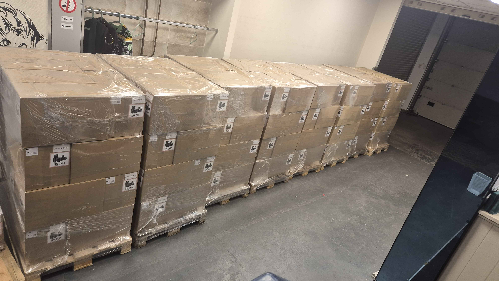
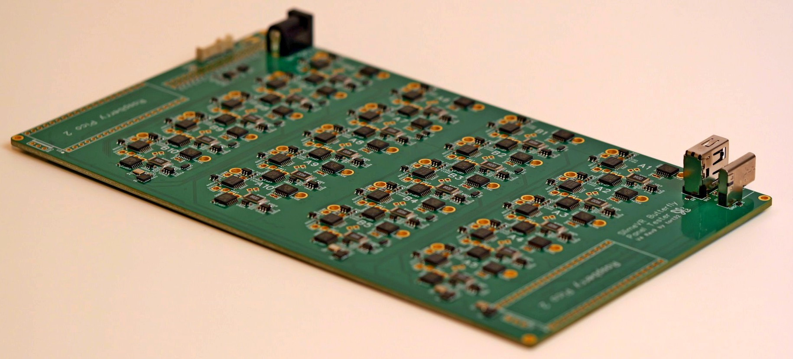
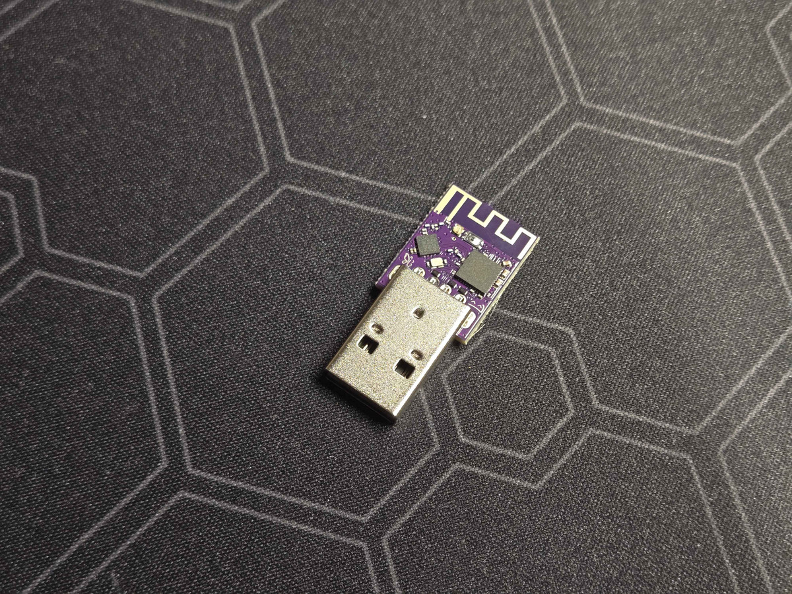
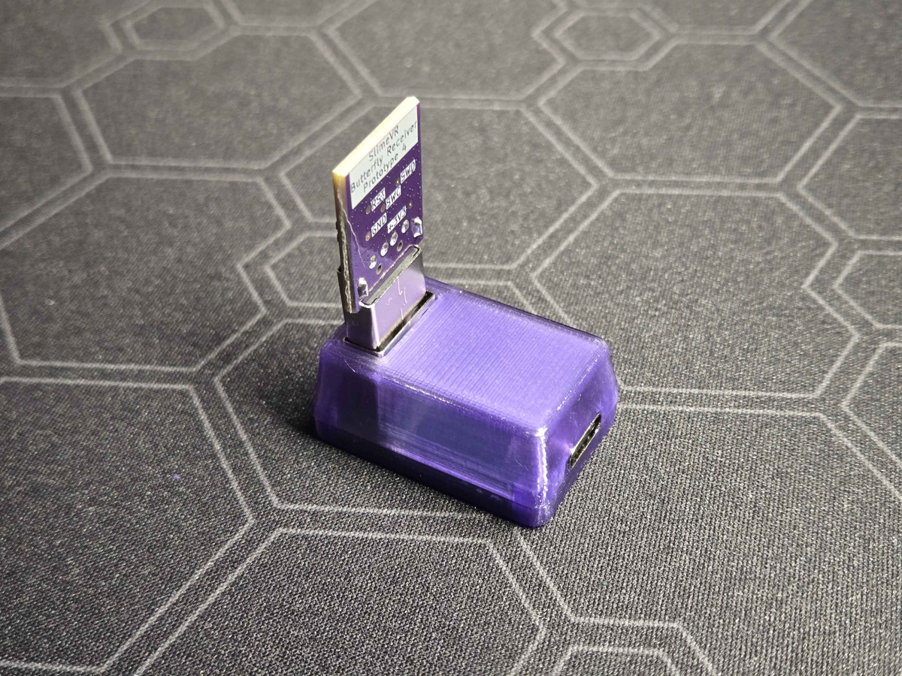
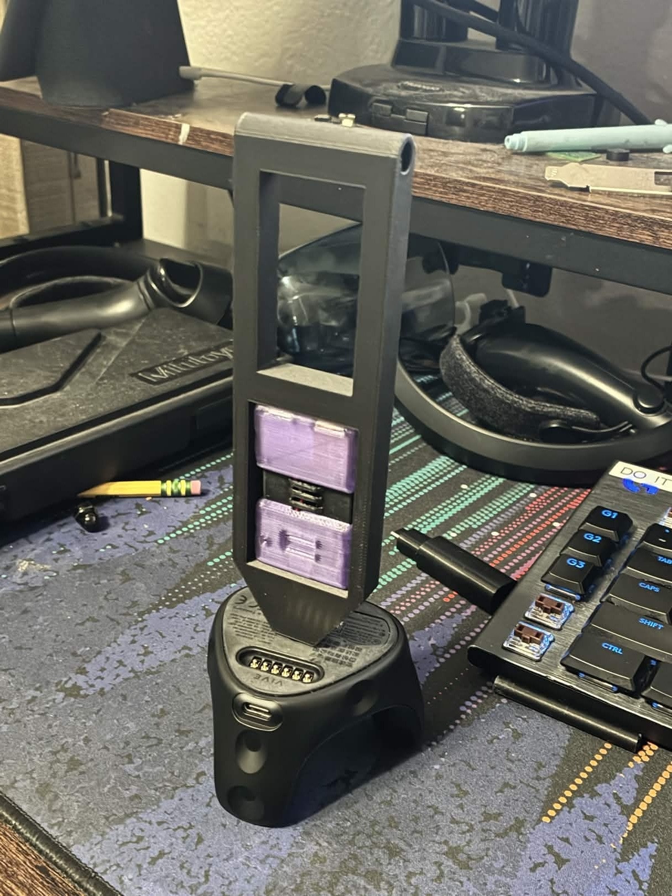
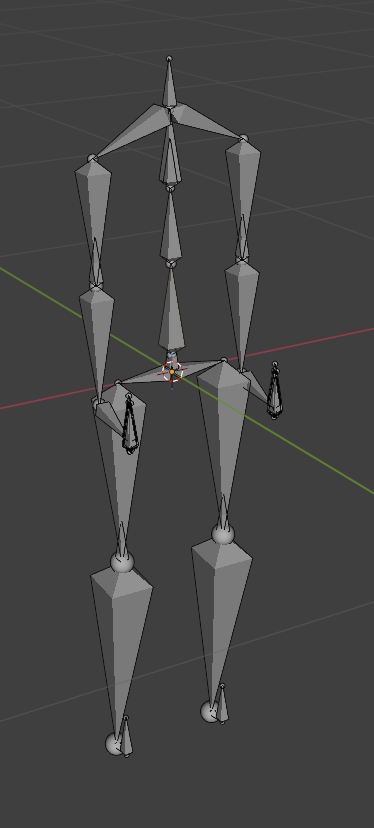
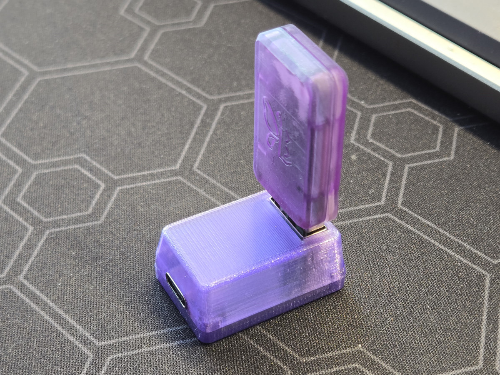
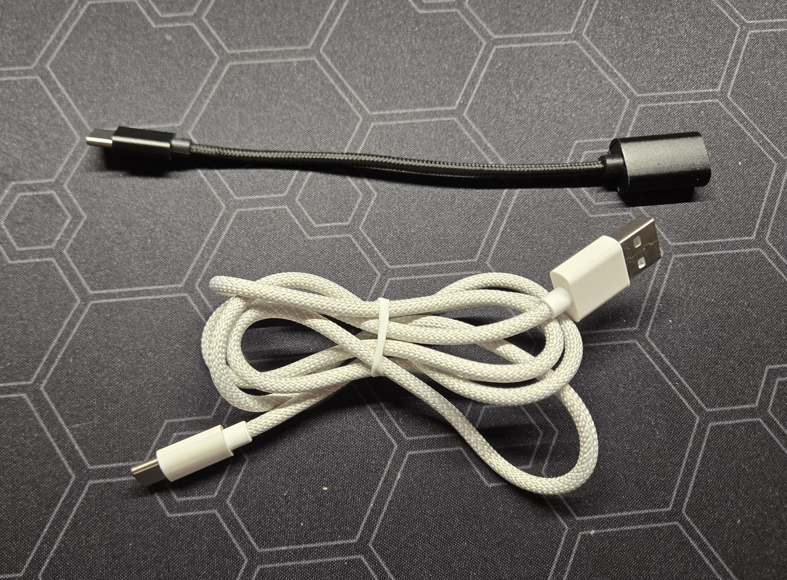

## Ecosystem News <:nighty_hug:1314209493747241011>
A triple update was just launched the other day, with the Server app, Driver, ***and*** Installer all launching new versions into the wild. These have been in open testing for a few weeks now. Here is a list of the most notable changes:
Server:
* Reverted reset logic to pre-18.1 logic. Should now act like older servers
* smol (nRF) trackers running TDMA firmware can see packet loss. This will be added to other trackers, including Wi-Fi slimes
* Feet reset keybinding (for binding to controller)
* Various other small changes, tweaks, and fixes
Driver:
* No more 'Chest binding' popup when launching steamvr
* Added tracker Velocity values for Natural locomotion support
* Various other small fixes and changes
Installer:
* Fixed the installer running slimevr as admin after installing resulting in it not being usable in VR until restarted
* Fixed a few copy, unzipping, and user state errors
## Rapid Roundup <:nighty_nom:1314209503276699708>
Ready yourself for a bunch of SlimeVR news bits to bite on:
* Summer has been busy with their new Butterfly Trackers, creating what I can only describe as the nerdiest magic wand I've ever seen. Its used to collect paired data from the attached Vive tracker in hopes to improve the quality of our fusion algorithm. Not stopping there, he's also working on magnetometer bias calculations to aid in checking user movement and investigating how gravity maths can better optimised in our fusion. Pic below
* MOCAPers and VTubers rejoice, as we are going through our BVH and VMC/OSC protocols to fix longstanding issues and polish our implementations to make them much more user friendly, such as BVH rest pose and T-pose injection being added soon to make animation retargeting much easier. See: https://discord.com/channels/817184208525983775/1475504963810754652
*That's it for this week. Thank you for reading to the end, hope you all have a lovely week and weekend. See you space slimethings~! <3*

## Butterfly News Continued <:butterfly:1470467583323930685>
Aura has designed and printed the first version of our USB cradle that will be shipped as part of each Butterfly Dongle pack. While its only the first iteration, its already close to production ready, and may only need a few minor tweaks or cosmetic adjustments before its ready to have its very own (extremely expensive) mould made for it. Pics below
In related news, we have received samples of both the USB-A-to-C cable and USB-A-to-C adaptor we plan to stock with our Butterfly Dongle kit. We wanted to ditch the basic plastic ones we have historically used in favour of premium, braided, cables. We are very happy with these ones, so expect them or something very similar in the finished package.
And last but not least, after the small fix to our straps I mentioned in our last update, we are finally ready to place a bulk-order. Additionally we will be ordering all the itty bitty little screws used to hold each tracker together in bulk, meaning two of the final pieces will be locked in and ready for assembly. Additionally, we are ordering an auto-loading screwdriver to test out if it can make assembly smoother. This thing looks like a torture device, but it automatically feeds the insanely small screws we use into the end, so the assembly person can just push it down and press a button. Very cool stuff, pic below.
As usual, if you are interested in pre-ordering Butterfly Trackers, or just want to learn more, head over to: https://slimevr.dev/smol

## Butterfly News <:butterfly:1470467583323930685>
Having just hit 300% funding, our Butterfly campaign has been a stellar success. You may have already seen, but our first review was extremely positive! Check it out if you haven't, as Jacobfov did an amazing job showcasing them: https://www.youtube.com/watch?v=vBZreCeOmio
Expect to see more reviews*** very soon***.
Only 12 days remain before the campaign officially concludes, though work continues on in the background as usual to make sure we hit our August shipping target. A few new advancements have been made since the last update, mostly related to quality assurance and materials testing.
First of these is our 'Flopamatron 9000'. Yes the name is final. This little jig was made by Futura, and is designed to flip flop a tracker for as long as we want it to in order to test the durability of the central flexible piece of our Butterfly Trackers. A few of you have questioned how much punishment we can put these through, so now we can test it out for sure. Keep in mind we wont have accurate data until our injection moulded versions are available later, but its a good starting point for testing the different types of TPU hardness and how they behave under repeated stresses. Video below
Moving on, Meia has manufactures some magnificent little gizmos to test our Butterfly charging docks and ensure each of the 10 ports is working as expected before they get shipped out. Lots of weird little things like this go into quality assurance. Pic below

