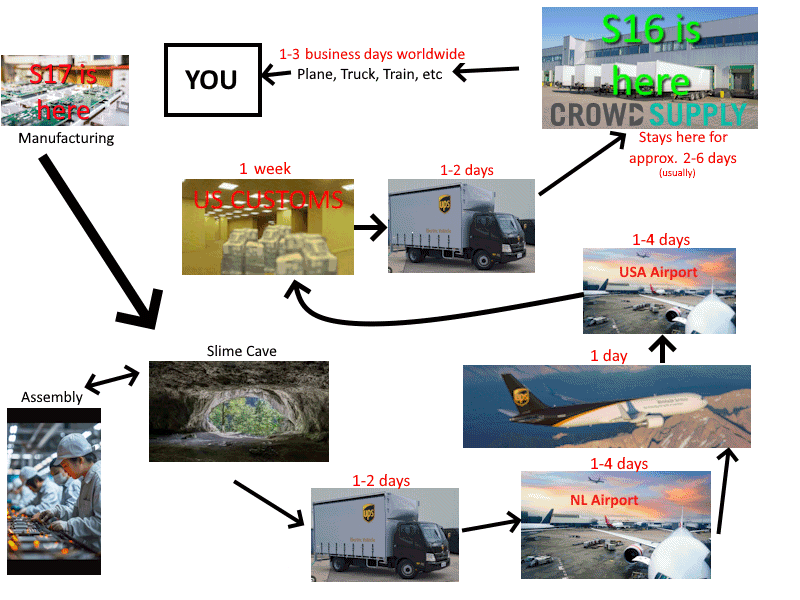
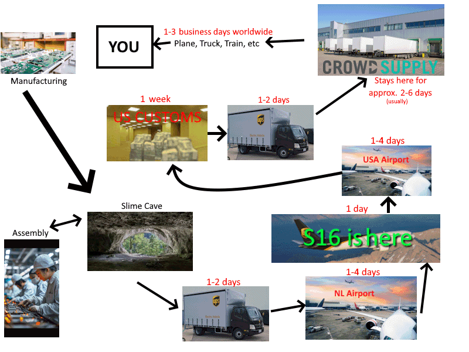
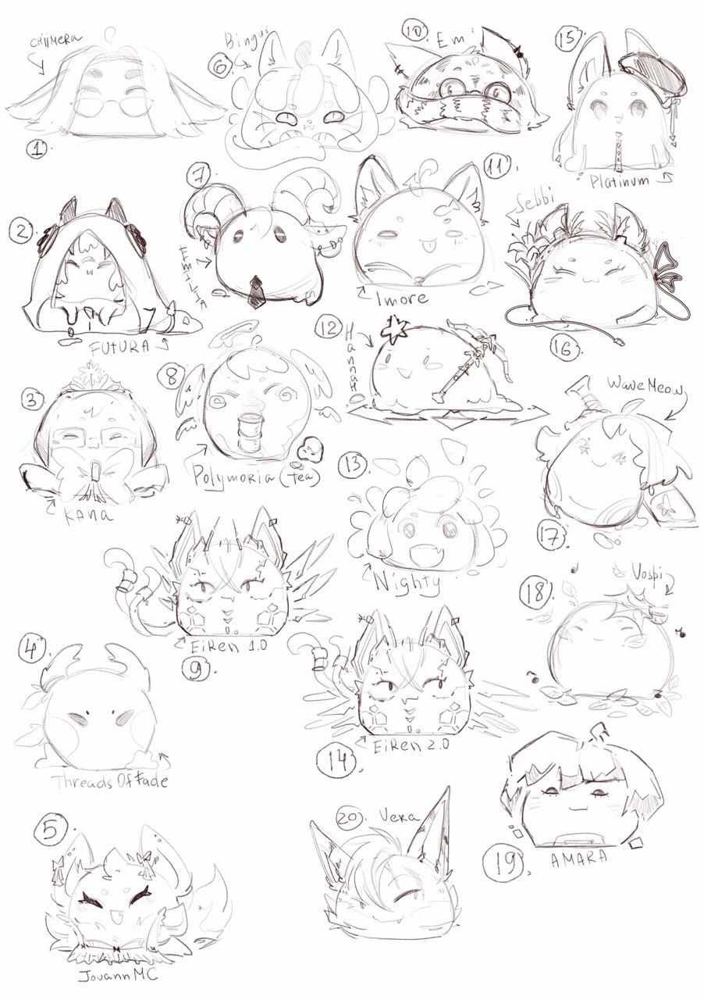

## Rapid Roundup <:nighty_nom:1314209503276699708>
Ready yourself for a bunch of SlimeVR news bits to bite on:
* The next batch of SlimeVR stickers are in the sketching stage and are looking so amazing! Once again modelled after various contributors, the finished designs of these will be included in Butterfly Tracker bundles and some of the future 1.2 tracker sets. Check out the fantastic artistry below!
* MOCAPers and VTubers rejoice... again. I personally took it upon myself to make fingers look cool as heck. Sickened by the old equi-length phalanx of our current finger system, I have added a system to asymmetrically divide fingers into more appealing and natural subdivisions. This is extremely important as now you can now do finger hearts! Check the little demo below.
*That's it for this week. Thank you for reading to the end, hope you all have a lovely week and weekend. See you space slimethings~! <3*

## Ecosystem News <:nighty_hug:1314209493747241011>
### A fairly huge change you will hopefully never notice is happening:
In simple terms we are changing one of core technologies we use to display stuff in the GUI.
In nerdy terms we are switching our web view engine from webkit-based Tauri to chromium based Electron.
What does this mean for you?
Hopefully either nothing or a better experience. The download will be a bit bigger, but should run the same with slightly less memory usage.
Why are we doing this?
A whole bunch of reasons. The change was primarily driven by our developers for 3 main factors:
1. Electron is much easier for us to develop on. It has industry leading dev tools, is made and backed by GitHub, and makes cross-platform development ***way*** simpler.
2. Linux versions of the server have been suffering from multiple serious issues, including memory leaks. While you might think this isn't important, the Steam Frame runs on linux, so the amount of people using linux in the VR space is about to get a lot larger.
3. Steam. Our [steam release](https://store.steampowered.com/app/3245490/SlimeVR/) was not feasible on Tauri, so switching to Electron was a no-brainer here.
This is a big change, but its a necessary step towards better software for everyone.
### Testing
With such a big change, we need to test it! We really need feedback on your experiences using this version, and there are currently two different ways you can help us out in that regard!
First up, you can get the latest Release Candidate in our beta testing forum, here: https://discord.com/channels/817184208525983775/1481527764137021451
Second, you can try out our steam release! Keys will go out periodically, so keep an eye on this thread if you are interested in providing feedback: https://discord.com/channels/817184208525983775/1475535820822679552
Please leave feedback in the relevant thread! Both positive and negative is much appreciated <3

