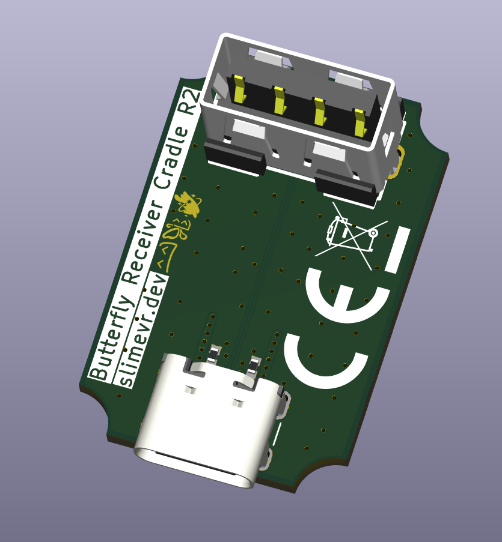

## Rapid Roundup <:nighty_nom:1314209503276699708>
Ready yourself for a bunch of SlimeVR news bits to bite on:
* Stermere was able to weave his wizardry and get our floor tweaks tech to be more reliable. A bug that caused certain edge cases to not have feet clipping engage has been, hopefully, found and squished. Expect a this to appear in a beta build very soon! Video demo below.
* For those who missed it, the SlimeVR team was interviewed in the latest Virtual Show Production podcast, with the effervescent **Smeltie** and your favourite demon-cat **ZRock35** taking the stage to answer all their Butterfly Tracker related questions and discussions. It's a fun watch if you love SlimeVR or want to learn more about Butterfly Trackers. Check it out here: https://www.youtube.com/watch?v=_ulecbS6kwU
* Aed has been working on allowing users to customize which tracker taps do what, so those of you who hate tapping your chest to yaw reset have something to look forward to. Wont be out for a while, but good news for a lot of you I'm sure.
*That's it for this week. Thank you for reading to the end, hope you all have a lovely week and weekend. See you space slimethings~! <3*

## Networking Feedback Survey <:nighty_data:1314209491365007360>
We have had a surge of reports from you guys that latency has become a problem with WiFi Slime trackers, and we are working hard to narrow down the cause. Unfortunately networking is crazy complicated and everyone has a unique setup, and we really need solid data to be able to infer where the issue is originating from. That's where we need your help!
If you can spare 2-5 minutes of time to fill out this google form, it would help tremendously:
https://forms.gle/EKiJtSREg2dLuEFH6
I will provide graphs of the info in an upcoming update, so think of this kind of like a steam hardware survey, but for slimes.

