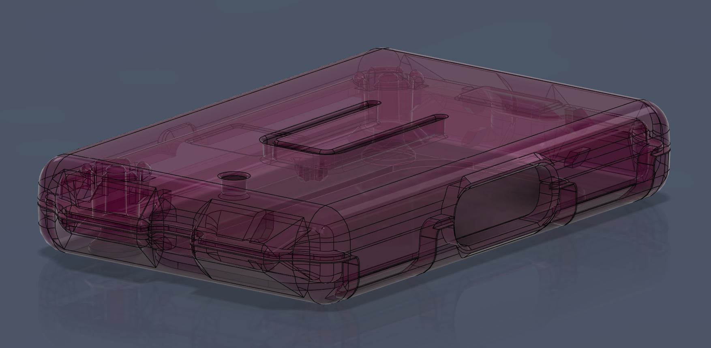
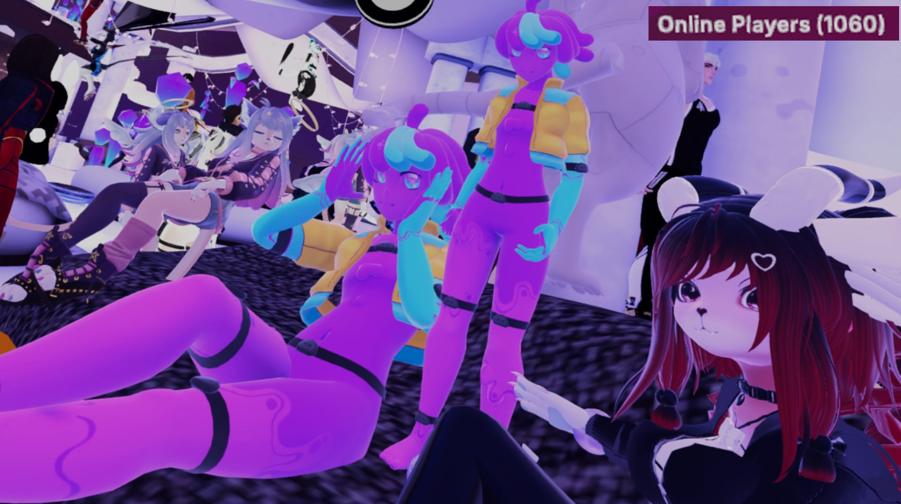

## Rapid Roundup <:nighty_nom:1314209503276699708>
Ready yourself for a bunch of SlimeVR news bits to bite on:
* Meia has been working hard on our Butterfly Tracker hardware, and has a cool picture of Revision 2 of our Butterfly Dongle Cradle PCB to show off. Check it out below. The team is working hard every week iterating on and testing designs, so I am hoping we get to see more very soon!
* As you all know, a lot of new Slimes are getting trackers in the next few days. The server might get a little crazy with Shipment fever, so just remember we are all human, or human-adjacent creatures in some cases, that have feelings. It's very stressful for everyone so please have some patience when asking for help, and please respect each other when asking for help or providing help to others! If you are new, be sure to check the pins thoroughly before asking for advice, as most answers to common questions will be in the first 4 pins of each channel <3
*That's it for this week. Thank you for reading to the end, hope you all have a lovely week and weekend. See you space slimethings~! <3*

## Basis. What the heck is Basis? <:nighty_question:1314209482133209088>
I'm sure its not a secret, but SlimeVR LOVES open-source stuff. We thrive on sharing, and that's why we are so excited about Basis VR.
So what is it? It's an open-source VR framework (not a platform) that lets anyone easily create VR experiences (games, demos, etc). It's fully open-source, and includes a whole bunch of systems like sound, avatar, movement, asset bundling, etc all in the framework. Basically it gives creative people the freedom to make cool VR stuff without the giant brick wall of making the system that runs it.
Imagine Timmy. Timmy loves the backrooms. Timmy wants to make a VR thing about backrooms. They can use Basis as a framework to make a 'Backrooms VR' game much like someone might make a world in VRChat, but have *WAY* more creative freedom and control and free from the shackles of the VRChat world SDK.
Get the idea? if not there is a video from them below from their YouTube.
https://www.youtube.com/watch?v=wz4TnMTppmg
### So why does this matter?
SlimeVR is planning to join them in their next load test to help fill up their instances. Ever been in an instance with 999 other people? Well that's the goal! If you want to see what the limits of social VR can be, you should come join us! https://discord.com/events/1239242259392757822/1483884192671600872
I will be posting more about this in the coming days, and we will have a Nighty avatar available for use for anyone from the server that wants to rep us!
## SlimeVR Server news <:nighty_a:1314209496029204572>
Server version **v19.0.0** just launched out of the release tubes, so expect a little update icon next time you launch the SlimeVR server.
What's new in this version?
Well, lots changed but also nothing really changed. This update is a big patch to switch out our rendering engine from our old one using Webkit to electron. I explained in details a few updates ago why we did this and what it means, but the short of it is that it will make the software more reliable and easier to code on.
**Expect better performance, faster start-up times, and less memory usage (*__especially__* on linux).**
**__*You will need the updated installer*__**, so be sure to download it fresh using the update icon at the top of the SlimeVR Server software, updating through playstore/sidequest, or by going to our website and following the download links: https://slimevr.dev
### Using an old installer will cause errors and wont install properly

