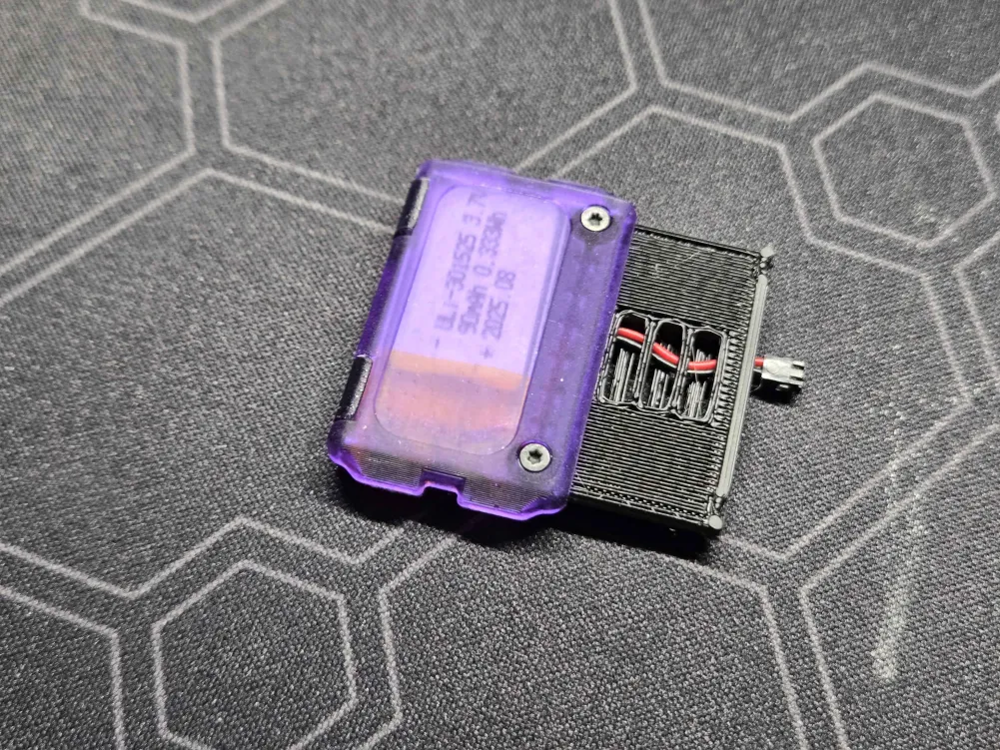
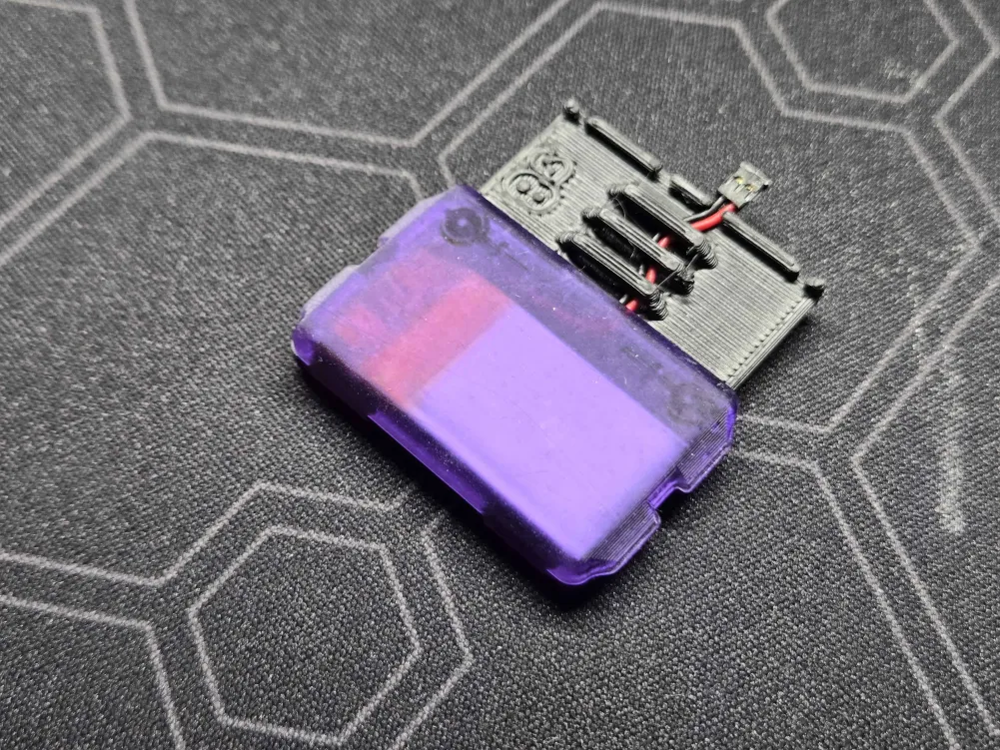
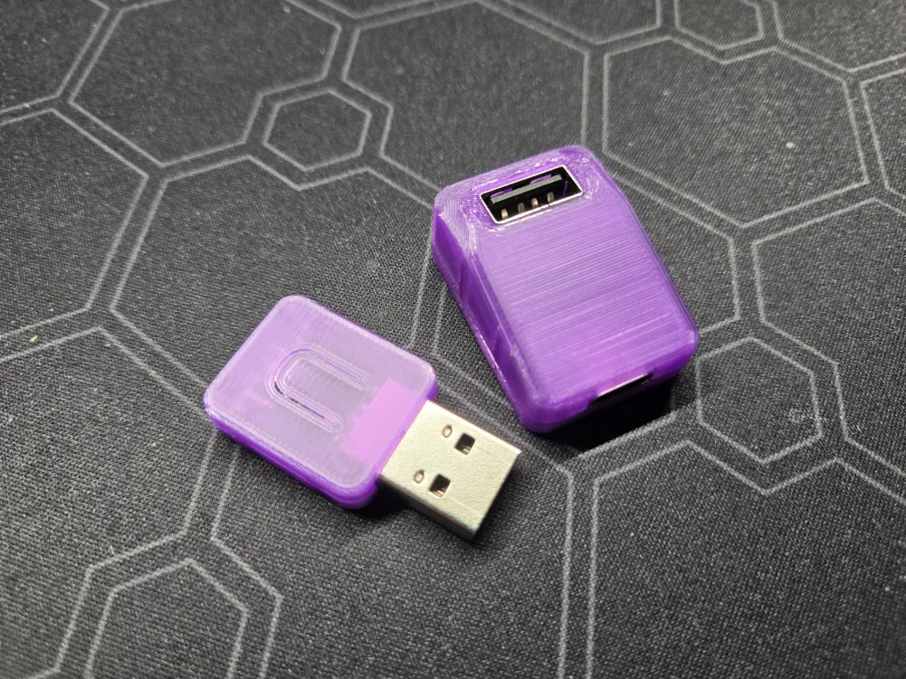
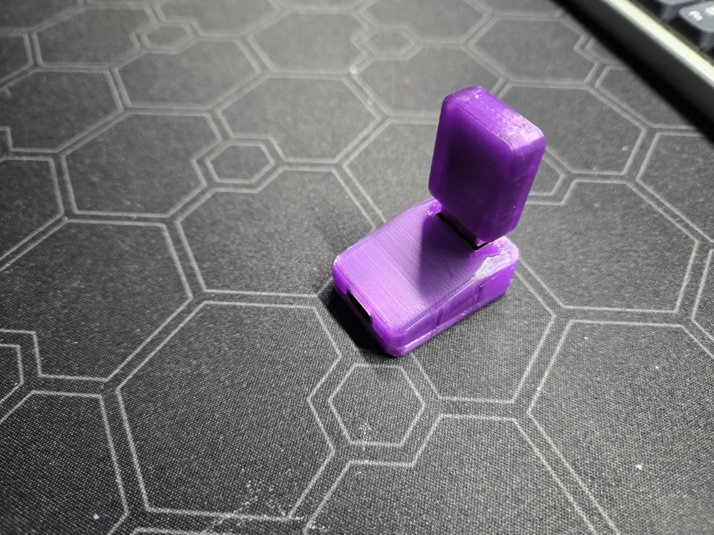
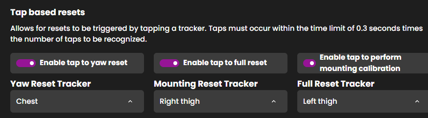

## Rapid Roundup <:nighty_nom:1314209503276699708>
Ready yourself for a bunch of SlimeVR news bits to bite on:
* Every week theres something cool being added by our amazing devs to make life easier for everyone, and since we haven't had an update for a while there is a small backlog of cool stuff that will be added into the server soon. As such I will rapidfire out some of the most notable stuff, check underneath for videos and pictures:
* Sapphire has somehow bent the reality of SteamVR to his will, adding in the ability for slimevr to detect our SlimeVR driver being disabled and re-enable it a single button in the checklist. This will for sure put one of my infographics out to pasture.
* Hannah has been continuing work on our version switching code that was first started by Anna a long time ago. It's still a while out, but once this is done you will be able to switch versions with just a few clicks, all without leaving the server window. Hopefully this will put to bed the "this update made the weather too hot" arguments... (spoiler: ||it wont||)
* Aed has been hard at work iterating on their tap gesture customization code, which will allow users to choose the tracker they wish to tap-tap to do their resets. Wanna get more exercise? just make your left ankle be yaw reset!
* Much of the core team has been hard at work grinding out the incredibly complex task of re-writing most of our core tracking and feature code from scratch. This is a huge undertaking but will really lay the foundations for a lot of stuff people have been wanting for a very long time, and will have the big benefit of include testing in the code to ensure nothing explodes from tiny changes. Keep it up, you are doing amazing!!
* For those DIY'ers out there living under a rock, our ICM45686 v1.1 is back in stock! Head to https://slimevr.dev/ to buy
*That's it for this week. Thank you for reading to the end, hope you all have a lovely week and weekend. See you space slimethings~! <3*

## Ecosystem News <:nighty_hug:1314209493747241011>
All the cool stuff that's been held up by the switch to Electron have finally breached the gates, with a flurry of new additions and changes being added to our upcoming v20 SlimeVR build. The common bugs with v19, such as config and java errors have been thoroughly smooshed, as well as a giant list of new additions and Quality of Life changes, such as:
* Settings quiz on start-up to preconfigure your settings for what you plan to use slimes for (PCVR, standalone, vtubing, mocap, etc)
* Fix for a fairly common floor clipping issue in some setups (base-station tracked headsets). Also makes tracking in Steam-link much better
* Very important spelling mistake was corrected. Everyone really liked this one
* Fixes, warnings, and safeguards for lots of common issues, such as SteamVR hand trackers being enabled, onboarding not saving as complete, DIY tool firmware sorting, and a few minor GUI inconsistencies.
* More groundwork to prepare for steam release
* Fixes for OSCQuery to make it more reliable
* Many many more changes
Also note; This comes with a new driver that includes a compatibility toggle so our trackers play nice with other less common games like Blade & Sorcery, Unreal editor, etc.. so try it out if you had to downgrade from v4.0.0 to get them working
If you would like to help out, please consider trying the new release candidate here: https://discord.com/channels/817184208525983775/1494793758808604702
Helping test these builds and providing feedback is one of the best things you can do to contribute to SlimeVR, so if u cant code and want to give something back to the community, this is a great opportunity for you <3
## Butterfly News <:butterfly:1470467583323930685>
Its been a while since we have has any major news on Butterfly Trackers, but not due to lack of progress. Our design and development team have been flat out ensuring all the tiny little parts required to be designed, mass-manufactured, and put together are progressing as they should.
As mentioned, many of the parts are either ordered or in pre-production (i.e. soon to be ordered). As mentioned in a previous update, our screws and straps are already locked in and stacked up in the cave, and joining those parts soon will be our dongle cradle PCB that is included with the Butterfly Dongle to nicely hold it in the vertical position. Speaking of dongle, we are also looking into plasti-welding machines to marry the top and bottom half of our dongles together, so hopefully I can get you some cool pics that machine soon.
Additionally, we finally received batteries which are to our specification after a few samples not up to our standards were rejected. Having the manufacturing specs locked in means we can order those at the ideal timeframe and after sufficient testing has been done.
In other news, after many design iteration talks with the manufacturer, we have new samples of our Iron-On Patches on the way to the cave. Hopefully if these ones are good we can lock in another piece of the puzzle. The shape and perforations posed a unique challenge for ordering these, but it will pay off when we see all the cool stuff you all stick the butterflies to!
Finally, we are nearly done with out final case design. While the overall shape and features of the case remain unchanged, there has been lots of work on preparing them for mass production with injection moulding. There are lots of weird design additions and things u need to add so they pop out of the mould nicely, so its a lot of small iterations and design discussions that need to be done with the designer and manufacturer.
Pre-order here: http://slimevr.dev/smoldc

## SlimeVR News <:nighty_trans:1488511807701385279>
Our original SlimeVR campaign just hit **$10 MILLION raised**. Holy moly that's a lot of slimes...
Big congratulations to the SlimeVR team for reaching such an enormous milestone. This is only just the beginning tho, we have lots of plans and are aiming for the stars!!!
In other news, SlimeVR infiltrated the Basis servers for their gigantic 1000 user load test last month. Thanks to everyone who repped SlimeVR by wearing the Nighty avatar, and those who stopped by to say howdy to Zrock35 and g'day to me.
The instance peaked at over 1100 users in one single zone! Was ***so cool*** to experience, I would highly recommend checking out their technology if you are at all interested in cutting edge VR. (pic below)

