## Rapid Roundup <:nighty_nom:1314209503276699708>
Ready yourself for a bunch of SlimeVR news bits to bite on:
* The significant backlog of Official SlimeVR warranty claims has nearly been cleared thanks to the diligent work of our support team. Unfortunately our stockpile of extension cables ran dry and we are waiting on more short cables, so there may be delays for those. If you are affected, you will likely be contacted soon.
* Emilia is working on an updated version of our assignments page. We ran out of room for fingers and toes, and are taking this opportunity to completely revamp the page to make it even easier to use, while also adding dedicated space for the incredibly complicated phalange assignments. Check out their very early designs below. These will very likely change but will give u an idea of what we are aiming for!
* SlimeVR has a bit of a learning curve to get great tracking, so we are commissioning a whole slew of tutorial videos that will be carefully curated along with the team to ensure they are great. We are partnering up with various Youtube VR creators for this, so expect some very unique and informative videos on all kinds of SlimeVR stuff, from Setting up standalone, to Warudo and Vnyan guides, Best practices, Events, and many more.
# Step Mounting
Just a reminder, we have an amazing beta Butterscotch is working on that is gonna revolutionize SlimeVR. If you want to help test it, go to https://discord.com/channels/817184208525983775/1433418765957337180/1433418765957337180 and read the first post.
This beta changes how mounting resets work, changing it from a Ski pose to just **a single step forward**. It takes all the hard work out of learning the ski pose, and should make getting great tracking a lot easier.
**We need more testers though, so head on over if you think this sounds interesting!!**
*That's it for this week. Thank you for reading to the end, hope you all have a lovely week and weekend. See you space slimethings~! <3*
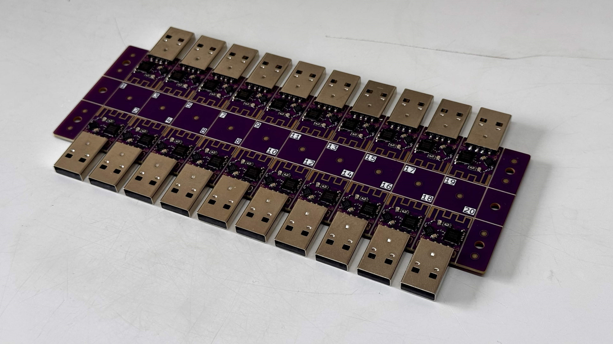
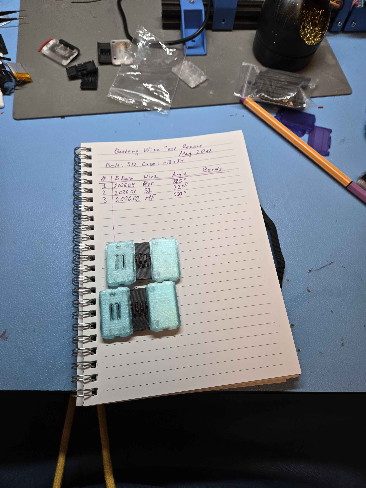
## SlimeVR News <:nighty_hug:1314209493747241011>
Lasers. SlimeVR has lasers now. Oh i need to explain? ...ok. The SlimeVR cave in Netherlands now home to a CO2 laser cutter/engraver machine for all kinds of prototyping and shenanigans. We plan to use this for making cool stuff, but for now its on toast duty. Check out the breakfast of champions that was crafted in the picture below.
Our latest glove prototype is finally on order, and our dev team is excited for this one as it will be one of the main working prototypes we start sending out for devs to work with. Its a good first step from the design/concept phase to a working product, but there is still a lot of testing, changing, and testing again that needs to be done before this gets into your hands.. or onto your hands. The picture below is a render of what it will look like once the required parts are sourced by the manufacturer, hopefully very soon.
Stimpkers!!! Our latest batch of cutie patootie slime stickers are nearing completion. These stickers may find there way into Butterfly Tracker orders somehow, we are still working out the best way of distributing these. I personally like the idea of 1-2 being included randomly in each tracker pouch/box. Only time will tell though, for now you get a near-finished art to gaze upon, below.
Last but not least, we have big plans to increase transparency within the SlimeVR worldspace. To achieve this the team is working on having two public facing roadmaps, one for our Server and one for our smol Slime firmware (Butterfly firmware). This will let you track where we are, what out plans are, and what's coming up in the near future. The goal of this is to make it much easier for the average user to know what's happening without digging for info, while also allowing both veteran and newer developers a much better chance at understanding what needs to get done. I will have more info on this in an update soon.
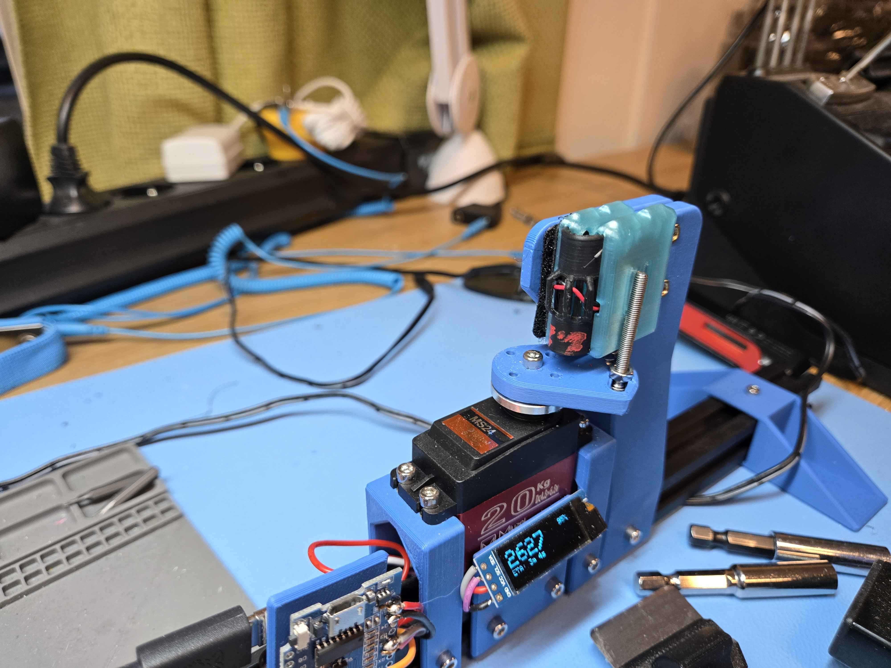
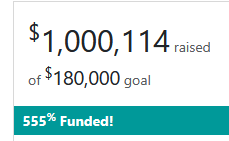
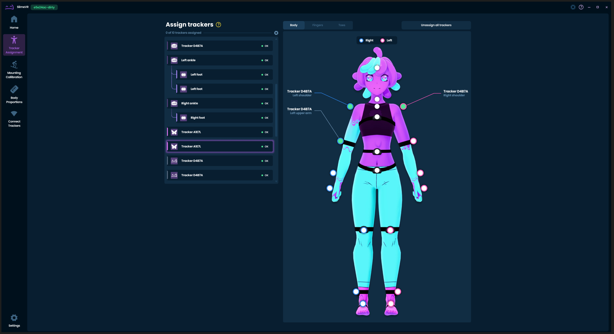
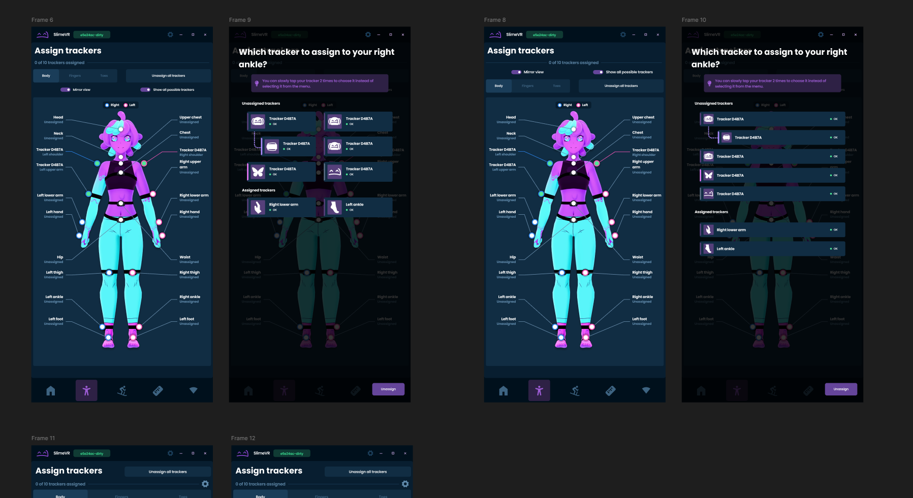
## Butterfly News <:butterfly:1470467583323930685>
Butterfly Tracker development is kicking into high gear, with loads of parts in pre-production or already in production. There are still many hurdles we have to get over, but we are currently very confident in hitting our projected August 31 deadline for our first shipment. With that said, let me show you the cool stuff we have been working on recently.
First up, we are progressing on packaging. While we are still in the design phase for this, there isn't too much iteration that needs to be done before we are ready to print. One of the most important parts for us is the art, which already has some concepts done for our Butterfly Tracker single packages and Dongle Kit, while our Sakura set has some special art that's close to complete. The current sketches for our tracker and dongle box are below. The art is so amazingly cute.
In other news our case is nearing its final form, with design drawings being locked in for manufacturing our mould. This is a huge milestone, as it is one of the core components. Hopefully we will have some samples in the next month or two to show off of the proper final cases, but for now, you will have to settle for the already fantastic looking 3d printer prototypes we have in the cave.
Next, I have the latest Dongle and Dongle Cradle prototypes to show off. The cradle PCB is already in production, and now we have the newest, more sleek looking, prototype of the shell we made for it as a final test for fitment before moulding. These will both be included in the Dongle Kit that's part of each Butterfly Set Bundle.
And finally... Our campaign also just hit **ONE MILLION DOLLARS!** Big win for SlimeVR, congratulations to the team!
If you want to find out more or join the other cool people who ordered, go here: http://slimevr.dev/smoldc
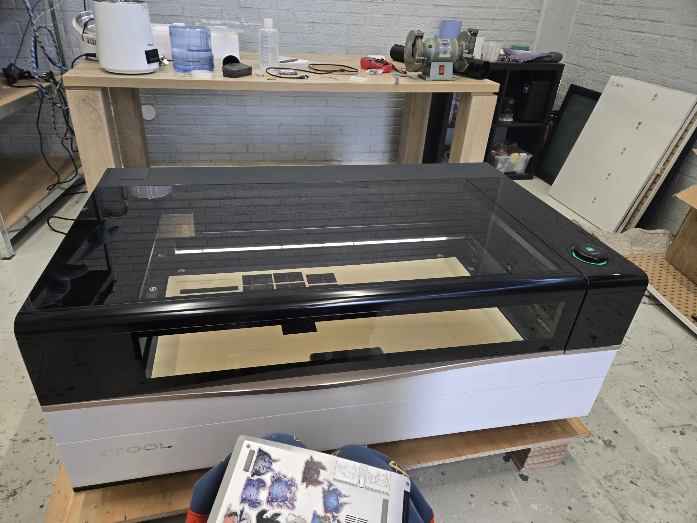
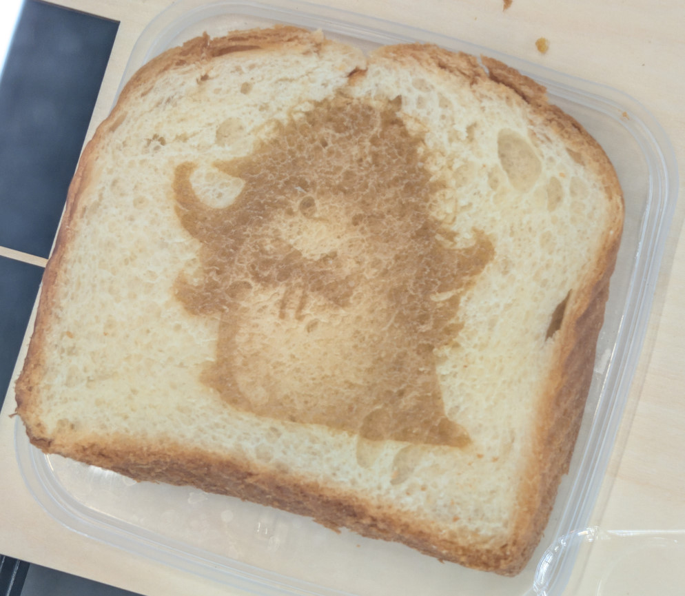
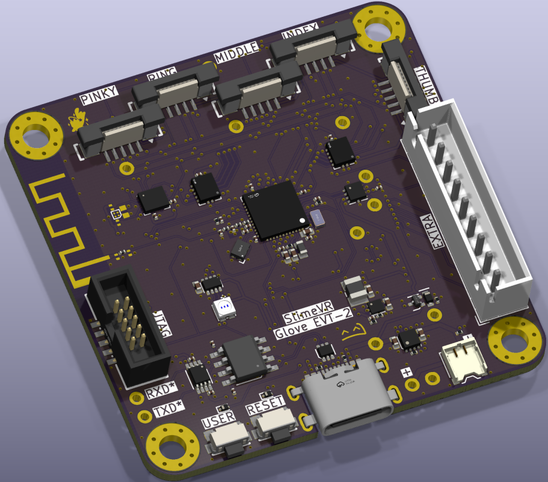
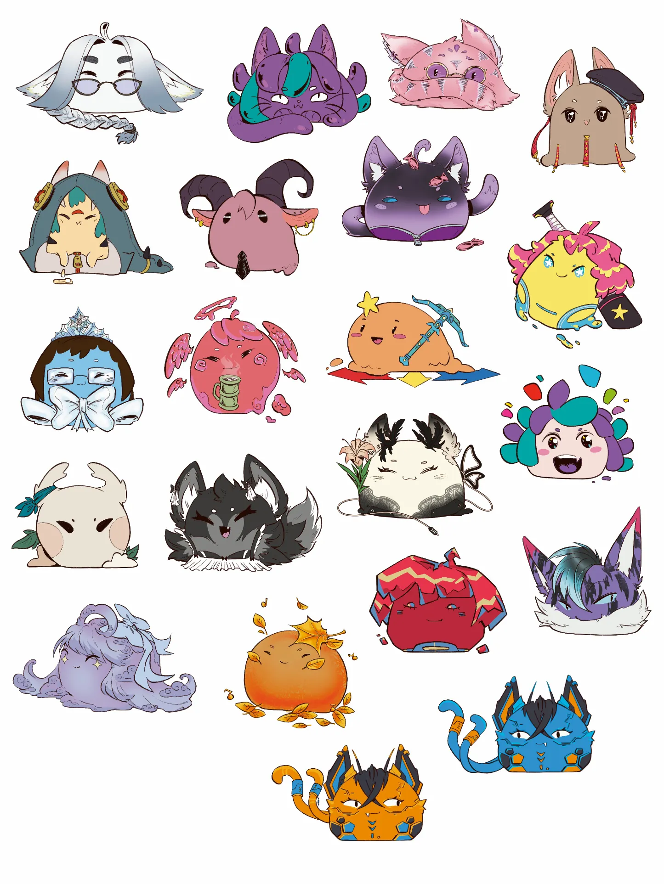

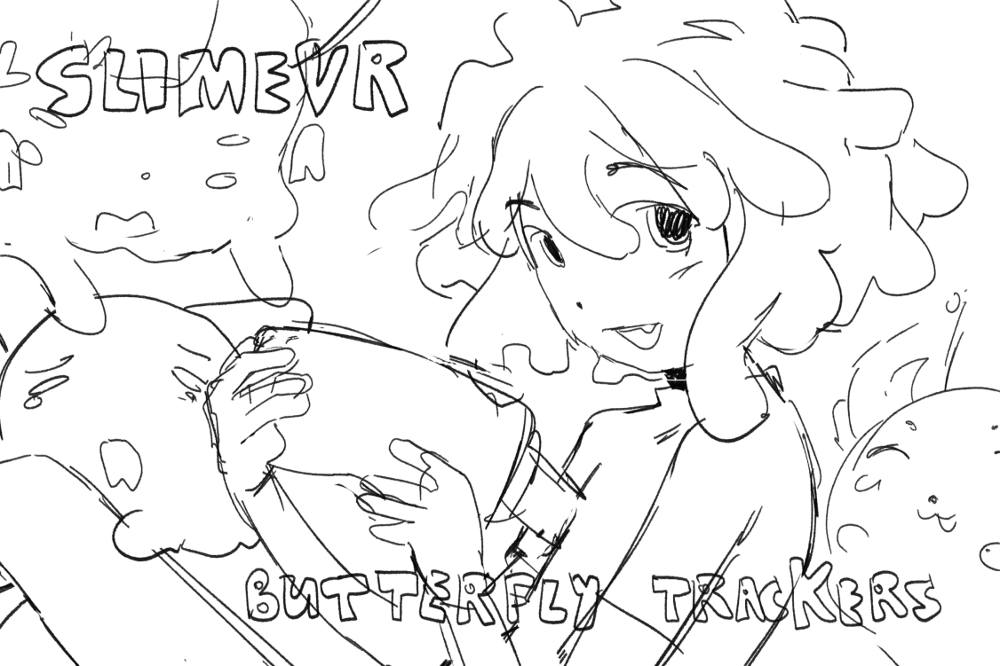
