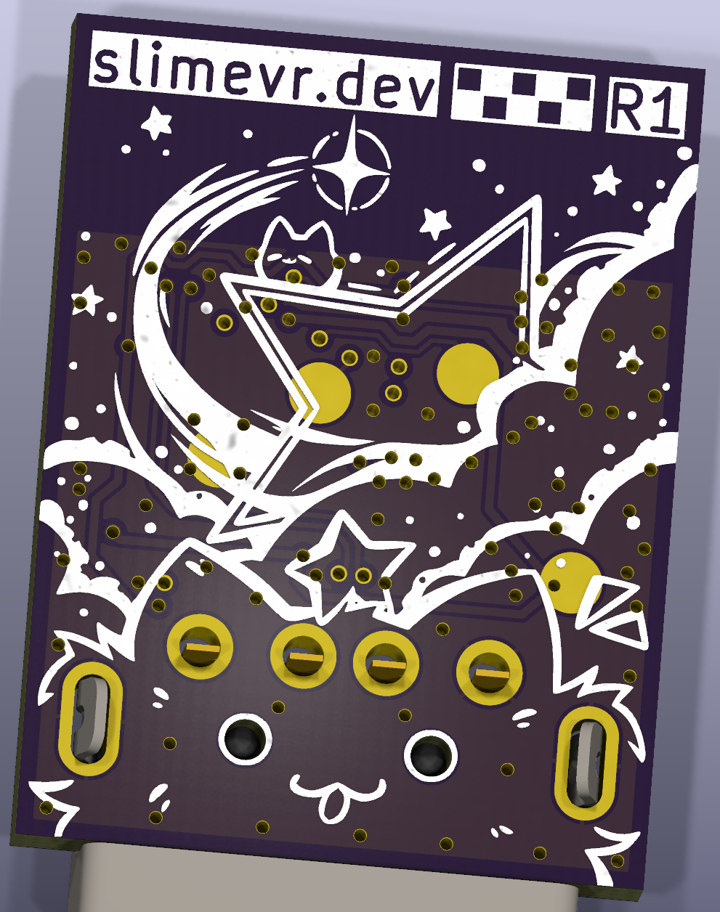
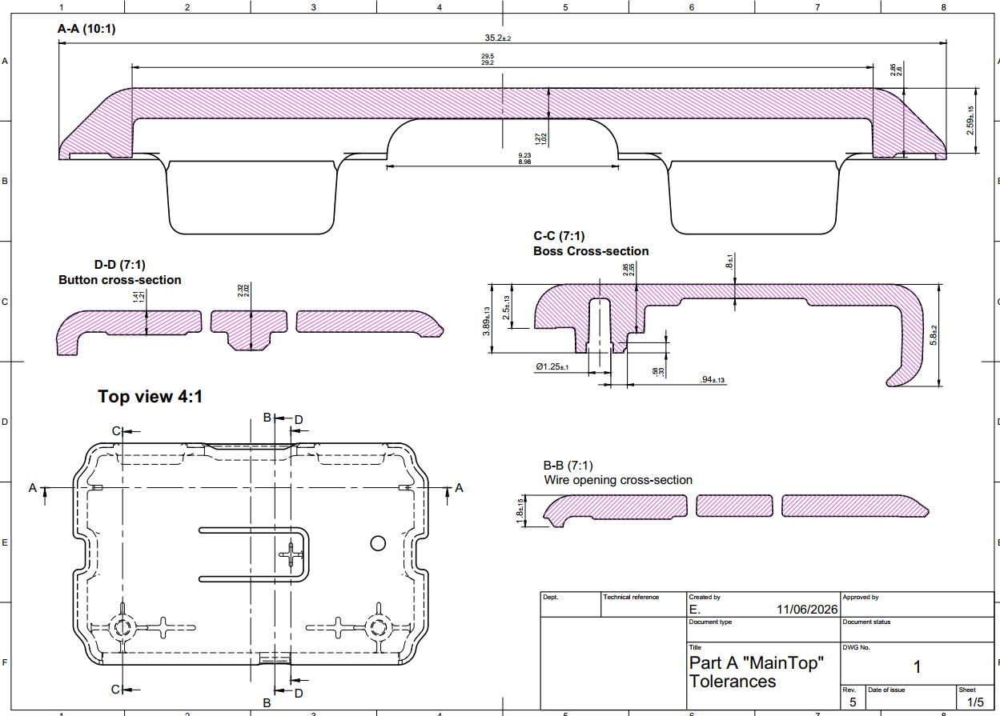
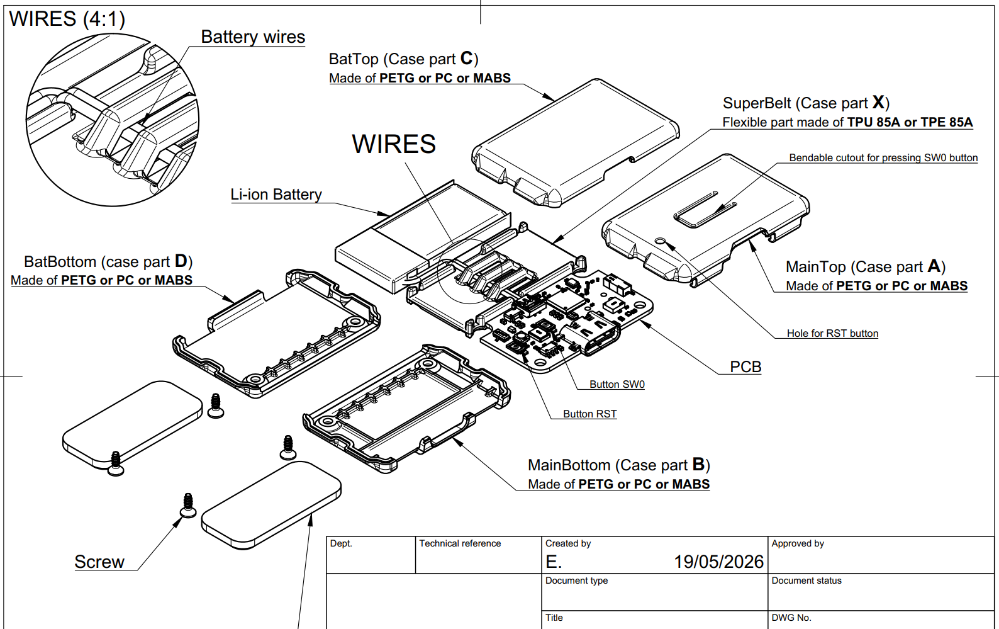
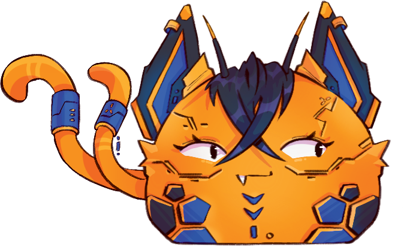
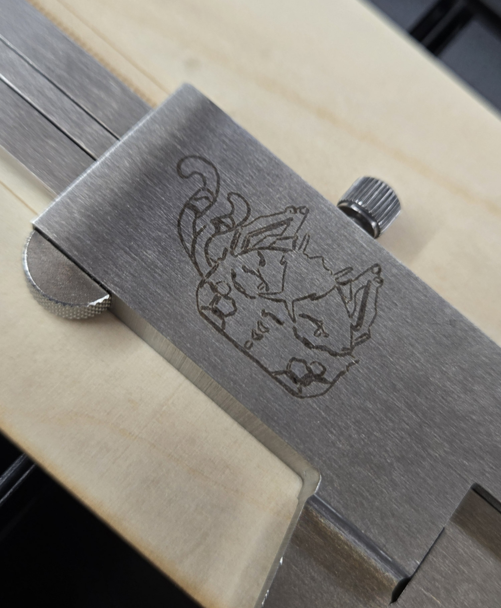
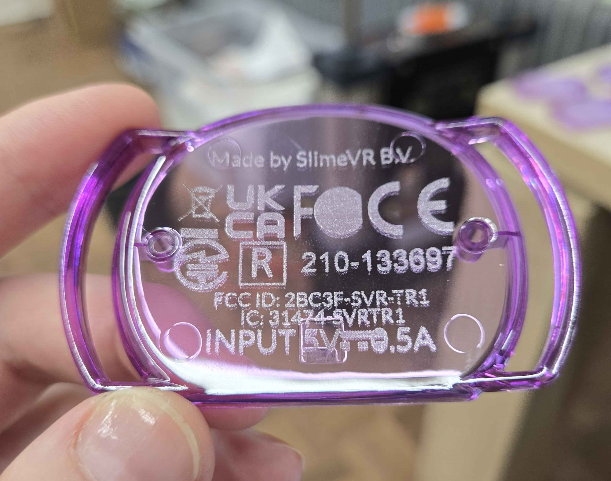
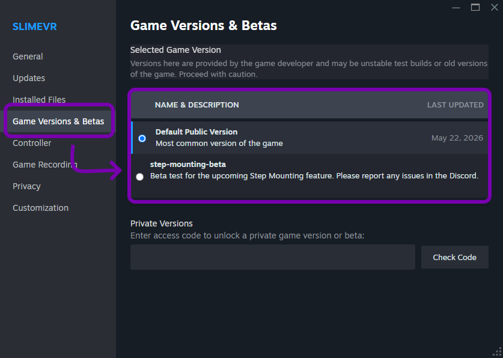
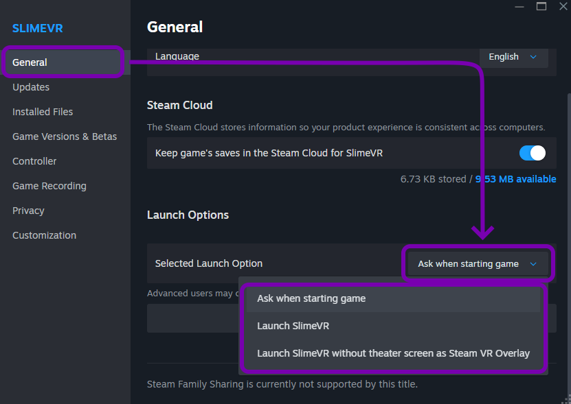
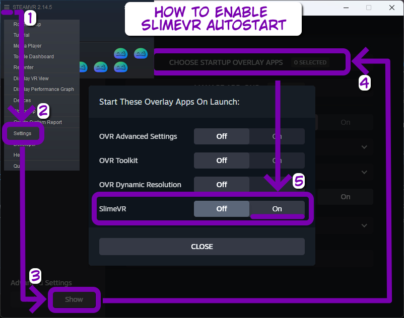

## Rapid Roundup <:nighty_nom:1314209503276699708>
Ready yourself for a bunch of SlimeVR news bits to bite on:
* We had a minor facelift on our website at https://slime.gay/, with a few things shuffled around and a some links added or removed, such as a download link for steam. We plan to tweak this a lot more over the next few months to make sure its super cute and easy to navigate.
* Hannah has been working on our SlimeVR Updater program that installs and updates the server software in a super simple and seamless way on all platforms. It already looks amazing, check out her progress in the demo below.
* The Slime cave LASER has been heating up, branding its mark on loads of important and silly things to get the team familiar with how it works. We wanted to test 'stamping' important information such as FCC identification codes on some of our products, so these tests were very important to find the limits of what materials work, the speed at which we can fire out designs, and if it is good enough to meet the strict requirements for labelling compliance information. We decided to stick with other methods for marking certification stuff, but you can check out some of the cool stuff that's been melted in the cave below.
*That's it for this week. Thank you for reading to the end, hope you all have a lovely week and weekend. See you space slimethings~! <3*

## SlimeVR News <:nighty_hug:1314209493747241011>
### Steam
Our steam version has had a few small but very cool additions added in that give it a small edge over using the standard version. Firstly, we have integrated the first beta branch for the amazing **Step mounting beta** being developed by the prodigal Butterscotch! If you are interested, switching from the normal version to this version is now just a few clicks inside the steam settings menu (see picture below).
If you are interested in trying it out, there is currently no GUI or user prompts on how this works so be sure to carefully read the instructions on how to use this in the discord beta forum post here so you don't get lost: https://discord.com/channels/817184208525983775/1433418765957337180/1433418765957337180
We have also added a theatre mode option for those of you who want a proper shortcut for SlimeVR visible within their VR dashboard. You may have already seen the popup asking you if you want this, but if you missed it use the picture guide below.
And one last cool feature: You can now have SlimeVR server auto-start! Just enable the overlay toggle in SteamVR settings and it will boot up whenever you launch SteamVR. I have attached a small guide to enable this!
For more info on our steam client, please check it out here: https://store.steampowered.com/app/3245490/SlimeVR/
### Roadmaps
We love transparency here at SlimeVR, and a lot of you have questions as to what's our plans are. While many of you read these updates religiously (<3), for others its a huge amount of information to sift through. As such we are building a set of roadmaps to layout what our plans are for the near and distant future to give you all a 'birds-eye-view' of what's happening in SlimeVR. We will have separate ones for each project to make it easy to quickly see what's happening. We plan to post these up in the next few months after our designers have had a chance to make them look amazing. We hope you like them!

## Butterfly News Part 2 <:butterfly:1470467583323930685>
With that out of the way, lets move on to more positive news:
We received new samples of tracker patches to the Slime cave for inspection and testing, and included both our Hook and Loop stick-on and iron-on attachment pads (AKA Velcro stickers). Preliminary test on these were perfect enough for us to lock them in with the manufacturer and place an order for mass-production. One more thing crossed off the list, check them out in the picture below!
We also received the latest panel of dongles prototypes, which I showed a rendering of in an earlier update. No longer just pixels, these bad boys will test so many slimes in the next few weeks while we do some, mostly cosmetic, final touches to its design. The dongle has been through many iterations to get to where it is now, and is very close to final tuning and full production.
In other news, our Foldamatron™ has been put into overdrive to find the extreme limits of bending that our Butterfly Tracker prototypes can survive. This durability test involves flexing the tracker 220 degrees thousands of times in order to test which materials are ideal for our belt component and battery wires. These tests far exceed what we expect you to put them through, but it gives us valuable data for ensuring you can be confident in your trackers lasting.
As usual, pre-orders can be made on out Crowd Supply campaign, here: http://slimevr.dev/smoldc
If you want more detail about our the current state of manufacturing, our latest newsletter will be up on our campaign page later this week.

