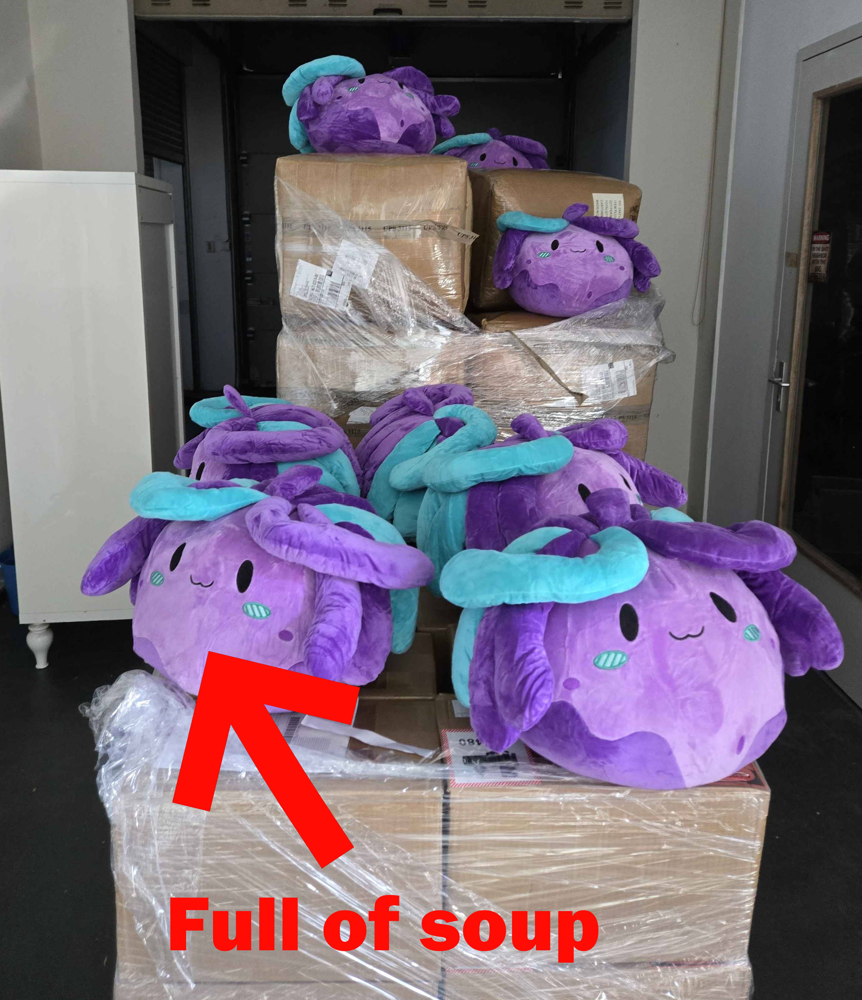
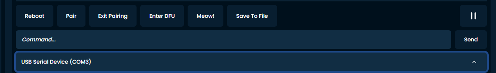
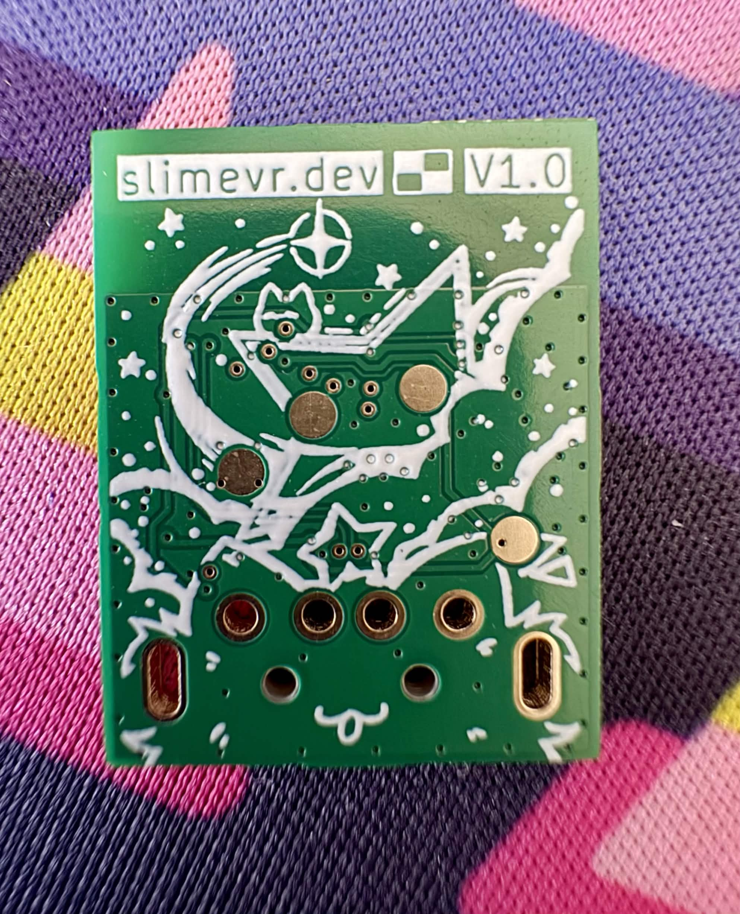
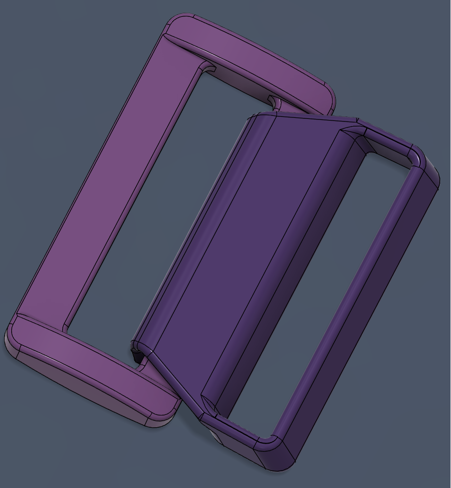
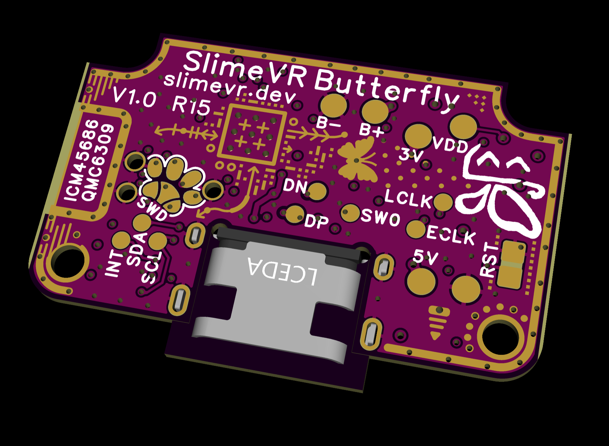
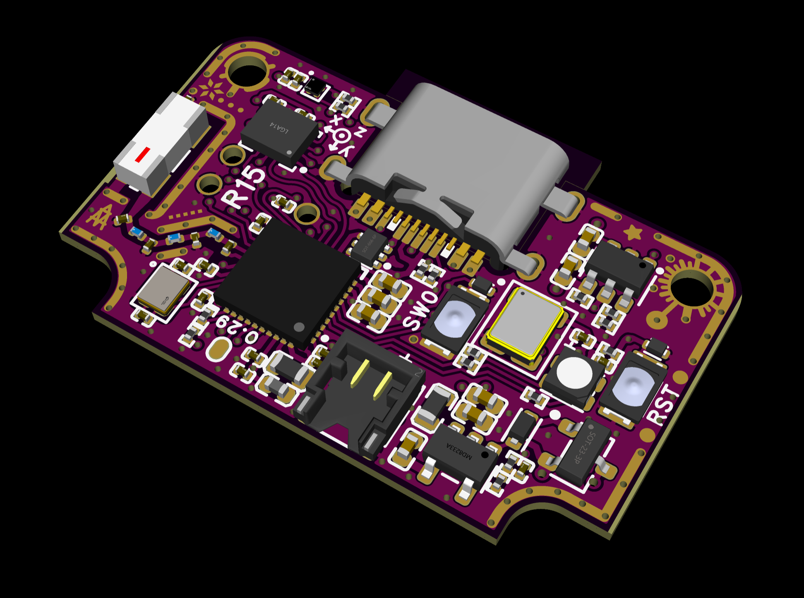
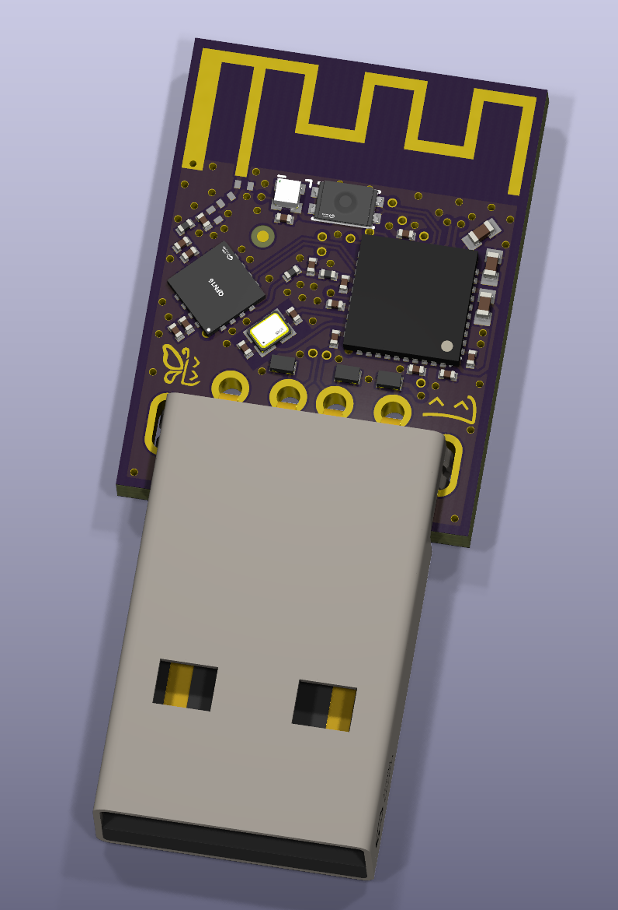

Sup, <:nighty_yay:1319261631217143910> I know you missed already, but today you get me instead! <:Yus2:862786221537624104> It's been a while, so I bet you missed me too~ <:hina_1:1514646533264506890><:hina_2:1514646552185016320>But don't get used to it <:nya_a:847203539352551544> As you might have noticed, we've got a new community manager a few weeks ago - - and she'll be way more active on all our socials, helping with making updates here, on Crowd Supply and everywhere else, and helping us with making a lot of new content! So get excited for a "1000 things you didn't know you could do with SlimeVR" series of YouTube videos in the near future <:slimenom:663823059920224277>
But I know what you've been actually waiting for. **Where slimes?**
I have updated the https://discord.com/channels/817184208525983775/1129107343058153623/1518982310278467584 with the latest in-stock estimates, current production status, when **Shipment 17** going to ship, and how many sets will be left over. If you order now, your order will either ship **from stock!** or from S17 in a few weeks <:nya_umu:850498715617198080> Not much waiting!
## Butterflies <:butterfly:1470467583323930685>
But how are the Butterflies doing, ? **Pretty good actually!** <:nighty_yay:1319261631217143910>
We have finalized PCBs for both the tracker and the dongle, look how pretty they are :3 <:slimepcbnom:839133114931347486> We're getting the last round of samples from our manufacturer and **they will be sent to professional antenna tuning when they arrive!** 📶 Yes, we're still waiting on the final injection-molded enclosures, but the professionals said that we don't need them, and FDM-printed ones are fine too as long as they're precise enough and are made of the same material. **So this will save us a couple of weeks off our timeline!** Hopefully. Probably. Not gonna promise anything just yet, there can still be unforeseen circumstances...
Also Tracker Enclosure and Dongle Enclosure molds are finally in proper production! The tracker enclosure took a few weeks back-and-forth with the manufacturer to iron out all the details, because it's such a complex mold... Now we wait! The mold will be milled, tested, they'll make some samples, check them, send them to us to confirm, and then mass-production... Can't wait 🥺 I wanna touch beautiful Sakura Trackers aaaa 🌸 For now, check these cool drawings our engineers made for the manufacturer <:firPog:785701297478959104>Beautiful...
## More stuff
We got so much more stuff... I can yap for hours, but who's gonna read, so I won't! I'll leave it to and to share all the small stuff throughout the weeks to come in bite-sized chunks or big posts, so go get yourself a role in <#844382850845376521> if you want more deep SlimeVR lore <:RWping:920549879456075777>
And I'll see you soon~ Oh yeah we got new slimes, holly-molly they're so cool, outdid themselves once again... Soon™ on the Team page on [slime.gay](<https://slime.gay>).

