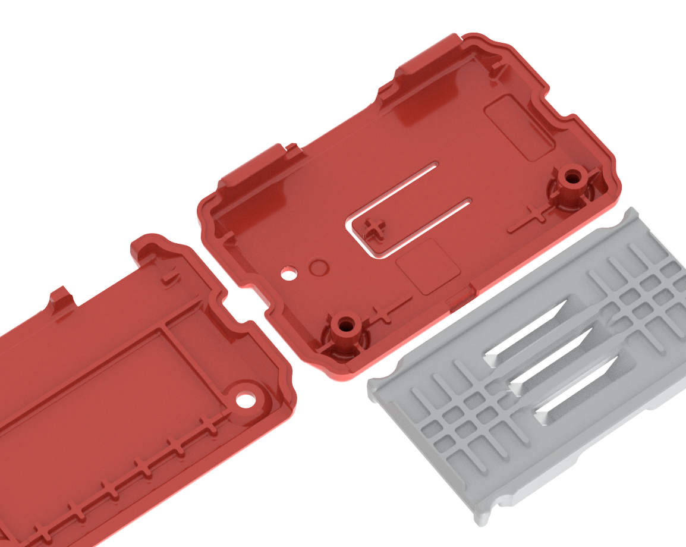
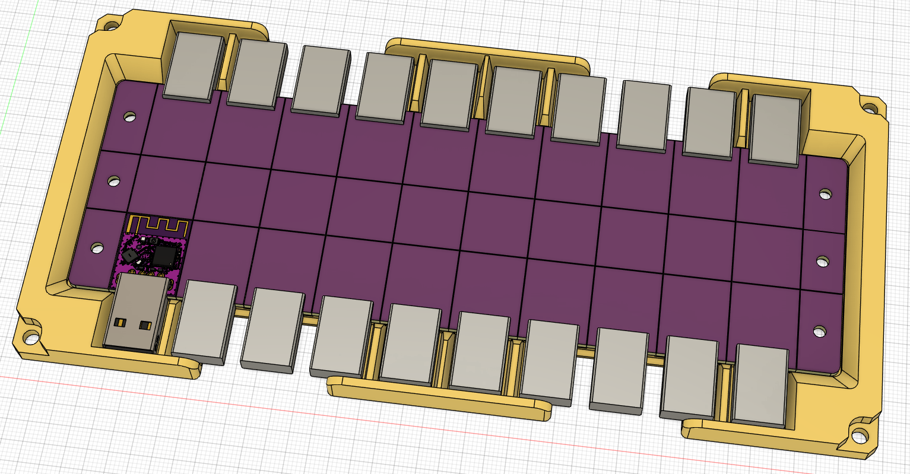
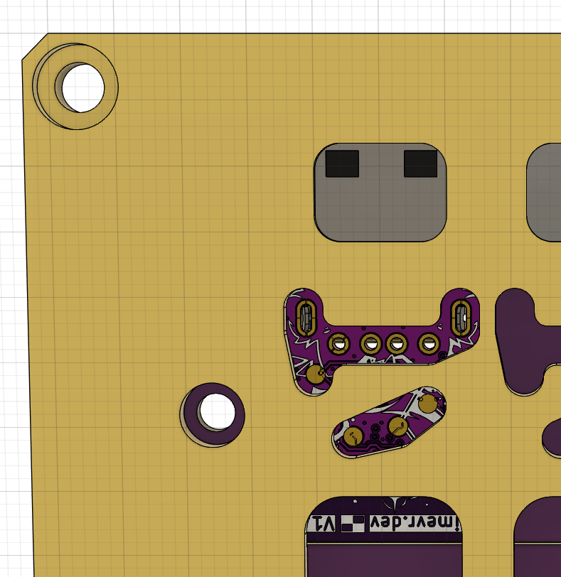
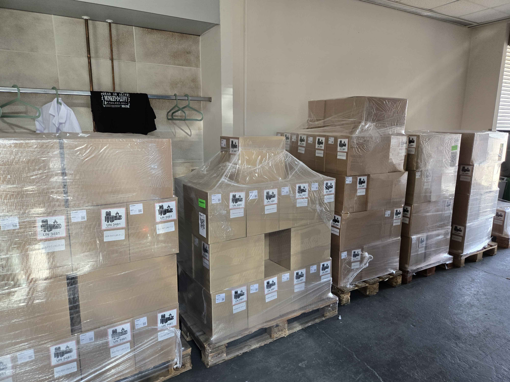

## Butterfly News <:nighty_yay:1319261631217143910> <:butterfly:1470467583323930685>
As usual, the team has been hard at work being busy bees in order to get the Butterfly Trackers out on time. This week we saw our Butterfly Tracker case mould designs being finalised, a fresh design for our Butterfly Dongle tester jig, and a realised prototype of our redesigned and improved Charging Dock. Check out all the juicy pics and videos below! We even have a beautiful 4k render of a Butterfly Tracker for you to drool over (it looks so tasty!) <:mDrool:777575446665494558>
## Shipment Update <:bingus_gun:1404234276630958080>
https://discord.com/channels/817184208525983775/1129107343058153623 has been updated by our slime overlords to have the latest timeframes and info on Shipment 17, which many of you are frothing at the mouth for info on. Luckily for you, we can now say that shipment 17 is all piled up in the SlimeVR HQ and ready for UPS to whisk it away to America in the coming week. Yippee! <a:SKC_yippie:1192868297713135626>
*That's it for this week. Thank you for reading to the end, hope you all have a lovely week and weekend. See you, space slimethings!*

## Drift <:nighty_cry:1314209498554175578> (17%)
Drift is when your trackers *very* slowly turn sideways during use, and drift is expected when using SlimeVR trackers. Depending on your activity level, official trackers are expected to achieve 30 to 60 minutes of play time before requiring correction. Correcting drift simply means triggering a Yaw Reset by facing forward and double-tapping your chest tracker (and can be done while sitting). Many calibration problems were incorrectly reported as drift.
If you are getting worse results with official SlimeVR trackers, please calibrate your trackers' IMU chip before putting them on. Just turn them all on, place them down somewhere, and leave them completely still for 30 seconds before wearing them. Trackers will often warm up during use, which can result more drift if they were calibrated when cold. If you find this is the case, just take them off, set them down again for 10 seconds, then put them back on.
**What are we doing about it?**
* We introduced the "Stay Aligned!" feature, that when properly set up can greatly reduce drift in many situations.
* We have plans to add temperature based feedback in the server to warn users to re-calibrate their trackers if their tracker has changed temperature significantly since it was last done.
* We are constantly re-tuning our IMU parameters to improve drift times, and will continue to do so. **Make sure your trackers are up to date to get the best tuning!** (current version is 0.7.2)
* We are working on custom advanced fusion algorithms that account specifically for full-body tracking use-cases, which should also improve drift performance.
## Connectivity Issues 📶 (20%)
The most frustrating issue for many of you, and second most common was issues with Wi-Fi. We have seen a surge of Wi-Fi issues in the last 6 months, most commonly of lagging, high ping, and disconnections. Unfortunately this is one of the most complicated for us to address. Our support and community has been diligently investigating the causes, but unfortunately we have not found any simple fixes. It has affected both official and DIY trackers, and downgrading software and firmware does not help.
What are we doing about it?
* Dongles, dongles, dongles. We have been testing and developing a dedicated dongle based on ESP-Now technology for original SlimeVR trackers. If it works out, you will be able to easily DIY your own dongle for a few dollars, or get a premade dongle from our store for very cheap. We have been working with the community on this for a while now, and we expect results of our efforts to be available to everyone before the end of summer.
* The complexity of home networks makes this hard to address, but our support has determined a few common router settings that can, in many cases, completely nullify this issue. Please give these a try if you are experiencing connection issues. More info here: https://discord.com/channels/817184208525983775/878727840118505533/1525566303694360636
Of course, if you bought Butterfly Trackers, you are already set. Butterfly Trackers don't use Wi-Fi at all, and are bundled with a dedicated dongle already. You will never suffer from a forced ISP router update crippling your fun.
